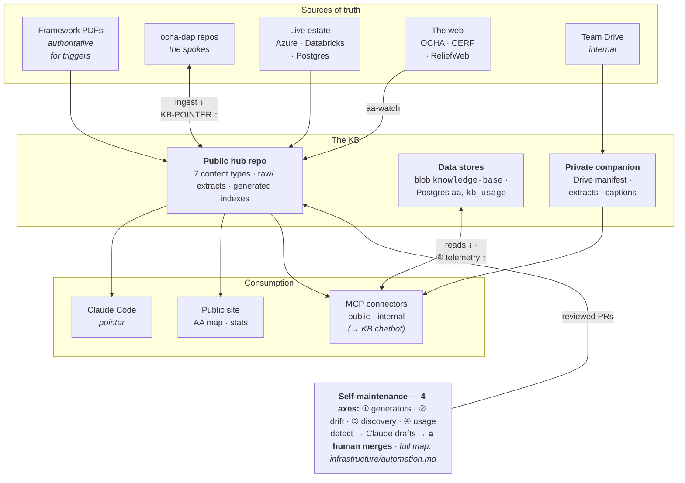

# Design — rationale & decision log

The *why* behind this KB. `INGESTION.md` holds the *how* (conventions); this holds the reasoning, the decisions, and what we deliberately rejected. **Keep it updated:** when an approach changes, add a dated entry rather than silently editing — the history is the point.

## Purpose

Take the team's disparate knowledge — documents (mostly PDFs), code, infrastructure — and make it **easily lookup-able** by both humans and Claude. The end state: Claude can answer most routine questions people bring the team, and accelerate framework/pipeline work, grounded in a cited, maintainable corpus. Not a know-it-all bot; a searchable substrate with a thin agent layer on top.

## Architecture in one paragraph

Markdown in git. **Hub-and-spoke:** this KB is the hub (summaries, cross-links, the cross-framework comparison no single repo can hold); the `ocha-dap` repos are the spokes (deep, code-adjacent detail, versioned with the code). **One home per fact** — pages point via `source_repo`/`code_ref`, never copy. Seven content types (`frameworks/`, `pipelines/`, `apps/`, `analysis/`, `methods/`, `infrastructure/` incl. `libs/`+`datasets/`, `assets/`) plus in-repo `raw/` full-texts and a **private companion repo** for internal-sourced material (Drive manifest/extracts/captions — [PRIVACY.md](PRIVACY.md)). The once-"later" layers are live: **consumption** through Claude Code (global pointer), the MCP connectors (public authless; internal token-gated with read-only DB/blob/Drive), the KB chatbot, and the public site (AA map + trigger stats); **self-maintenance** on four axes (deterministic generators auto-commit; drift/freshness, discovery, and usage telemetry detect → Claude drafts → a human merges — the full map is [infrastructure/automation.md](../infrastructure/automation.md)).

## Decision log

Lightweight ADRs. Each: the decision, why, and what it rejects. Dated. The full log is **chronological** below; this index groups it **by theme** so you can find the decisions on one topic without reading all 50+. (Ctrl-F a `Dnn` to jump.)

| Theme | Decisions |
|---|---|
| **Foundations & architecture** — corpus shape, content types, scope | D1 (markdown corpus, not a model) · D2 (hub-and-spoke) · D3 (content types + datasets-as-tags) · D4 (structure for findability) · D5 (consistent questions) · D8 (portfolio vs DS subset) · D40 (`analysis/` type; "framework" = a real framework) · D51 (scope = full OCHA/CERF portfolio) · D53 (framework must be OCHA/CERF-owned) |
| **Document authority & reconciliation** — what's authoritative, fetching PDFs | D6 (latest PDF authoritative) · D7 (HDX model reports legacy) · D9 (PDF acquisition) · D10 (full-text + summary) · D18 (read the active branch; in-dev can be newer) · D32 (PDF-freshness drift) · D49 (self-fetching past the WAF) |
| **Schema evolution** — frontmatter fields over time | D17 (schema v3) · D21 (`extra`, `n_windows`) · D22 (`window_axes`) · D27 (funding/scope facets) · D31 (schema v4: per-window indicators, funding splits, discrepancy kind-tags) · D42 (`monitoring_period`; activation-driven lifecycle) · D52 (`valid_until`, `all_in`) |
| **Ingestion workflow & validation** — how pages get drafted | D15 (validate on a diverse sample) · D23/D24 (Phase-2a validation; lock `n_windows`) · D25/D26 (batch 1) · D34 (batch 2; YAML-gate fix) · D35 (generated folder READMEs) · D36 (pipelines/apps ingest from code) · D39 (corpus complete) · D54 (Opus QA gate in headless ingest) |
| **Cross-cutting layers** — the comparative product | D37 (dependency graph + blast radius) · D38 (`methods/trigger-patterns`) · D41 (DB-schema mirror + tables in the graph) · D43 (pipeline registry + Databricks compute) |
| **Hub↔spoke linkage, drift & self-maintenance** | D12 (capture-as-you-go + drift safety net) · D28 (spoke→hub pointers) · D29 (hub depth ∝ 1/spoke quality) · D30 (structural drift detection) · D50 (three-axis self-maintenance; detect→Claude-draft→PR) · D55 (meta-docs self-maintain; checks→issues not red CI; issue janitor) · D56 (janitor→KB steward; one front door; issues mean a human's needed) |
| **Deployment / runtime tracking** | D16 (track where things run) · D19 (apps are deployments) · D20 (pipeline `jobs[]`) · D48 (rendered static sites registry) |
| **Privacy & data classification** | D11 (`visibility` from day one) · D44 (public/internal by source) · D44b (bulk Drive manifest is internal) · D45 (headless Drive auth) · D46 (internal home = private companion repo) · D47 (slide-visual captions) |
| **Feedback & operations** | D13 (front door is a later layer) · D14 (exclude legacy by age, not prefix) · D33 (GitHub issues = feedback channel) |

### 2026-06 — foundational
- **D1 · Markdown corpus, not a trained model.** Rejected fine-tuning and a monolithic "knows-everything" bot: can't cite, goes stale, can't publish, hallucinates specifics. A searchable corpus + retrieval beats it on every axis we care about.
- **D2 · Hub-and-spoke, one-home-per-fact.** Deep detail stays in repos (can't drift from code); cross-cutting/comparative knowledge lives here. Bidirectional links, no duplication.
- **D3 · Four content types + datasets-as-tags.** `frameworks` (design), `pipelines` (living systems/runbooks), `methods` (cross-cutting), `infrastructure` (conventions). A dataset graduates from tag → page only when a shared fact would otherwise be duplicated.
- **D4 · Structure only for findability.** Frontmatter = facets to *find* things, not a spec. Triggers especially: coarse `trigger_facets` + prose + `code_ref`; do **not** normalize a trigger into fields — the variation is the asset.
- **D5 · Consistent questions, idiosyncratic answers; open vocabularies.** Headings stay fixed across pages; tag vocabularies extend during ingestion. Structure adapts to findings, but in deliberate sweeps (git bulk-edits), never page-by-page drift.

### 2026-06 — from recon
- **D6 · Latest framework PDF is authoritative for the trigger** (user, 2026-06-12). The repo *derives/implements* it but the analysis sometimes gets lost. So ingestion is **reconciliation**: take the trigger from the PDF, cross-check the repo, record `repo_completeness` + `discrepancies`. Don't smooth over mismatches.
- **D7 · HDX "model reports" are legacy** (user). Team stopped using them (may revive). Index-only, not authoritative. (HDX dataset `2048a947-5714-4220-905b-e662cbcd14c8`.)
- **D8 · Website = whole OCHA AA portfolio; repos = the DS-built subset.** Some published frameworks were built by other actors. The KB spine centers on frameworks where a repo (and analysis) exists.
- **D9 · PDF acquisition.** unocha publication page (fetch with a browser User-Agent — the site 403s default fetchers) → extract `unocha.org/attachments/*.pdf` → `pdftotext`. ReliefWeb v2 API exists but needs a registered appname. PDFs are dated/versioned and bilingual (FR/ES translations = same version, not new ones).
- **D10 · PDFs stored as full-text extraction + curated summary.** Summarization must never strand a fact; raw stays greppable. No RAG/semantic index until grep proves insufficient.
- **D11 · `visibility: internal|public` from day one.** Cheaper than retrofitting redaction across 100+ pages.
- **D12 · Updates: capture-as-you-go is primary; drift automation is a safety net.** Scheduled `source_sha` diff → PR (never auto-commit), built only once a real corpus exists.
- **D13 · Front door is a later additive layer.** Read-only DB/blob MCP + claude.ai Project or Slack bot. `ds-slack-bot` and `ds-claude-config` already exist as a head start.
- **D14 · Exclude legacy by default — by age/archival, NOT by prefix** (clarified by user, 2026-06-15). The `pa-` prefix does **not** mean "old": many `pa-aa-*` repos are current and in scope (e.g. `pa-aa-fji-storms`, `pa-aa-phl-storms`, `pa-aa-tcd-flooding` — all ingested in 2b batch 1). What's out of default scope is genuinely legacy: the `pa-anticipatory-action` monorepo and COVID-era/archived repos (cookiecutter, food-insecurity, etc.). The scope signal is last-push date + ARCHIVED status in `repo-manifest.md`, not the prefix; opt any repo back in per row.
- **D15 · Validate schema on a diverse sample before broad fan-out.** High variance across frameworks means one example misleads — design against ~6 deliberately diverse frameworks, then scale.
- **D16 · Track the runtime/deployment layer, not just code** (user, 2026-06-12). Where things *run* is its own knowledge: marimo apps as **Azure web apps** (RG `IMB-CHD-DataScience-EastUS2`, OCHA-PROD, ~20 apps, `chd-<repo>` naming) and pipelines as **Databricks jobs** (CLI profile `default`, workspace `adb-6009046713167663`). Captured two ways: a `deployment` block on each pipeline/app page, and a generated `infrastructure/deployments.md` registry (both auto-pullable via `az` / `databricks`). Auto-refresh fits the Phase-5 drift job.
- **D18 · Version authority spans published + in-development, and work is usually on a branch** (user, 2026-06-12). The branch survey of the 6-framework sample found **none were on `main`**, and main was up to ~15 months stale (ner on `iri-trend`; bfa's *endorsed* 2026 revision sits on a `2026-revision` branch, not main; hti R&D on `melissa-exposure`). So: (a) ingestion must enumerate branches and read the **active** one, recording `source_branch` — never assume main; (b) a trigger version newer than the latest published PDF can exist unendorsed on a branch → a `status: in-development` page (`trigger_source: repo`, `framework_doc: null`), not authoritative. The published PDF stays authoritative only for the *endorsed* trigger.
- **D24 · Phase-2a re-validation passed; `n_windows` counting locked** (2026-06-13). Re-ran with `ingest (Sonnet) → review-and-fix (Opus)`: **6/6 valid**, and the Opus stage produced reference-or-better pages — autonomously finding *real code bugs* (moz: a half-wired runtime error where `get_monitoring_status` reads an `exposed_area_48kt` that `main.py` never produces; a km/h-vs-knots unit mismatch) and *PDF-internal inconsistencies* (bfa English budget table sums to 7.7M but totals 8.0M). It also corrected a hand-authored error (ner `status: triggered`→`endorsed` — the *version* never fired; the pilot did). Cost: ~247k tokens/framework (Sonnet draft + thorough Opus review) ≈ **~20M for the ~80-unit bulk** (≈2× the Sonnet-only estimate; worth it — the review finds bugs). **Convention locked:** a "window" = one distinct activation component; redundant data sources for the same activation = ONE row (the agents' cleaner count; my hand pages over-counted). Workflow is production-ready for 2b.
- **D23 · Phase-2a validation: workflow works; reconciliation is the soft spot** (2026-06-12). Ran `workflows/ingest-frameworks.mjs` on the 6 hand-done frameworks (Sonnet). **Mechanics solid 6/6:** correct active branch every time (none on main), PDF resolution, exact trigger thresholds, version dates, `n_windows`. **Soft on judgment:** missed subtle discrepancies (HTI's Tableau-1 typo, NGA's WARNING tier/stale constants), over-claimed `window_axes` (added `severity` 4/6 where the dominant axis was one), missed `supersedes` lineage (moz), and a few conformance gaps (missing `raw_extract`/`extra`/Historical-activations section, `flood` vs `flooding`). Bug found: workflow delivers `args` as a JSON string → parse defensively. Confound: Niger came back byte-identical (agent read the committed page; moot for 2b where no page exists). **Fix → D-shape the workflow as `ingest (Sonnet) → review-and-fix (Opus)`** (the verify agent's issue lists were high-quality, so make them corrective) + prompt-hardening (discrepancy-hunt checklist, axis discipline, conformance self-check, fixed hazard vocab, companion-repo reads). The verify/fix QA is where Opus earns its cost; Sonnet does the bulk reading.
- **D22 · `window_axes` — how a framework's windows differ** (user, 2026-06-12). Team's mental model: windows are differentiated by **time** (readiness/action, issued-month, season), **space** (which area), or — rarely — **severity**. Added `trigger_facets.window_axes: []` (vocab time|space|severity). This is the discriminating, queryable successor to the dropped `structure` tag, paired with `n_windows` (count vs how-they-differ). Sample: 5×time, 1×space (nga), 0×severity. Caveat: a few windows differ by *indicator* (moz obs-wind vs obs-rain) — folds into time when obs follows forecast, occasionally doesn't; noted in `extra`/comments, not forced into the vocab. (Per-country differences = space but they're *variants*, not windows — kept separate.)
- **D21 · Schema polish from the rough-edges review** (user, 2026-06-12). (1) `extra: {}` escape hatch on all structured templates — stash what doesn't fit *yet*; recurring keys signal a real field. (2) Dropped `trigger_facets.structure` (all 6 samples were `multi-window` — not discriminating) and replaced it with `n_windows` (int, count of Trigger-windows-table rows — discriminating + catalog-queryable); the staging *pattern* lives in `methods/trigger-patterns.md`. (3) `repo_completeness` may be a layered map (`{analysis: full, deployed_code: stale}`) when it differs by layer (bfa exemplar). (4) `version` convention for development/pre-development pages (no published doc): branch name or `draft-<label>`. (Window-level detail stays in body tables by design — `n_windows` is the one promoted facet.)
- **D20 · Pipelines hold a `deployment.jobs[]` list** (user, 2026-06-12). A pipeline repo is often several jobs/workflows with different schedules (storms-pipeline = 4 Databricks jobs; hti-monitoring = 3 GHA workflows). Replaced the single `schedule`/`ref`/`url` with `deployment.jobs: [{name, ref, schedule, status}]` (one row even if single) + a `## Jobs & schedule` body table. 1..N is now uniform and the per-job schedules are structured.
- **D19 · Apps are deployments (not documents); status enum simplified; track REAL activations** (user, 2026-06-12). (a) `apps` moved out of the documents block into a "live system" group, cross-referenced to `infrastructure/deployments.md` (the canonical app inventory — Azure web apps + GH Pages); apps are deliverables, not authoritative sources. (b) Framework `status` simplified to **`pre-development | development | endorsed | superseded | retired`** (drops piloted/active/in-development; the unpublished-newer-trigger-on-a-branch case = `development`). (c) New `activations: [{date, window, note}]` field + `## Historical activations` body section record **REAL** activations that occurred (funds moved), kept explicitly distinct from the simulated/backtested return-period record. **Resolved (user):** apps get their **own content type** (`apps/`, one page per app, full frontmatter) — the 5th content type. The deployment registry stays the inventory; `apps/` pages add per-app prose.
- **D17 · Schema v3, from the diverse-sample ingestion** (2026-06-12). The 6-framework sample (ner/nga/hti/moz/lac/bfa) surfaced four consistent strains, now handled: (a) **every framework is multi-window** → a structured `## Trigger windows` body table (windows in the body, not normalized into frontmatter — preserves D4); (b) **the live trigger often runs outside the repo** (IRI Maproom, INAM/PRISM, INSIVUMEH) → `operated_by` field; the repo is then a derivation, not the production system; (c) **repo-drift-from-PDF is the norm** (moz repo = old two-threshold design; bfa repo = 3 generations + stale CLI) → vindicates PDF-authority + `discrepancies`; `repo_completeness: partial` is the common verdict; (d) **multi-country** (LAC umbrella + country annexes) → multi-valued `country_iso3`, `framework_doc_annexes`, a `## Per-country variants` table, and implementation-scope may exceed framework-scope (LAC repo carries Nicaragua, dropped from the framework).

### 2026-06-15 — Phase 2b, batch 1
- **D25 · First billable batch (10 frameworks) ran clean; one new failure mode found** (2026-06-15). Ran `workflows/ingest-frameworks.mjs` over 10 diverse frameworks (afg/bgd/cod/cub/moz-cholera/tcd/mrt/fji/phl/npl — droughts, floods, cyclones, cholera; W/Central Africa, Sahel, Caribbean, Pacific, S/SE Asia): **10/10 ingested, 10/10 valid**, ~15.6 min, 20 agents. Opus stage again found real issues (afg: dev-slot deployment + test-mode workflow defaults on an *endorsed* framework, plus a PDF-internal grid-search-vs-ridge-regression contradiction; bgd: a 25%-vs-30% damage-threshold error and a mischaracterized shared-CERF funding pool). **New failure mode:** the Opus reviewer validates *body* conformance but not YAML-*parseability* — cod-flooding shipped with unquoted `discrepancies:` items containing `": "` (e.g. "Zone 1: …"), which silently dropped it from the generated catalog until hand-fixed. **Fix forward:** (a) added `scripts/gen_catalog.py` (frontmatter→catalog, the generator that surfaced the break) — run it as a parse-gate after every batch; (b) next workflow iteration should add a `yaml.safe_load` self-check to the write step so unquoted-scalar breaks fail loudly in-agent. **Token cost (measured, raw transcript sum):** 58.0M raw tokens — **92.8% cache reads**; only 171k output (≈17k/framework). Per-model: Sonnet 32.5M raw / Opus 25.6M raw. ≈ **$44 API-list-equiv for the batch (~$4.4/framework)**; the cache-read share means real Max-plan window-impact is far below the raw figure.
- **D27 · Promoted funding & scope facets from `extra` → frontmatter** (user, 2026-06-15). The 10-framework batch put budget/agencies/target into `extra` on 9-10/10 pages — the D21 "recurring key ⇒ real field" signal. Promoted three coarse, comparative facets: `prearranged_funding_usd` (headline pre-arranged $ — CERF envelope, + AHF/partner only when also pre-arranged), `implementing_agencies: []`, `target_people` (total int). Per-window/per-country/partner-vs-CERF splits stay in `extra` or the Per-country table — the promoted fields are *facets to compare*, not the full budget breakdown (keeps D4). Backfilled all 16 pages (the 6 hand pages read from prose: bfa $8M, lac $10.5M, moz-cyclones $4.5M; hti/ner/nga left null — funding not cleanly stated), added a `$ pre-arr.` column to `catalog.md`, and wired the fields + an **activation-hunting rule** (don't default `activations:[]` without checking PDF/repo/CERF-search) into `_TEMPLATE.md`, `INGESTION.md`, and the ingest workflow. Also hardened the workflow with a **YAML parse-gate** (both stages) and a write-only-to-`OUT` rule, and normalized the strain key to lowercase `extra.schema_strain`. Decided NOT to promote: multi-axis windows (cub's obs window has an embedded spatial condition; mrt has per-window operators) — these stay as `extra`/strain notes; a `methods/` note will capture the pattern rather than complicating `window_axes`.
- **D28 · Spoke→hub pointers: README header + `CLAUDE.md`, generated, append-not-clobber** (2026-06-15). The hub→spoke direction was already built (`source_repo`/`branch`/`sha`/`code_ref` on every page); the reverse was a Phase-4 one-liner. Design now prototyped on `ds-aa-tcd-drought` ([PR #8](https://github.com/OCHA-DAP/ds-aa-tcd-drought/pull/8)): three artifacts per repo — (1) a standardized **README `KB-POINTER` header** (KB-page link, status, current version + correct PDF, **active branch**, trigger code) injected between existing sections, not overwriting human content; (2) a thin agent-facing **`CLAUDE.md`** (read the KB page first, PDF is authoritative, work isn't on `main`, capture-as-you-go); (3) **machine markers** (`<!-- KB-POINTER:START/END -->`, `<!-- kb-page -->`) so the block regenerates and a drift job can check repo↔KB both ways. All derivable from KB frontmatter → a generator + one PR per repo, never hand-edited. Friction surfaced for the fan-out: repos enforce **markdownlint MD013 (80-char)** via pre-commit — scope the disable to the generated block, don't relax repo-wide; target `main` (the visible README) while the header names the real active branch. Open: also fix stale body links (the tcd Overview still points at the 2022 PDF + `pa-anticipatory-action`), or leave human content alone?
- **D29 · Hub depth ∝ 1 / spoke quality; the hub is the spoke's complement, not its copy** (user, 2026-06-15). Prompted by "for some pipelines it's nice to have tons of info in the spoke (e.g. `ds-storms-pipeline`)". Codified in `INGESTION.md` § "How much goes in the hub vs the spoke": push operational/code-coupled/volatile detail DOWN to the repo (a rich spoke README is a feature); the hub carries only what the spoke structurally can't — the comparative layer, the PDF-vs-code reconciliation, a consistent scannable summary schema, and pointers. Where the spoke is an excellent runbook the hub page is thin + "see the repo"; where the repo is thin/stale/multi-branch the hub legitimately carries more. Never duplicate a fact you mean to keep accurate (duplication = drift); the one exception is a deliberately-frozen summary marked secondary to `code_ref`. Worked example: thinned `pipelines/storms-pipeline.md` (dropped the restated Steps / exact I/O / failure playbook → one-line summaries + a README down-pointer; kept jobs-at-a-glance, cross-pipeline deps, rationale).
- **D30 · Drift detection built — structural, not semantic; `source_repo` normalized to slugs** (2026-06-15). Answers "how do we keep the hub matching the spokes?" `scripts/check_drift.py` + `.github/workflows/drift-check.yml` (daily): for each page, compare recorded `source_sha` vs the spoke branch HEAD via `gh api`; if the spoke moved AND a `code_ref` path changed → **STALE**; dead `source_branch` → **BRANCH-GONE**; moved-but-`code_ref`-untouched → low-signal. Restricting to `code_ref` is what makes it non-noisy. It never edits pages (D12) — maintains one `kb-drift` tracking issue; the fix is targeted re-ingestion + diff review. Structural detection can't verify prose still *semantically* matches — that's why D29 (minimise overlap) is the real defense; the check covers the irreducible remainder. **Prerequisite fixed:** 7 batch-1 pages had `source_repo` as a local filesystem path → normalized all to `ocha-dap/<repo>` slugs (and hardened the workflow to emit slugs); also stripped a stray `origin/` prefix on afg's `source_branch`. First run already caught real drift: afg (monitoring code advanced post-ingest), phl (new `fungwong` analysis on the active branch), moz-cyclones (active branch `historical-rainfall` deleted → `trigger-revision`).
- **D26 · One stray write into the repo tree** (2026-06-15). The moz-cholera ingest agent wrote a draft into `frameworks/moz-cholera/` (the live repo) in addition to `OUT`; the reviewed `OUT` copy was authoritative and overwrote it on copy-in. Harmless here, but the prompt should forbid writing anywhere except `OUT`.

### 2026-06-16 — review feedback (zackarno, PR #1)
- **D31 · Schema changes from first colleague review** (zackarno, 2026-06-16). Three changes, applied + backfilled across all 16 pages: **(a) indicators are per-window and plural** — dropped `trigger_facets.primary_indicator` (a framework may use several indicators, and they belong to *windows*, not the framework); replaced with `trigger_facets.indicators: []` (the flat union across windows, search-only), and the Trigger-windows `indicator` cell may list several. **(b) Funding by source + co-financing** — kept `prearranged_funding_usd` (total) but added `funding_by_source: {}` (e.g. `{CERF: 12000000, AHF: 10000000}`) and separate `cofinancing_usd` / `cofinancing_sources` (partner/government money arranged alongside, stated in the doc — not folded into the pre-arranged total). Fixed bgd, whose D27 "total" had silently bundled $5.95M co-financing into a $9.95M figure → now $4M CERF + $5.95M co-financing. **(c) Discrepancy kind-tags** — every `discrepancies` entry is prefixed `[stale]` (legacy/superseded code or values still present but NOT the live trigger — informational), `[conflict]` (repo and authoritative doc actually disagree — needs attention), or `[gap]` (analysis missing). Directly fixes zack's "the afg discrepancies dwell on 2025-vs-2026 stale scripts, which could read as live errors": afg's 10 discrepancies are now 6 `[stale]` / 3 `[conflict]`, with one consistent-precision non-issue dropped. Template/INGESTION/workflow all updated to emit + enforce these going forward; older pages get full per-window indicators + funding splits on their next re-ingest (mechanical migration kept them conformant now).
- **D32 · Second drift axis: framework-PDF freshness** (2026-06-16). zack's other catch — `lac-dry-corridor` silently a version behind (2025 page, 2026 published) — is a drift the `source_sha` check can't see (it watches *code*, not the *document*). The real failure wasn't detection capability, it was that nobody was prompted to re-check. `scripts/check_pdf_freshness.py` + `.github/workflows/pdf-freshness.yml` (weekly): flag endorsed pages whose `framework_doc_date` is ≥14 months old (or where a best-effort ReliefWeb API probe spots a newer doc), with one-click search links, into a `kb-pdf-freshness` issue. The ReliefWeb API 403s our egress, so the probe degrades gracefully to age-based prompting; the *authoritative* "get the newest PDF" is a re-run of the ingest workflow (which resolves the latest version via browser-UA). Tested at 2026-06-16 it flags lac (16mo) + hti/ner/tcd/bgd. **lac resolution (2026-06-17):** zack was right — a **2026 framework DOES exist** (the 2026–2027 renewal, published ~March 2026, EN/ES). My first re-ingest missed it because I fed it the *generic/2025* candidate URLs from the crosswalk, so the agent anchored on those and found only re-posted Feb-2025 content. A targeted web-search ("…anticipatory action framework drought 2026", year-specific slugs `…-drought-2026-…`) found the GTM/SLV/HND 2026 docs; re-ingesting against those produced `2026-03-13` (triggered, supersedes `2025-02`): expanded GTM scope (Chiquimula+Zacapa+Jalapa+El Progreso), SLV moved to Ahuachapán+Santa Ana, SEAS5-only trigger, and **two real activations** (GTM Postrera Jul-2025 CERF $4M/51.5k people = the Dry Corridor's first-ever; GTM+SLV Primera Mar-2026 CERF $4M+$2.5M). `2025-02` set to `superseded`. **Two lessons:** (1) version = PDF *content* date, not portfolio post date; (2) **freshness re-ingests must NOT reuse stored candidate URLs** — those point at old versions; force a year-specific portfolio search (now baked into the workflow STEP 2 + the freshness guard hands a search, not a stale URL).

### 2026-06-17 — feedback channel + repo tidy
- **D33 · GitHub issues are the feedback channel; root tidied** (team, via Slack, 2026-06-17). Q: "best way for the team to flag errors / give feedback?" → **GitHub issues** — already the established channel (the `kb-drift` / `kb-pdf-freshness` automations open issues), trackable, and linkable to pages/commits. Added a structured issue form (`.github/ISSUE_TEMPLATE/kb-feedback.yml`, label `kb-feedback`) that asks for the page + the *authoritative source* for any claimed error (so corrections reconcile, not just assert), plus a README "Found an error?" section. Two-tier: quick fixes = edit the page + PR (sources are linked on every page); everything else = an issue. Also moved `INGESTION.md` + `glossary.md` into `docs/` — root is now just `README.md` (front door) + `CLAUDE.md` (agent index) + `catalog.md` (generated index); everything else lives under its content-type dir or `docs/`. (Historical decision-log prose still names `INGESTION.md` by filename — left as written; only live markdown links were repointed.) **Update (2026-06-17):** the form's free-text "page/area" became two dropdowns — a static **Content type** + a **Specific item** list generated from the corpus by `scripts/gen_issue_form.py` (GitHub forms can't cascade, so the item list is flat + type-prefixed; regenerated each batch).

- **D34 · Phase 2b batch 2 (10 frameworks); fixed a fragile YAML gate** (2026-06-17, first PR against the merged `main`). Ingested bfa-flooding, eth-flooding, mdg-storms, sahel-drought, ssd-flooding, bgd-flooding, cod-infectious-disease, ner-flooding, nga-cholera, tcd-flooding → **10/10 ingested, all v4-conformant** (27 versions total). **3 fell back to `status: development`** (eth-flooding, ssd-flooding, nga-cholera — repo-only, no published framework found; correct handling of the weak-candidate ones). Two notable catches: (a) the agents found a **real bug in the workflow's YAML parse-gate** — `t.split('---',2)[1]` truncates at a `# --- section ---` divider comment and falsely passes; fixed to the line-anchored `t.find(chr(10)+'---',3)` form (and reverted bfa's `# === ===` workaround). (b) mdg-storms came back `valid:false` because the reviewer couldn't verify a Cyclone Gezani (Feb 2026) activation from the pre-2026 sources — a **web check confirmed it** (framework triggered 9 Feb 2026 at the 166 km/h Scenario-3 threshold, ~$900k CERF AA released ahead of landfall near Toamasina; Madagascar's first cyclone AA), so `triggered` is correct and the hedged note was replaced with verified detail. Reinforces: the activation-hunting rule plus a verify-or-downgrade reviewer instinct works — an unverifiable activation gets flagged, not silently asserted.

- **D35 · Per-framework folder READMEs are generated** (user, 2026-06-17). Only the 6 hand-authored sample folders had a `README.md` index; the ingestion workflow only writes version pages, so the other 20 folders had none — an inconsistency, and the workflow was out of sync with the documented "each folder has a README index" convention. Resolved by `scripts/gen_framework_readmes.py`: derives each folder index from its version frontmatter (summary from the current version's `## Summary`, current-version + status + operated-by line, a version-lineage table [version/status/doc-date/$/activated], and sibling-framework links by name prefix). Generated for all 26 folders; runs after each batch alongside `gen_catalog.py`. Tradeoff: it overwrites the hand-authored READMEs, losing a few curated extras (e.g. moz-cyclones' inline pipeline link + drift warning) — acceptable since that detail lives on the version pages; a future enhancement could derive pipeline cross-links from `pipelines/` frontmatter.

### 2026-06-17 — systems ingestion (pipelines + apps)
- **D36 · Pipelines & apps ingest from code + deployment, not a PDF** (2026-06-17). Frameworks reconcile against an authoritative published PDF; pipelines and apps have none — the **code and the deployment ARE the source of truth**. Built `workflows/ingest-systems.mjs` (a sibling to the framework workflow, same branch-aware `ingest (Sonnet) → review-fix (Opus)` shape, YAML-gate fix baked in) parameterised by `type: pipeline|app`: it reads the repo (Databricks `databricks.yml` jobs, GHA workflow crons, entrypoints, DB schemas / app code) and cross-references `infrastructure/deployments.md` for where each thing runs, then writes the `pipelines/`-runbook or `apps/` page. First batch: 4 pipelines + 3 apps, **7/7 valid**, reference-grade runbooks (exact blob/DB I/O, real failure-modes, deployed-branch-vs-checked-out flags). **It surfaced real registry gaps** (now partly fixed): `deployments.md` had **no GitHub Actions section** though many pipelines run on GHA cron (added one — it indexes the GHA pipelines, per-workflow detail on the pages); nhc-forecast's named prod Databricks job is PAUSED (live writer is GHA); the `chd-ds-floodexposure-monitoring` Azure name maps to the *pipeline* repo while the app lives in `-app` (registry ambiguity); dev-slot info isn't in registry rows. GHA has no org-wide API like `az`/`databricks`, so that registry layer grows per-repo as pipelines are ingested rather than from one refresh command.

- **D37 · Cross-type dependency graph + blast radius** (user, 2026-06-17). "Connect the content types so we can see cascading failures" (frameworks use pipeline outputs; apps are companions; lots of things use Listmonk). The relationships already existed but as inconsistent one-directional free-text (`downstream`/`related`/`deps`). Added a single structured edge field **`depends_on: []`** (canonical KB node ids — page ids or shared-infra ids like `listmonk`) to all three content types, declaring DIRECT upstream only. `scripts/gen_dependency_graph.py` derives the reverse edges + transitive **blast radius** and writes `infrastructure/dependency-graph.md`: a single-point-of-failure table ("if X breaks, what's affected"), a Mermaid diagram (typed/coloured), an adjacency table, and flags for unresolved deps. Backfilled 13 edges across the corpus from the existing prose; both ingest workflows now emit `depends_on`; runs in the post-batch routine. First graph: **storms-pipeline → 6 downstream**, **Listmonk → 5** (the comms SPOF), and it flags `aws-smtp`/`floodscan-ingest` as referenced-but-not-yet-ingested. Edges are declared once and reverse-derived, so the graph is always bidirectionally consistent; it enriches as more monitoring pipelines are ingested (20 frameworks currently have no edge — monitoring still in-repo).

- **D38 · `methods/trigger-patterns.md` populated bottom-up** (user, 2026-06-17). The page had been a stub ("populate during Phase 1") referencing the long-dropped `structure` facet. With 26 frameworks ingested, wrote the typology from the actual `trigger_facets`: 5 hazard-family patterns (cyclone wind+rain; seasonal-forecast drought forecast∨obs; forecast-discharge flood; observational flood exceedance; cholera surveillance-percentile-per-province), 4 cross-cutting structures (readiness→action staging; forecast-OR-observational; per-area windows; severity tiers), and the calibration split (return-period 19 / percentile 6 / bespoke 1). This is the comparative layer the hub exists for — framework pages can now link a pattern instead of re-explaining it. Regenerate the counts from `catalog.md` as the corpus grows; add a pattern when it recurs in ≥2 frameworks.

- **D39 · Framework corpus complete (batch 3); the schema captures the maturity pipeline** (2026-06-17). Ingested the last 8 frameworks (caf, eth-drought, ken, mmr, plw, syr, vut, yem) → **34 frameworks / 35 versions**. Most had no published doc, and the status enum did its job: **2 `pre-development`** (caf, syr — repos that say outright they're not yet AA frameworks), **3 `development`** (mmr, vut, plw — repo-only / partial), and the rest real (`eth-drought` + `ken-drought` `triggered`, `yem-flooding` endorsed) — so the KB now documents the *in-progress* pipeline, not just live frameworks. The Opus pass again earned its keep on `eth-drought`: caught that the repo is an in-development 3-season redesign vs the endorsed 2020 single-AND-window trigger (fixed n_windows 3→1, calibration, admin level), and removed a misattributed 2024 WFP/EMI activation + co-financing figure that belonged to a *parallel* system. Caveat carried on the page: eth-drought's funding ($20M CERF / 900k target) is **unverified** in the sources (flagged `[gap]` — needs a CERF-allocation source). Only `bgd-storms` remains un-ingested (a dedup with `bgd-cyclone`). Next: the systems back-catalogue.

- **D40 · New `analysis/` content type; `framework` means a real framework only** (user, 2026-06-17). The corpus had conflated "an AA framework" with "a repo doing AA analysis." The rule now: a page is a **`framework` only if a published framework doc exists for that specific thing** (`trigger_source: framework_doc`; a real-but-**non-public** doc still counts — note `extra.doc_status`). Everything else analytical → **`analysis/`** (6th content type): regional overviews whose components are the frameworks, ad-hoc activations, pre-framework/exploratory repos. Reclassified 7 pages out of `frameworks/` → `analysis/`: sahel-drought (regional-overview, `feeds` the bfa/ner/mrt/tcd drought frameworks), ssd-flooding (ad-hoc), cod-flooding/eth-flooding/nga-cholera (exploratory), caf-flooding/syr-drought (pre-framework). Kept as frameworks (real, non-public doc): mmr-cyclones + vut-cyclones (`development`), yem-flooding (→ `retired`, expired). Frameworks: 34→**27** (28 versions); catalog auto-excludes analysis. Added `analysis/_TEMPLATE.md` + README, the rule in INGESTION + the ingest workflow (no doc ⇒ analysis page), an `analysis` node type + `feeds` field, and wired analysis into the issue-form + dependency-graph generators. The moved pages keep framework-style bodies from their first ingest (a re-shape can come on re-ingest).

- **D41 · DB schema mirror + tables in the dependency graph** (user, 2026-06-17). "Mirror the DB schemas here, grab table sizes, and integrate the tables into the dep graph." `scripts/gen_db_schema.py` introspects Postgres read-only via `ocha-stratus` → `infrastructure/db-schema.md` (schemas → tables → columns + PK, **row-count estimate + on-disk size**) + `.db-tables.json`. First snapshot (prod): **4 schemas, 25 tables, 30.3 GB** — `public.imerg` 76.9M rows/10.9 GB, `public.floodscan` 42M/7.9 GB, `public.seas5` 27.2M/4.8 GB, `app.floodscan_exposure` 19.6M, the `storms` schema (6 tables). `gen_dependency_graph.py` now reads `.db-tables.json` and adds **table nodes** + edges by matching pipeline `outputs` (writes) / `inputs` (reads) and app `inputs` against real table names → the blast radius now flows pipeline → table → app (e.g. `floodexposure-monitoring → app.floodscan_exposure → floodexposure-monitoring-app`). Both **prod** (`db-schema.md`) and **dev** (`db-schema-dev.md`) are snapshotted. Notable: **dev has far more — 52 tables / 25.6 GB incl. the full `storms` schema (26 tables, 16.5 GB) + a `projects` schema** — confirming the storms backbone and much pipeline output live in the **dev slot** (matches the dev-slot deployment discrepancies across the systems pages). The graph wires the **prod** table list (the canonical layer); storms.* (dev) don't auto-wire because the storms-pipeline `outputs` use a compressed shorthand, not `schema.table`. Refreshed daily by `.github/workflows/db-schema.yml` (prod + dev, auto-commits). **Setup needed for the GHA:** DSCI_AZ_DB_PROD_* secrets, Azure PG firewall allowing the runner (or the self-hosted `chd-github-runner`), and ocha-stratus install access. **⚠️ Posture flag:** the KB repo is **public**, so `db-schema.md` exposes the DB structure (table/column names, row counts, sizes) publicly — part of the unresolved internal→public gate (D11); decide whether to make the repo private or keep schema internal-only.

### 2026-06-18 — lifecycle model

- **D42 · `monitoring_period` field + activation-driven lifecycle replaces the `triggered` status** (user, 2026-06-18). Two related changes. **(a) `monitoring_period`**: a new framework-frontmatter block — `months` (ints 1–12, the calendar months a framework can possibly fire, union across windows), `source` (`stated` vs `inferred`), `note`. Rapid-onset = the doc's hazard-season span; slow-onset (drought) = the decision/check months *inferred from the trigger wording* (forecast issue-months, not the forecast valid season). Populated across all 27 versions; surfaced as a compacted season span (e.g. `Nov–Apr`) in `catalog.md` + a new public-site column (note as tooltip). **(b) Lifecycle**: per the user, "I don't think we should have a `triggered` status at all — a framework goes development → endorsed → it can get triggered; once triggered it's no longer active and development generally starts again; some are fully retired, like Yemen." After iterating (a first cut used a 6-month cooldown that decayed to retired — rejected as both arbitrary and prone to mislabeling), the **final model has no time-decay**: **`triggered` is removed from the status vocab** (the 12 `status: triggered` pages → `endorsed`), and two lifecycle states are **computed at generation time** in both `gen_public_site.py` and `gen_catalog.py`, each persisting until a human next updates the version: **`recently-triggered`** (the version activated under its own reign) and **`expired`** (its `valid_until` passed without it ever firing). `retired` is now *only* ever set explicitly (Yemen) — never automatic. **Key subtlety that drove the design:** the `activations` list on a *current* version often records *framework* history, including firings under *earlier* versions — so an activation only counts when `activation date ≥ version date`. Without it, a re-endorsed version (afg-drought 2026, after its 2025 trigger) wrongly reads triggered; with it, it correctly reads `endorsed`. Added a `valid_until` frontmatter field (single end date: `YYYY`/`YYYY-MM`/`YYYY-MM-DD`; `null` if the doc states no validity) — promoted from the ad-hoc `extra.validity_period`/`framework_validity` notes several pages already carried — and a new `expired` pin colour/badge. Today's computed split: 7 recently-triggered (bfa-flooding, ken, phl, cod, eth, lac GTM+SLV, mdg), 0 expired (every current version is still within its 1–2-yr validity), rest endorsed; yem retired (explicit). **Note:** with no decay, an old fired-but-never-revised version (eth-drought, fired 2020/21) reads `recently-triggered` indefinitely — correct per the "until updated" rule, though "recently" is a stretch for old ones; flag if it grates.

### 2026-06-22 — pipeline unit & Databricks compute

- **D43 · A "pipeline" = a deployed scheduled job (not a repo); Databricks compute ingested** (user, 2026-06-22). User: multi-pipeline repos (`ds-storms-pipeline` = 2 jobs, `ds-raster-pipelines` = 4) break the one-page-per-repo model; "we need an authoritative monitoring of the prod pipelines to keep the trains on the tracks" and to figure out what a pipeline *is*, incl. how DBX configures dev/prod and the clusters/policies. **Decision (chosen over page-per-pipeline and richer-frontmatter): _registry + repo pages_.** The unit of a pipeline is a **deployed, scheduled job identified by its runtime handle** (Databricks `job_id` *or* GHA workflow) — repo pages stay the codebase/design home; a **job-id-keyed registry is the authoritative, monitorable unit** and the future dependency-graph node. **Two orthogonal dev/prod axes** made explicit: (1) **deployment target** (DAB `targets: dev|prod` → personal interactive cluster vs ephemeral **Job Compute**); (2) **data-plane `--mode`/`STAGE`** (which DB/blob). A real prod pipeline = prod target **AND** `mode=prod`; they routinely mismatch mid-cutover. **Ingested live Databricks state** (CLI profile `default`): new `infrastructure/databricks.md` (workspace, the 3 **compute policies** — esp. Job Compute `000C79D951EAF0D6`, the prod SPOF injecting the `dsci` secrets — the cluster model, DAB conventions, the dev/prod model), and upgraded the `deployments.md` Databricks table into a **prod-pipeline registry** (job_id, repo, schedule, state, data-mode, output tables, `status?`). **Findings that justify superseding `pipelines-status`** (Databricks-only, `databricks=job`-tag-reliant, display-only): the live `NHC Pipeline`/`GDACS/ADAM Pipeline` are **untagged** (invisible), the tagged `Run NHC` it watches is **PAUSED**, and the *real* prod NHC writer is the **GHA `ds-nhc-forecast`** (not Databricks at all); `Storm Alert` runs on a **personal interactive cluster**; NHC+GDACS prod jobs run **`mode=dev`** (cutover). **Next:** `gen_pipeline_registry.py` (read `databricks jobs list` + `gh workflow list`, like `gen_db_schema.py`) with cadence/freshness health; make the Job Compute policy + `dsci` scope nodes in `dependency-graph.md`. Databricks CLI token expires — `databricks auth login --profile default` to refresh. **BUILT (same day):** `scripts/gen_pipeline_registry.py` → `infrastructure/pipeline-registry.md` (+`.pipeline-registry.json`) — live registry + health across Databricks (`jobs list/get/list-runs`) **and** GHA (`gh run list`), one row per deployed job, cadence-vs-last-success health. Conservative (paused→WARN, seasonal→idle, unverifiable GHA→UNKNOWN; only confirmed FAILING/OVERDUE→DOWN). **First run found 6 genuinely-down prod pipelines none of which `pipelines-status` could see:** `Run ECMWF Storms` + `Run IBTrACS` failing every run (INTERNAL_ERROR), the intended-prod NHC GHA workflow (`ds-nhc-forecast`) failing since 8 Jun, and `ds-afro-cholera`/`ds-acled-fetcher`/`ds-aa-mdg-monitoring` monitoring silently stalled for weeks–months; +WARNs for NHC/GDACS `mode=dev` cutover and `Storm Alert` on a personal cluster. Job Compute policy wired into the dep graph (`dbx-job-compute`, blast radius 9). The `deployments.md` hand table was replaced by a pointer (it had already drifted — it claimed the NHC GHA path was live). Daily refresh `.github/workflows/pipeline-registry.yml` (needs a Databricks **service-principal/PAT** secret — the interactive login won't work in CI — and an org-read `gh` PAT for cross-repo run history). Gotcha baked in: `databricks jobs list` returns abbreviated settings → must `jobs get <JOB_ID>` (positional, not `--job-id`) for git_source/tasks/data-mode/compute.

### 2026-06-23 — data classification & Drive scope

- **D44 · Public/internal split is by SOURCE, not content type; Google Drive is internal** (user, 2026-06-23). Setting up to ingest the team's Google Drive raised the public/private question (the repo is public; the user's principle is "make as much public as possible"). Resolved into a written policy — **[docs/PRIVACY.md](PRIVACY.md)** — with one rule: **classification follows the source, not the content type.** A full-text extract of a *public* framework PDF is **public** (no added exposure); anything from an *internal* source is **internal**. Three classes (public / internal / restricted) with explicit placement. **Consequences:** (a) **public framework-doc full-text → in-repo `raw/frameworks/<fw>/<version>.txt`** (greppable), `raw_extract` points there — this **refines D-era "persist to blob"** (blob was chosen when the public/private gate was open; for a public source, in-repo text is better and honours "raw is always reachable"); the two dead `/tmp` `raw_extract` pointers (mdg-storms, phl-storms) are to be re-extracted in-repo. (b) **Google Drive _content_ is `internal`, but its _metadata_ is public** (the metadata-vs-data axis): the **manifest** (titles/folders/links/dates → `infrastructure/drive-index.md`) is committed to the public repo — it's a catalog of what exists, not content; the **extracted text + substantive summaries** live in a **private store** (gitignored local `drive/` cache + blob `{PROJECT_PREFIX}/processed/drive/` and/or a private repo), **never** the public repo (`.gitignore` blocks `drive/`). Promoting actual content to public is an explicit per-item human decision. (c) **Drive crawl scope**: only the **Data Science team shared drive** — NOT the data-storage drive, and excluding **`General - All AA projects / Data`** (too much volume; data not knowledge). (d) Drive access is the interactive MCP connector (session-bound, not headless/cron) — extract in a session, then query the committed/synced cache fast. The non-public-doc frameworks (mmr/vut/yem, `extra.doc_status`) are the in-scope exception that proves the rule: same content type, internal source → internal extract. INGESTION.md Visibility section + CLAUDE.md map point to PRIVACY.md. _Next: re-extract public framework PDFs into `raw/` + fix the pointers; then the (internal) Drive manifest._

### 2026-06-24 — Drive manifest crawl: auth & drift

- **D45 · The Drive _manifest_ crawl is headless (own internal OAuth client); only _content_ stays interactive — refines D44(d)** (user, 2026-06-24). D44(d) assumed all Drive access was the interactive MCP connector (session-bound). That's now only true for the **content** layer (Phase 7c per-doc text). The **manifest** crawl (`gen_drive_index.py`) was made **headless/scriptable/schedulable** — the user asked to grab/index the whole drive "with code" rather than pay connector token costs (each connector folder-list must be re-emitted to persist → millions of tokens for a full tree; the Drive API does it server-side for ~zero model tokens, in minutes). **Auth was the hard part, resolved after two dead ends:** (1) a **read-only service account** + share-to-drive — blocked: adding an SA to a *shared drive* needs the user to be a drive **Manager** AND the Workspace to allow non-domain (external) members; locked down. (2) `gcloud auth application-default login --scopes=…drive.readonly` with gcloud's **own** OAuth client — **"app is blocked"**: the org's App-access-control blocks Google's shared gcloud client from sensitive Drive scopes. **Solution:** a **dedicated OAuth client we own** in a **new minimal GCP project `ocha-ds-kb`** (under `humdata.org`), **Internal** consent screen → org-owned/first-party → **exempt from the third-party-app block**; the crawl runs as the **user's read-only Drive ADC** minted against *that* client (`--client-id-file=~/.config/ds-kb/oauth-client.json`). **Operational gotchas captured:** never `pip install --user` the Google libs — they shadow gcloud's bundled `protobuf` (`_upb` `MessageMapContainer` AttributeError) and break the CLI for everything; use an isolated **venv** (`~/.config/ds-kb/venv`). The SA `ds-kb-drive-reader@ocha-ds-kb…` is kept **dormant** (zero GCP roles) for the eventual clean upgrade: a super-admin grants it **domain-wide delegation** for `drive.readonly`, after which CI runs as a non-user identity (no stored user token). **Drift:** added `gen_drive_index.py --check` — re-crawl, diff vs the committed manifest by Drive id (added/removed/renamed folders), exit 1 on change; intended for a weekly **launchd** (zero-secret, local ADC) → PR/issue on drift, mirroring the Phase-5 never-auto-commit pattern. GHA is the cloud alternative but needs the OAuth **refresh token** as a secret (parked, like `pipeline-registry.yml`).
- **D44b · The Drive manifest is _internal_, not public — aggregate exposure + volume overrode the "metadata is public" rule** (user, 2026-06-24). D44(b) had put the Drive **manifest** in the public repo (metadata ≠ content). The first full crawl made that untenable: the whole drive is **1,941 folders / 53,252 files** (23 MB JSON, 9 MB md — GitHub won't even render it), and the bulk is **data, not knowledge** — `HDX Signals` (24,096 files, a pipeline output dir), `Collaborations` (15,575), `Climate Data` (4,472). Two decisions: **(1) tighten scope** — exclude those bulk-data root folders (`EXCLUDE_ROOT_TITLES`) the same way `…/Data` was excluded (and **narrow** the old wholesale `General - All AA projects` skip to just its `/Data` child, per the original instruction), leaving ~9k knowledge entries. **(2) the manifest is internal** — even ~9k entries is an aggregate of partner/collaboration/project **filenames**, which is more exposure than a public catalog should carry (a single access-gated link exposes nothing; thousands of titles together do). So the manifest now writes to the gitignored **`drive/` store** alongside the content, and the public repo keeps only a **pointer** (`infrastructure/drive-index.md`). This **refines the metadata-vs-data axis**: a manifest is *less* sensitive than content, but "metadata" is **not** automatically publishable at scale — public exposure of any individual row/extract stays an explicit per-item human promotion. PRIVACY.md table + rules, INGESTION.md, CLAUDE.md map, `.gitignore` comment, and the generator all updated to match.
- **D46 · Internal home = a PRIVATE companion repo, not blob; drift machinery collapses into git** (user, 2026-06-24). After D44b put the manifest "internal," the first internal home was the **dev blob** (via `ocha-stratus`) plus a custom drift stack (`--check` + `drive_drift_check.sh` issue-opener + a launchd plist). On review this was the wrong shape and over-built: (a) **blob is the data-plane tool** (rasters/parquet/pipeline outputs) — a poor fit for a 2 MB *versioned text* artifact (no diff, no history, SAS-only access, and "durable" landing on the *least*-canonical dev slot); (b) the custom drift stack **reinvents git**. **Decision:** the internal home is a **private companion repo, [`ds-knowledge-base-internal`](https://github.com/OCHA-DAP/ds-knowledge-base-internal)** — versioned, diffable, access-controlled, and where a teammate would actually look. Consequences: **`git diff` after a re-crawl IS the drift record** (deleted `--check`-as-mechanism, `drive_drift_check.sh`, the launchd plist, and the blob copy + `drive_index_to_blob.py`); the generator now **writes into the private repo** (`KB_INTERNAL_DIR`, default = sibling clone; refuses to write if it can't find it); refresh = `scripts/drive_refresh.sh` (crawl → commit → push). The **public KB references the private repo by access-gated pointer** (`infrastructure/drive-index.md` → the repo URL/path) — same model as Drive share-links: a public visitor sees that internal detail exists and where, only access-holders open it; the discipline is **reference, never inline**. Phase 7c content extracts will land in the same private repo (`drive/extracts/`). Blob stays in its lane (gridded data / pipeline outputs), unused by the KB. Updated: PRIVACY.md (table/map/rules), ROADMAP 7b–7d, CLAUDE.md map, scripts/README, `.gitignore` (now a safety-net, not the home).

### 2026-06-25 — slide-visual captions + daily sync automation

- **D47 · Slide *visuals* → searchable captions via headless Claude Code (Max plan, not the API); a daily GHA keeps the whole thing current** (user, 2026-06-25). Two gaps closed. **(a) Visuals.** Text extraction misses the information in slide *plots/charts/maps/tables* — and for many decks that *is* the content (the Nigeria "06 Trigger Finalization" deck returned 454 bytes of text but its one table holds the entire GloFAS/GRRR trigger logic + POD/FPR/F1 metrics). `gen_slide_captions.py` renders each slide (Google Slides → Drive-export PDF; `.pptx` → LibreOffice → PDF; then `pdftoppm` → PNG) and captions it into a `*.captions.txt` sidecar, greppable beside the text extract. **Key constraint — no per-use billing:** captioning runs **headless Claude Code** (`claude -p`), which bills to the user's **subscription/Max plan**, *not* the per-token Anthropic API (the API path was built first, then dropped); CI authenticates with a `CLAUDE_CODE_OAUTH_TOKEN` (`claude setup-token`). **Cost is measured, not guessed:** the Nigeria backfill (406 slide-images, default model, every deck) = **~3 % of a weekly Max allowance**; Nigeria is ~3.6 % of the corpus's ~11k slide-images, so a full backfill at that setting ≈ **~85 % of a week** — too much for one sitting. Levers: **Sonnet** (the standing GHA choice — captions are an *index*, not the final word), only-changed-decks daily, and a deliberate paced backfill. **Captions don't need to be great because depth is on-demand:** when a caption points to the slide that matters, re-render *that one slide* and examine it with Opus (the Drive link is in every sidecar header) — Sonnet breadth, Opus depth precisely where asked. **(b) Automation.** The whole pipeline (crawl → extract → caption) runs **daily in the private repo** (`.github/workflows/drive-sync.yml`): it re-crawls, re-extracts covered subtrees, captions only **new/changed** decks (ids diffed from the prior manifest — never the historical backlog), writes `drive/CHANGES.md` via `drive_changes.py`, and **auto-commits** (so `git log` is the change feed). Daily steady-state cost ≈ zero (only new content); the historical caption backfill is a deliberate on-demand `workflow_dispatch` (`backfill_prefix`). **Index hygiene:** both `.extract-index.jsonl` and `.caption-index.jsonl` are JSON-Lines with a `merge=union` `.gitattributes` rule, so a local run and the daily CI run never conflict (the reader de-dupes). Auth note: like the Drive ADC, the captioning runs *as the user* (subscription token) — fine for now; an org-identity path would need admin setup. Corpus at this point: 3,560 text extracts across 11 subtrees + Nigeria slide captions (32 decks / 406 slides).
### 2026-06-25 — rendered-site deployment registry

- **D48 · Rendered static sites (Quarto/RMarkdown books, marimo-WASM, docs sites) get one registry home + a `_publish.yml` discovery method** (user, 2026-06-25). Many repos publish a "nice rendered version" via **Netlify or GitHub Pages** that was previously uncaptured or scattered across pages under ad-hoc keys (`apps:`, a one-off `extra.netlify_app`, prose-only). Decision: these are **not** full `apps/` pages — capture each twice: (1) the URL in the owning page's `apps:` frontmatter (pipeline pages, which lack `apps:`, get a one-line body pointer instead), and (2) a row in the rebuilt **"GitHub Pages & Netlify — rendered sites & WASM apps"** table in `infrastructure/deployments.md` (recording the *serving branch* — published sites often run off a feature branch's `docs/`, not `main`). **Don't invent new frontmatter keys.** **Discovery:** the reliable signal for Quarto books is **`_publish.yml`** (written by `quarto publish` next to `_quarto.yml`), which records the exact target + URL even when there's **no CI deploy and no GH Pages** — these are typically published straight from a laptop to **personal** Netlify/Quarto-Pub accounts (afg → `zackarno.quarto.pub`) and so are invisible to any org-wide inventory. Org sweep = `gh search code --owner ocha-dap --filename _publish.yml` (caveat: indexes only default branches of readable repos — a floor, not a ceiling). First sweep (2026-06-25) found 5 books (afg, syr, cub, gfm, cholera-pdf-scraper), all live; combined with the GH Pages/WASM sites already known, the registry now has 11 entries. **Open risk noted, not acted on:** the personal-account hosting means a keeper could vanish if someone deletes their site — eventual migration to org-owned hosting is worth considering. Updated: deployments.md (section + refresh recipe), INGESTION.md (the convention).

- **D49 · Framework-PDF text+captions made fully self-fetching (headless browser beats the WAF); a weekly public sync** (user, 2026-06-25). Extended D47's captioning to the **published framework PDFs** (public source → **public** captions, in-repo `raw/frameworks/<fw>/<ver>.captions.txt`, *not* the private repo) — these are dense with the exact visuals text misses (AOI maps, return-period/trigger charts, threshold/indicator tables). **The blocker was fetching, not captioning:** reliefweb/unocha sit behind a WAF that returns an **HTTP-202 JS bot-challenge** to `curl` — the 24 Phase-7a text extracts only worked because the WAF was quiet that day; it's flaky and currently blocks `curl` entirely (5/5 retries). **Keystone: `scripts/browser_fetch.py`** — headless Chromium (Playwright) runs the challenge JS like a real browser and gets the PDF; proven on the exact URL `curl` 202'd on, and wired as the fallback in *both* `gen_framework_extracts.py` (text) and `gen_framework_captions.py` (captions): cache → `curl` → **browser**, with a shared gitignored `raw/.pdf-cache/`. Both now also **skip already-done versions** (PDFs are immutable per dated version), so they only process newly-ingested framework pages. **First real output:** nga-flooding 2025-08-11 (the endorsed PDF) → 15 pages on Sonnet (~$0.35), capturing the historical trigger-timing heatmap + the GloFAS/Google threshold tables (3,132 / 1,195 m³/s) the text extract can't see. **Automation:** weekly **`framework-sync.yml`** (public repo; schedule + dispatch only — never `pull_request`, to keep the caption token away from fork PRs) runs both → auto-commits. **Open caveat:** GitHub-runner IPs are datacenter IPs Cloudflare may challenge harder than a residential IP — if the in-CI browser fetch proves unreliable, the fallback is running the same scripts locally (proven) on a schedule, or committing `raw/.pdf-cache`. So the keystone is solved (a browser, not `curl`); the only open question is *where* the browser runs.

### 2026-06-29 — self-maintenance system + comprehensiveness

- **D50 · The KB maintains itself on three axes; judgment-heavy updates are Claude-drafted → PR, deterministic ones auto-commit** (user, 2026-06-29). Generalised the one-off drift checks into a coherent self-maintenance system, documented in [infrastructure/automation.md](../infrastructure/automation.md). **(1) Generators** (db-schema, registry, catalog, extracts/captions, spoke-repos) are pure functions of live state → regenerate + auto-commit to `main`. **(2) Drift/freshness** watches what's already in the KB — `check_drift.py` (code, `kb-drift`), `check_pdf_freshness.py` (docs, `kb-pdf-freshness`), `check_infra_drift.py` (Azure+dbx estate, `kb-infra-drift`, baseline-diff like the others). **(3) Discovery** watches the outside — `check_new_repos.py` (forward org sweep, `kb-new-repos`), `check_coverage.py` (existing repo backlog, `kb-coverage`), `aa_watch.py` (full OCHA/CERF portfolio + activations via Claude WebSearch, `kb-aa-watch`). **The fix half is shared:** `kb-ingest.yml` runs headless `claude -p` on the **Max plan** (`CLAUDE_CODE_OAUTH_TOKEN`, the D47 mechanism) to draft/re-draft the affected page and open a **PR that closes the tracking issue** — `ingest_system.py` (app/pipeline, new or `--page` re-ingest) and `ingest_framework.py` (re-draft from PDF extract). Detectors `--emit-*` the affected items and dispatch the loop; it **trickles** (caps/run) and **dedups** (skips pages with an open PR), never runs on `pull_request`. Detection (D50) is automated end-to-end; the only human step is reviewing/merging the PR — the right place for a human on Claude-drafted content. **CI dormancy:** the two secret-needing workflows (`pipeline-registry`, `infra-drift`) run meanwhile from a local checkout via `run_local_updaters.sh` + a launchd agent on local `az`/`databricks` auth. **Open setup:** an org `repo:read` PAT (`INGEST_GH_PAT`/`DISCOVER_GH_PAT`) would let the fix loop clone private spokes and the sweep see private repos, and close the `check_drift` private-spoke blind spot; absent it, those halves degrade to public-only.

- **D51 · The KB scope is the FULL OCHA/CERF AA portfolio — not only DS-team-built frameworks; comprehensiveness over repo-provenance** (user, 2026-06-29). Probing for "Somalia drought" (on the OCHA site, absent from the KB) exposed that both coverage tools were *scoped* and missed it: `check_coverage.py` is repo-based (no `ds-aa-som-drought` repo — the 2020 pilot used IPC proxies, predating modeled-trigger repos) and `aa_watch.py` had an 18-month recency window. Decision: **the KB should be as comprehensive as possible of the OCHA/CERF AA portfolio**, including **historical pilots** (the 2020–21 cohort: Somalia drought, South Sudan flood, Madagascar plague, Malawi dry spells) and frameworks with **no DS repo and no modern published doc**, drafted from public OCHA/CERF sources. So: `aa_watch.py` reconciles the **whole portfolio every run** (window dropped, pointed at the CERF AA Portfolio Update), there is **no out-of-scope ignore-list**, and the [INGESTION.md](INGESTION.md) framework rule is widened — a framework no longer needs its own published *doc/repo* to be in scope; portfolio membership is enough, with the page drafted from whatever public material exists.

- **D52 · Framework lifecycle gains two capacity/validity signals: doc-stated `valid_until` (→ expiry) and `all_in` (→ "able to trigger")** (user, 2026-06-29). Two gaps in the lifecycle. **(a) Expiry.** A framework's validity period is stated in its doc but wasn't always recorded → frameworks stayed "Active" past their period. Swept every doc for the stated validity (a "Validity"/"Validité" section or CERF wording — "two years from pre-approval", "two cyclone seasons 2025/26 & 2026/27", "until the end of 2025") and filled `valid_until` on the 6 endorsed pages that lacked it — surfacing **npl-flooding** and **hti-hurricanes** as expired, plus a **doc-vs-reality correction**: ner-drought's PDF says "two-year period" but the real validity was one year (last valid 2025) — set `2025` + a `[conflict]` discrepancy so it isn't reverted from the PDF. `scripts/check_validity.py` + `validity-check.yml` (push to `frameworks/**` + weekly) now flag expired-but-still-endorsed and missing/malformed `valid_until`. **(b) "Able to trigger" (capacity).** Distinct from status: the map ring now shows whether a framework **can fire now** — solid green = able & in season, pale = able off-season, **no ring = cannot trigger** (activated & spent / expired / in development). Rule (user): a framework goes **not-able after a full activation** (its envelope is spent) **except cholera** (recurring) and **multi-window SPLIT** frameworks (independent per-window budgets). New **`all_in`** frontmatter field (default true = one envelope; `false` = split) drives it together with `n_windows` + hazard; `gen_public_site.py` computes `able_to_trigger`/`retriggerable`. The map's ring was **repurposed** from "monitoring this month" to "able to trigger" (season folded in as ring brightness); the popup shows "able to trigger" / "not able to trigger now (spent)". **Map-representation refinements (user, same day):** (i) **colour semantics aligned** — **red = a real trigger** (the bright-red activation dots `#e3322d`; the *recently-triggered* pin is a clear red `#d9544e`, chosen over a paler salmon so it doesn't blur with the ring), **orange = able to trigger** (ring `#ef7d18`, pale orange `#f6c79c` off-season). The *in-season* ring **pulses** (1.1 s, respects `prefers-reduced-motion`); *expired* dulled to `#b2a56e`. (ii) **Spent/expired → "in development" override:** a framework whose endorsed version has **fired (spent)** OR **expired** AND has a **newer in-development** version is represented on the map by that dev version (it's being rebuilt for the next cycle) — e.g. Cuba/Haiti/Nigeria/Ethiopia (spent), Niger drought (expired); npl-flooding has no successor so stays *expired*. The dev pin **carries the prior version's activation dots** so the framework's history isn't lost. Selection logic in `gen_public_site.py` (the `current`-version loop).

### 2026-06-29 — framework ownership gate + discovery-verification discipline

- **D53 · A `framework` page must be OCHA/CERF-OWNED; discovery output is candidates to VERIFY, not facts to commit** (user, 2026-06-29). Two failures in the automated discovery surfaced the rule. **(a) Kenya** — `frameworks/ken-drought` (built in the Phase-2b corpus) documented the **IFRC/KRCS Early Action Protocol EAP2022KE02** as an *endorsed OCHA framework* and credited it with the EAP's Sep-2025 activation. Reality: that EAP is **IFRC-owned** (KRCS/KMD/NDMA run it); **OCHA's** Kenya drought framework is the *separate, in-development* IOD-adjusted trigger in `ds-aa-ken-drought` (never endorsed/deployed/triggered). Corrected the page → `status: development`, `trigger_source: repo`, `framework_doc`/funding/agencies/target → `null` (the EAP's specifics preserved in `extra.operational_eap_*`), `activations: []` (the trigger was the EAP's, not ours). **(b) Timor-Leste** — the CERF-backbone `aa-watch` run mis-classified a one-off **CERF drought top-up allocation** as an "OCHA AA framework" and I propagated it into the backlog before verifying. **Rule:** in scope = **OCHA-facilitated, CERF-financed** AA frameworks only; **out** = IFRC/Red Cross EAPs, FAO/WFP/government early action, and plain CERF allocations (rapid-response / underfunded / top-ups) that aren't a triggered AA-framework release. Where OCHA only does *exploratory analysis* of another body's framework, that's an OCHA framework **in development** (`status: development`, `trigger_source: repo`) — and **never credit the other body's activation to it**. Fixes: hardened `aa_watch.py` with an explicit ownership gate (requires CERF pre-arranged financing + a CERF/OCHA source per framework; Kenya + Timor-Leste as named negative examples); ran an **ownership audit of all 26 framework pages** — `ken-drought` was the **only** mis-scope (the other five mentioning IFRC/Red Cross cite them as partners/funders, with an OCHA/national `framework_doc`). **Process lesson (the bigger one):** automated discovery emits **candidates that must be ownership-verified before they land** — adding TLS to the backlog before verifying was the mistake, not the watcher missing it. Verify, then ingest.

### 2026-06-30 — restore the Opus QA gate to headless ingest (draft → review → PR)

- **D54 · `kb-ingest` Opus-reviews each draft in place BEFORE opening the PR; the PR arrives pre-reviewed** (user, 2026-06-30). D50 had headless ingest go straight from *draft* → *PR for human review*, dropping the Opus QA agent that the interactive `workflows/ingest-systems.mjs` runs over every draft. The four open ingest PRs (SOM/SSD/MWI/MDG) bore this out — an Opus pass over them caught a real misclassification (SSD-flood typed as `retired`/borderline-analysis when OCHA lists it as a framework) plus smaller fixes. Decision: **wire the Opus review back in, automated, between draft and PR** (user: "keep the ingestion as simple as possible for human review"). New `scripts/ingest_review.py` runs a second headless `claude -p` (Opus, `--allowedTools WebSearch Read Edit`) over whatever the draft step changed in the working tree: verify against the template + INGESTION.md + public sources, **fix in place**, re-gate YAML, and emit a markdown review summary. `kb-ingest.yml` gains an *"Opus review the draft"* step before *"Open PR"*, folds the summary into the PR body (under "🤖 Opus pre-review"), and re-titles the PR *"(Claude draft, Opus-reviewed)"*. Fail-soft: if review errors it warns and opens the PR with the unreviewed draft rather than losing the work. The summary file (`.kb-ingest-review.md`) is gitignored (transient). Net: detection automated (D50) + draft automated + **QA automated**; the human reads the Opus summary, spot-checks, merges. Also handled the four pending PRs by hand to clear the backlog (incl. the SSD-flood reclassification to a judgement-based framework, cross-linked with `analysis/ssd-flooding.md`).

### 2026-06-30 — meta-docs self-maintain; checks file issues, not red CI; an issue janitor

- **D55 · The how-it-works docs join the self-maintenance system; detectors open issues instead of failing CI; and an issue janitor resolves *any* issue → PR** (user, 2026-06-30). Three connected moves after an audit found the meta-docs had silently rotted (ROADMAP counts `34/16` vs real `30/35`; a phase marked todo that had shipped; resolved "open questions" still open). **(a) Meta-docs onto the same three axes as content** ([automation.md](../infrastructure/automation.md)): counts are *generated* (`gen_doc_counts.py` → the ROADMAP `<!-- COUNTS -->` block, never hand-typed); mechanical rot is *detected* (`check_docs.py` → `kb-docs`, + a `mkdocs build --strict` link check in `lint-docs.yml`); judgment staleness is fixed by a monthly headless-Claude pass (`docs-audit.yml`). The DESIGN log stays append-only; the convention "ship a phase / change the approach ⇒ update ROADMAP+DESIGN in the same PR" is written into INGESTION. **(b) Detectors open issues, never fail CI** (user: "would it make sense for it to NOT fail but instead open issues?"). `validity-check` was the lone hard-failing gate; converted to the drift pattern — `continue-on-error` + a single `kb-validity` tracking issue (opens/updates on expiries, auto-closes when clean). An endorsed-but-expired framework needs a human lifecycle call (renew/supersede/retire), which belongs in a tracked issue, not a blocking red ✗. **(c) The issue janitor** (`issue-janitor.yml` + `resolve_issue.py`) generalises the `kb-ingest` fix loop to **arbitrary issues**: it reads an eligible open issue **+ its full comment thread** and drafts a fix → a `kb-autofix` PR that closes it. People (and the detectors) file issues; **commenting the authoritative answer on an issue makes the next run apply it** (the thread is in the prompt; the per-issue PR branch is force-updated). Same guardrails throughout: verify-before-edit (no source / no decision ⇒ no change), never fabricate, never auto-merge (the PR is the human gate), never run on `pull_request`. Housekeeping in the same arc: bumped all workflows off deprecated Node 20 (`actions/checkout@v5`, `actions/setup-python@v6`). Net: the KB now maintains **its own documentation and its issue backlog**, not just the content pages — detection + drafting + QA automated, the human only reviews PRs and makes the genuinely-human calls (lifecycle decisions, merges).

### 2026-06-30 — the issue janitor becomes the KB steward: one human front door

- **D56 · Rename the issue janitor → "KB steward" and make it the team's single entry point; issues mean "a human/judgment is involved", deterministic re-syncs never touch issues** (user, 2026-06-30). Talking through "I want simple operation and a simple entry point for me and the team to update the KB," two refinements to D55's janitor. **(a) One front door.** The team-facing story is one sentence: *open an issue describing what you want changed/added; the steward drafts a PR — or comments asking — you review and merge.* So the trigger is inverted from opt-IN-label to **any issue opened/commented by a team member** (write/admin), no label needed; `discuss`/`no-autofix`/`wontfix` opt OUT (pure conversation). It **always responds** — a PR, or a comment asking for the missing source/decision — so nothing a teammate raises is silently dropped. Automated **judgment** issues (`kb-feedback`/`kb-validity`/`kb-docs`/`kb-new-repos`/`kb-coverage`/`kb-aa-watch`/`kb-autofix`) still flow through it, and for a "build a whole new page" issue it **delegates to the structured `ingest_*.py`** (template + source-grounding + Sonnet→Opus review) instead of hand-writing. **(b) Issues only when a human is needed.** The redundancy in D55 was that `kb-drift`/`kb-pdf-freshness`/`kb-infra-drift` detectors filed a *summary issue* AND dispatched a per-page `kb-ingest` re-ingest — and those labels were also janitor-eligible, so the steward raced the dispatch on the same problem. Resolved by the principle **route to the janitor only when the work needs a judgment call; deterministic, page-pinpointed re-syncs go straight to a `kb-ingest` PR** (the detector already knows the exact page + source, so an issue + Opus-triage hop is pure overhead). So those three labels are dropped from the steward; an issue becomes meaningful = "automation couldn't act alone." The **daily sweep** is deliberately narrower than the front door (labelled judgment issues only, not every open team issue) so it doesn't burn Opus re-chasing stale discussions. Renamed `issue-janitor.yml`→`kb-steward.yml`, `issue_janitor_prompt.md`→`kb_steward_prompt.md` (resolve_issue.py unchanged in name). Still: never auto-merges, never runs on `pull_request`, verify-before-edit. *(Next, separately: make drift/freshness/infra go PR-direct and file an issue only when the auto-fix can't produce one — the escalation path.)*

### 2026-06-30 — security review of the KB steward (untrusted issue → LLM agent)

- **D57 · Harden the steward: trust gate + least-privilege token + credential isolation + blast-radius limits** (user, 2026-06-30). Making the steward the open front door (D56) means **partly-untrusted issue text now drives an LLM agent that has Bash, WebFetch, and write tokens in CI** — a prompt-injection → token-exfiltration / cross-repo-write surface. Review found four real gaps; all fixed. **(1) Trust gate.** The `kb-feedback` issue template auto-labels public submissions, so `has_judgment_label` would have engaged Claude on *anyone's* issue. Now the steward only acts on a **trusted trigger**: a maintainer comment (already gated OWNER/MEMBER/COLLABORATOR), a manual dispatch, or an `issues` event whose **author is a team member or our own automation bot** (`github.event.issue.author_association` / author login — no API call). A public feedback issue no longer auto-engages; a maintainer vouches (comment / `kb-autofix`) first. The daily sweep is likewise restricted to **our-bot-authored** labelled issues. **(2) Least privilege.** Removed `INGEST_GH_PAT` (a personal classic PAT = *all* the owner's repos + `workflows` scope) from the steward entirely — it now holds only the **repo-scoped App token** (contents/PR/issues, no `workflows` perm, no reach beyond this repo), `github.token` as read fallback. So the agent's environment can't reach another repo, and an App-token push that touched `.github/workflows/` would be rejected by GitHub anyway. **(3) Credential isolation.** `resolve_issue.py` now runs Claude with a **scrubbed env** (every `*GH*`/`*TOKEN*` var removed; only `CLAUDE_CODE_OAUTH_TOKEN` kept), and checkout uses **`persist-credentials: false`** so the push token isn't readable from `.git/config`; the workflow does the push/PR itself *after* Claude exits, supplying the token only in the shell. A prompt-injected agent therefore has no GitHub write token to steal. **(4) Blast radius.** Edits under `.github/` and `scripts/` are reverted before the PR (the agent can't change CI or its own machinery), the prompt opens with a non-negotiable scope/refusal section (no secrets/exfil/CI/"ignore previous instructions"), and nothing auto-merges. **Where it runs matters too:** the steward executes in GitHub Actions over a checkout of *only this repo* — it has **zero access to anyone's local files, Claude history, or other repos** (those never leave the user's machine). **Residual (accepted):** Claude must hold `CLAUDE_CODE_OAUTH_TOKEN` to run — Max-plan API access only (cost/abuse, not repo write), and rotatable. Same hardening is worth porting to `kb-ingest`/`ingest-app` (lower risk — they ingest from sources, not arbitrary issue text).

### 2026-07-01 — steward capability limits + one clear "how the KB changes" page

- **D58 · The steward is a *proposer* with hard, workflow-enforced limits — it can't erase or restructure the KB; and `infrastructure/automation.md` becomes the single "how the KB changes" page** (user, 2026-07-01). Asked "how much can the steward really do — could an issue make it erase pages / restructure?", made the honest answer *no* by construction rather than by hope. Added a **destructive/large-change guardrail** in `kb-steward.yml`: after the draft, if the working tree shows **any file deletion/rename** (a `D` in the porcelain status) or touches **more than `MAX_FILES` (25)**, the draft is discarded and (on explicit requests) the issue gets a comment saying a maintainer must do it by hand — so the steward never even *opens a PR* that erases or restructures. The prompt is aligned to keep edits small/surgical and not run wide index regenerators. Combined with the existing controls, the steward's power is now precisely: *propose small, sourced content edits via a human-reviewed PR* — it cannot delete pages, restructure, change CI/scripts, escape the repo, or merge. Documentation: reframed `automation.md` from "how the KB keeps itself current" to **"how the KB changes — human + automated"** — a new top-level flow (person → steward/PR; live state → generators/detectors → kb-ingest/issue → steward), an **"every automation at a glance"** table (all 19 workflows + schedules, UTC), and a **"what the steward can and can't do"** section. Kept it as one page (not a new one) so the mermaid + self-maintenance detail stay one-home.

### 2026-07-01 — the Opus review can actually verify (tools it was missing)

- **D59 · Give the kb-ingest Opus review the tools to verify (Bash + WebFetch), scrubbing write creds** (user, 2026-07-01). PR #116's review summary revealed the gap: *"the sandbox blocks the Python interpreter and network."* Root cause wasn't a sandbox — `ingest_review.py` invoked Claude with only `--allowedTools "WebSearch Read Edit"`, so it had **no Bash** (couldn't run the `python3` YAML gate or `gh`/`git`) and **no WebFetch** (couldn't fetch a specific page/raw file); the agent narrated "no tool" as "network blocked." The draft steps don't hit this because they clone the spoke in Python first and Claude only *reads* local files. Fix: the reviewer now gets **`WebSearch WebFetch Bash Read Edit`** — on a GitHub runner that's real network, so it can run the YAML gate, `curl` public sources, and **re-fetch the source repo** (`git clone --depth 1` / `raw.githubusercontent.com` at `source_sha`) to check code-level claims. Ported the steward's **credential scrub** (D57) to `ingest_review.py`: every GH token is stripped from the review's Claude subprocess, so Bash can't exfiltrate a write token — public verification uses unauthenticated fetch; a **private** spoke can't be re-fetched here (noted under "Still verify"; the draft already read it with the PAT). Backstops already in place stay: the script re-runs a deterministic YAML gate after review, and `kb-ingest` only stages content paths, so a stray review edit to `.github/`/`scripts/` is never committed. *(The steward/`resolve_issue.py` already had Bash+WebFetch — this only closes the reviewer's gap.)*

### 2026-07-01 — steward polish after its first live run

- **D60 · Steward PRs carry a "what I changed" summary; and a form issue engages it once, not twice** (user, 2026-07-01). The steward's first real production run (issue #118, a team member's feedback-form report that "BFA drought shows as monitored in July — that's the old version") worked end-to-end — trust gate passed, PR #120 opened as `chd-ds-kb-bot`, CI auto-ran, merged; the fix correctly excluded July as a *data-monitoring* (not trigger-firing) month and cited the doc. Reviewing that run surfaced two rough edges. **(1) No PR summary.** The steward PR body was the generic template — the reasoning lived only in the diff, so a reviewer had to reverse-engineer it. `resolve_issue.py` now runs Claude with `--output-format json`, captures its final message, and (`--summary-out`) writes it; `kb-steward.yml` folds it into the PR body under "🤖 What the steward changed" (and refreshes it on re-runs via `gh api PATCH`, avoiding the gh-pr-edit Projects-classic bug). The prompt gained a closing step: end with *what changed / why+source / please-check*. **(2) Double-trigger.** A feedback-form issue fires both `issues.opened` and `issues.labeled` (the template auto-adds `kb-feedback`), so the steward ran **twice** on #118. Fixed at the job `if`: an `issues` event now proceeds only on `opened` OR when the label just added is `kb-autofix` — so it engages once, and a maintainer adding `kb-autofix` remains the explicit opt-in for an otherwise-untrusted issue (trust for that path comes from the labeller having write access, encoded in `trusted_trigger`). Summary file is gitignored. *(Separately noted: `docs-audit.yml` still opens its PRs as `github-actions[bot]` rather than the App bot — a consistency/auto-CI gap to close next.)*

### 2026-07-01 — the steward answers questions, not just fixes

- **D61 · The steward replies substantively per comment — it can answer questions/assessments, not only draft file changes** (user, 2026-07-01). On issue #6 a maintainer asked "are these problems covered by newer methods in this repo?" and got silence. Cause: the no-edit path posted a single *canned* "I can't make a confident change" note, **once** (guarded by a `kb-autofix-noop` marker) — so a question (which yields no *edit*) produced no answer, and a follow-up comment hit the already-set marker and stayed silent. Two fixes. **(1) It answers.** The prompt is reframed from "when NOT to edit → leave clean" to "**when to REPLY instead of editing**": for a question or assessment the steward *researches* (pages, `methods/`, backlog, git history, WebSearch/WebFetch) and its final message is a real, sourced answer; for a needed decision it lays out options and asks; for an unverifiable claim it says what it needs. **(2) It replies per comment.** `kb-steward.yml`'s no-edit branch now posts Claude's captured final message (the `--summary-out` file) as the issue reply whenever a human is actively engaging (`FORCE` = comment/dispatch/label), with a generic fallback only if Claude produced nothing — and the once-only marker guard is dropped. This can't loop because the trigger already excludes the bot's own comments (`chd-ds-kb-bot[bot]`), and the daily sweep (`FORCE=false`) still stays silent so it doesn't chatter on old issues. Net: commenting on an issue is now a real back-and-forth — the steward answers, or drafts a PR, every time. (The destructive-change guard keeps its own once-guarded "a human should do this" note.)

### 2026-07-01 — a framework is the country+hazard; discovery must catch NEWER versions

- **D62 · A framework = one country+hazard (new versions supersede); discovery now flags a newer published version of a framework we hold, not just new combos or older back-catalogue** (user, 2026-07-01). The DRC **2026** cholera framework (unocha.org, "version révisée du 10 juin 2026") wasn't surfaced. Diagnosis: it's **not a new framework** — DRC+cholera is one we hold (`cod-infectious-disease`, `hazard: cholera`, version 2025-03-11), so per the user's principle *a framework IS the country+hazard combo and a new version supersedes the old* (never two frameworks for one country+hazard). `aa-watch` therefore had it out of scope — it looked for new country+hazard combos + missing **older** versions + activations, but had **no "a newer version exists for a framework we hold" check**. `pdf-freshness` *did* flag it as aging (issue #21, 15 mo), but its ReliefWeb probe missed the 2026 doc, its re-ingest is capped 4/run (9 due), and it explicitly punts *adopting* a new version to a human — so it sat stale. Fixes: (1) recorded the identity principle in `INGESTION.md` (**match on `country_iso3`+`hazard`, not the folder slug** — DRC cholera lives under `cod-infectious-disease`); (2) broadened `aa_watch.py`'s version check from "MISSING OLDER VERSIONS" to "**MISSING VERSIONS — newer or older**", with the DRC case as the worked example (newer ⇒ we're stale/superseded ⇒ flag), and added a newer/older column to its report; (3) ingesting the 2026 version into `cod-infectious-disease/` (superseding 2025-03-11). *(Open: `pdf-freshness`'s newer-doc auto-detection is best-effort ReliefWeb-title-match and unreliable for unocha.org docs; the robust catch is now the Claude-powered `aa-watch` pass. The `cod-infectious-disease` slug is itself off-convention vs `<iso3>-<hazard>` — a possible future rename, but the `hazard` field is correct so detection isn't affected.)*

### 2026-07-02 — hand-written infrastructure pages get staleness tracking

- **D63 · `last_reviewed` on hand-written `infrastructure/` pages + a `STALE-INFRA` detector** (user, 2026-07-02). The 2026-07-01 content audit found the hand-written infrastructure layer (storage, database, conventions, deployments, …) was the only stratum with **no staleness signal at all**: no frontmatter, so invisible to drift checks and staleness tooling — exactly the pages that rot silently because no spoke repo anchors them. Fix: each hand-written root page now carries `content_type: infrastructure` + `last_reviewed: "YYYY-MM-DD"` (seeded from its last git commit date — honest, not aspirational), and `check_docs.py` gains two checks on the weekly `check-docs.yml` → `kb-docs` loop: **`STALE-INFRA`** (stamp > 180 days — re-verify the page and bump) and **`NO-REVIEW-STAMP`** (page missing the stamp — so new pages join the system instead of silently opting out). Generated pages (db-schema, dependency-graph, pipeline-registry, spoke-repos) are exempt — their generators keep them current on their own schedules. Convention recorded in `INGESTION.md` § Source pointers. *(Deliberately `last_reviewed`, not `last_synced`: there's nothing to sync against — the claim is "a human verified this against reality on this date".)*

### 2026-07-06 — ingestion persists the raw PDF text it verified against

- **D64 · Framework ingests persist the PDF full-text + wire `raw_extract` at ingest time** (user, 2026-07-06, from PR #168). The Opus QA review reads the primary PDF to verify a draft but deliberately cannot create files — so the greppable `raw/frameworks/<fw>/<ver>.txt` cache (Phase 7a) silently depended on someone remembering to run the extractor later, and `framework-sync` extracted new `.txt`s but **never wired the pages' `raw_extract` pointers** (found 5 pages with an extract on disk and an empty pointer: cod 2026-06-10, mwi 2021, ssd-flood 2022-05, npl 2021 + 2024-09-27). Fixes, all deterministic (generator work, not agent work): (1) `gen_framework_extracts.py --wire` fills each page's *empty* `raw_extract` with a targeted line edit (set pointers never touched); (2) `kb-ingest.yml` gains a persist step between the Opus review and the PR — when a framework page was drafted, it installs poppler+Chromium, extracts, wires, and the PR commits `raw/frameworks/` too (best-effort: GH-runner egress is sometimes WAF-blocked; the weekly sync or a local run mops up); (3) `framework-sync.yml` runs with `--wire` and commits `frameworks/` alongside `raw/`. Known persistent failure: `som-drought/2019` — neither curl nor headless Chromium can fetch its doc; needs a manual PDF hunt.

### 2026-07-06 — the steward handles PR comments too (issues + issue comments + PR comments)

- **D65 · The steward revises PR branches from review comments** (user, 2026-07-06). A maintainer commented "this is not a pipeline, this would be considered analysis" on the bot's kb-ingest PR #148 — and the steward's gate silently skipped it (`issue_comment` on PRs was filtered by `issue.pull_request == null`; run 28812937930), so the instruction went nowhere until a human noticed. Now the front door covers all three surfaces: **issues, issue comments, and PR comments** (conversation via `issue_comment`, inline via `pull_request_review_comment`). On a PR comment the steward checks out the PR's HEAD branch, reads body + diff + all comments (`resolve_issue.py --pr`), applies the feedback, pushes to the same branch, and replies on the PR — or answers, if it was a question. Boundaries: **auto-engages only on our bots' PRs** (kb-ingest/kb-autofix drafts); a **human's PR needs an explicit `@kb-steward` summon** (it never pushes to someone's in-progress branch uninvited); fork PRs and closed/merged PRs are skipped; same maintainer-only trust gate; and the destructive-change guard gets a PR-mode variant — it may delete/move files **the PR itself added** (that's what "reclassify this draft" means) but never a file that exists on `main`. Same MAX_FILES cap, same `.github`/`scripts` revert, same credential scrubbing.

### 2026-07-06 — own-PR comments engage the steward; it resolves merge conflicts; never a silent decline

- **D66 · The steward acts on your own PR's comments and can resolve merge conflicts** (user, 2026-07-06). "Can you resolve the conflict" on the user's own PR #138 hit two gaps at once: (1) the D65 gate only auto-engaged on *bot* PRs, so a human's own PR needed a `@kb-steward` summon the user didn't know about — and (2) the decline was **silent** (run 28819175987 succeeded doing nothing). Fixes: **(a)** the gate now auto-engages when the commenter IS the PR author (asking on your own PR is an invitation; pushing to *someone else's* branch still needs the `@kb-steward` summon), and a decline always replies once with how to summon it — never a silent skip. **(b)** Merge-conflict resolution: the PR-mode prompt teaches `git merge origin/main` → resolve markers preserving both sides' intent (worked example: two decision-log entries claiming the same D-number → keep both, renumber the branch's) → `git add`, no commit; the workflow detects the in-progress merge (`MERGE_HEAD`) and gives it its own guards — conflicts recomputed via `git merge-tree` must not touch `.github/`/`scripts/` (machinery conflicts are a human's), no unmerged paths may remain, conflicted-file count ≤ MAX_FILES — then creates a **true merge commit** (the porcelain guard would have misread the whole incoming merge as the steward's edit). **(c)** The steward's machinery now runs from a temp extraction of main's `scripts/` instead of a worktree overlay, keeping the index clean so a merge can start at all.

### 2026-07-02 — Drive scope = the whole team drive minus obvious data

- **D67 · Drive scope = the WHOLE team drive minus _obvious data_ (folder-name + path rules), replacing D44b's wholesale root exclusions** (user, 2026-07-02). D44b had excluded three *root* folders (`HDX Signals`, `Climate Data`, `Collaborations`) as "bulk data." Re-crawling showed that was too blunt: **`Climate Data`** (a program folder — climate guides, comms, interviews, webinars; the name is misleading, the real rasters are on the separate data-storage drive) and **`Collaborations`** (189 files today, overwhelmingly slides/PDFs/docs) are **knowledge**, and even `HDX Signals` is a knowledge folder (meeting notes, presentations, system design, website) *except* its `indicators/` + `tmp/` subtrees, which are **~24k generated signal-plot PNGs** — the actual data bulk. So the exclusion moved from "three root folders" to **two composable data rules** in `gen_drive_index.py`: **(1) `EXCLUDE_SEGMENT_NAMES = {data}`** — any folder literally named `data` has its whole subtree dropped (exact-segment, so `DataGrids`/`Dataset tracker`/`Other datasets` survive). This is **self-maintaining and drive-wide**: it catches `…/General - All AA projects/Data` *and* ~30 nested `*/data/` pockets across Archive/HNO-support/CERF-AA/Publications the old single `EXCLUDE_PATHS` entry missed, plus any added later. **(2) `EXCLUDE_PATHS`** — a short list of data-only subtrees *not* named `data`: two dataset-only collaboration folders (`ChallengeBSE`, `ConflictForecast.org`), the MapAction `DataFromLenardo…` dump, `Nico_IDMC_analysis/nico-replication`, `Climate Data/Other datasets`, and `HDX Signals/indicators` + `HDX Signals/tmp`. Result: **1,425 folders / 9,721 files** (vs ~10k under the old rule — net −328: the new data-name rule drops more embedded data drive-wide than the three-root skip added back). The manifest-is-internal decision (D44b/D46) is unchanged; only the *scope-of-data-to-drop* is refined. (Note: D44b's cited volumes — `Collaborations` 15,575, `Climate Data` 4,472 — don't match today's drive; whether restructured since or an artifact of that first pre-exclusion crawl, the current authoritative crawl is the basis. D44b left append-only.)

### 2026-07-06 — discovery catches countries dropped from multi-country frameworks

- **D68 · aa-watch checks earlier versions' country lists — a country dropped in a revision is a lapsed combo we must still hold** (user, 2026-07-06; D67 is the drive-scope decision on the #138 branch). Nicaragua wasn't on the public AA map: the Feb-2024 Dry Corridor framework covered **four** countries incl. NIC (with its own per-country doc on ReliefWeb), the 2025/2026 revisions dropped it, and we only hold the 2025+2026 versions — so NIC+drought existed in the portfolio's history but on no page, and the map (which plots every version's `country_iso3`) never showed it. Neither detector could see this: `aa-watch` diffs the **current** CERF portfolio (3 Dry-Corridor countries now) and `pdf-freshness` only ages the docs we hold. Fix: aa-watch task **2b** — for each multi-country inventory line, check EARLIER published versions' country lists; any country present in a published version but absent from every inventory line is flagged (NIC as the worked example), with its own report section + inclusion in the FINDINGS count. The NIC page itself was ingested via the repo-less web path (kind=framework, country=NIC, hazard=drought). Same family as D62: version churn is where the portfolio diff goes blind — newer versions (D62) and narrower versions (D68) both need history-aware checks.

### 2026-07-07 — aa-watch reads the real portfolio (deterministic backbone pre-fetch)

- **D69 · aa-watch pre-fetches the CERF backbone before the agent runs** (pre-MCP-share audit, 2026-07-07). Every aa-watch run to date carried the same method note: the authoritative CERF portfolio sources (portal + Portfolio Update PDF + At-the-Forefront PDF) **403'd the agent's WebFetch**, so enumeration degraded to WebSearch snippets — the backbone design (D51) was never actually being exercised. Fix: `aa_watch.py` now fetches the three sources deterministically before invoking Claude (browser-UA curl → `browser_fetch.py` headless-Chromium WAF fallback → `pdftotext`), writes them to local files, and the prompt tells the agent to READ those files first, WebFetching only what pre-fetch missed. Verified live: 3/3 sources fetched (plain browser-UA curl passes cerf.un.org's WAF; it was the agent-side fetcher being blocked), and the recovered Portfolio Update PDF let the audit verify the inventory **covers the full authoritative portfolio** (the PDF's only extra-inventory countries are Sudan — a formless Feb allocation, excluded by the ownership gate — and a "Mali" substring of "Somalia"). `aa-watch.yml` installs poppler + Chromium accordingly.

### 2026-07-07 — methods/ built out from the maintainer knowledge dump + the AA Manual

- **D70 · `methods/` gains trigger-design.md + return-periods.md (maintainer-authoritative content)** (user, 2026-07-07). The methods layer had been the KB's weakest stratum (one page vs the README's five promised topics). The maintainer dumped the core method knowledge directly — trigger purpose (release pre-arranged funding, generally automatically), onset classes (slow=drought, rapid=cyclones/floods, plus cholera), team vocabulary (**"activated"**, never "fired"; a mechanism contains many specific triggers; threshold-met ≠ framework-activated — consecutive-month/confirmation-meeting conditions exist), mandatory per-specific-trigger historical analysis, the two-historical-records rule (impact AND observational indicator), the Weibull RP convention ((n_years+1)/n_activations), and the ALWAYS-report rule for RPs incl. **overall RP** (years where ≥1 trigger activated; ≤ individual RPs) and **effective RP** (RP of spending the max amount in a year; ≥ overall) — the last two cross-checked against the public trigger-statistics page's live definitions and the all-in/split funding column. Grounded further in the **AA Manual (2024)** on the internal Drive (`…/General - All AA projects/AA Manual - 2024/`, Trigger Development module + Spec/Report templates), cited by access-gated pointer per PRIVACY. Also: methods/ pages now carry `content_type: method` + `last_reviewed`, and `check_docs.py`'s staleness check covers methods/ alongside infrastructure/.

### 2026-07-08 — aa-watch backbone: drop the frozen CERF PDFs, enumerate from the maintained OCHA library

- **D71 · The two CERF portfolio PDFs are unmaintained snapshots — the backbone is now the OCHA AA framework library** (user, issue #192). `CERF_AA_Portfolio_Update.pdf` and `CERF_Atforefront_AA.pdf` (D69's backbone) are frozen ~end-2024 and never updated, so enumerating from them would increasingly under-count the portfolio. Replaced in `aa_watch.py` `CERF_SOURCES` with **`unocha.org/our-work/humanitarian-financing/anticipatory-action`** — the maintained per-country framework-document library grouped by year (incl. activation notes), whose raw HTML carries the full list (verified: 207KB prefetch, 78 framework mentions) — keeping `cerf.un.org/anticipatory-action` as the CERF hub (JS-rendered, prose-only in prefetch). The prompt's completeness check no longer cites the PDFs' stale "~19–20 frameworks" count; it sanity-checks the enumeration against our own inventory size (~30 combos) instead. The D69 prefetch mechanism is unchanged — only the sources rotated. (Steward correctly declined this one: `scripts/` is outside its blast radius; recorded here as the maintainer code change it asked for.)
### 2026-07-08 — blob data inventory

- **D72 · New `assets/` content type — blob data coverage** (2026-07-08). "What data do we actually have, and is coverage sufficient?" was unanswerable from the KB. Three existing layers each served a different role — `infrastructure/storage.md` (blob account + path conventions), `infrastructure/datasets/` (what a dataset *is* — resolution, licensing, CRS), `pipelines/` (how data gets there) — but none said *what we have stored*. Added `assets/<project_prefix>/<datasource>.md` as a new generated layer: coverage reports answering gauge stations covered, year ranges, leadtime windows, ensemble members, and gaps. Pilot: `ds-aa-nga-flooding/glofas.md`, generated by `scripts/gen_blob_inventory.py`. **Key design call: per-datasource pages, not per-project.** Coverage semantics differ too much across datasources (GloFAS gauge × year × member × leadtime vs FloodScan admin × date range vs WorldPop version/admin level) to usefully merge. Exception: one `analysis-outputs.md` catch-all per project for cross-datasource derived files (trigger matrices, workflow summaries, web map lookups) that don't map to a single raw datasource. **Two-tier page depth:** deep pages (structured scientific data with filename-encoded attributes) emit coverage tables with gap detection; shallow pages (static reference layers: CODAB, WorldPop, HydroSHEDS) emit directory listing + format description only. The generator `gen_blob_inventory.py` uses `--filter <datasource>` to select a coverage parser; without a known filter, it produces the shallow tier automatically. **Frontmatter additions:** `datasource_type: forecast|reference|exposure|analysis` (for filtering across projects), `coverage_axes: []` (machine-readable list of what varies — gauge, year, member, leadtime, storm, etc.), `framework_ref` (the associated framework page slug — avoids duplicating country/hazard/project context already on the framework page; asset pages are the data layer, framework pages are the context layer). **Cross-links are bidirectional:** the framework page links to the asset page; the asset page links back. **Pages are internal** (`visibility: internal` — blob data is internal infrastructure). Generated on demand (not on a fixed cadence — run after large ingests or when a coverage question arises). **NGA cross-project survey findings:** NGA has 14+ datasources; most other AA projects have a much smaller footprint; FloodScan uses a consistent HFR aggregation pattern (`iso3, pcode, valid_date, adm_level + zonal stats`) across projects — good first candidate for a cross-project parser. **Next coverage parsers to add:** `--filter floodscan` (HFR pattern, cross-project), `--filter geoglows` (NPL flooding, reach_id in filename), `--filter chirps-gefs` (MOZ cyclones, storm × issue_date directory hierarchy); then a generic parquet-inventory mode that auto-detects schema from any `processed/{datasource}/*.parquet` without a bespoke parser.

### 2026-07-08 — the steward chills on colleagues' PRs

- **D73 · On others' PRs: offer help once, but MAKE CHANGES only when explicitly asked** (user, 2026-07-08, PR #210; refined same day). Summoned with *"what do you think of these changes?"*, the steward **pushed a merge commit** to a teammate's draft branch instead of giving an assessment — the work was correct (conflicts resolved, D-number renumbered, PR merged) but an opinion question is not push authorization on someone else's branch. The PR-mode prompt now sets the bar explicitly: questions get an assessment reply; commits to another person's branch only on an explicit "apply / fix the conflicts / go ahead"; when in doubt, say what it WOULD change and ask. The once-per-PR **help-offer comment stays** (first refinement removed it; the user restored it — discoverability is a feature: "it's good for people to know that it exists"), now worded to state the ask-first contract: mention `@kb-steward` with a question for an answer, ask explicitly for a change to get a push.

### 2026-07-08 — style reference + the team front door

- **D74 · HDX v2 design system = the team style reference; mirrored internal; one-command team onboarding** (user, 2026-07-08). Two decisions. **(a) Style:** the HDX v2 design system (gated staging `/components`) is the default style reference for "pretty much everything" the team builds. Source is non-public → per classification-follows-source the greppable mirror lives in the **internal repo** (`style-reference/`: 482 tokens/19 families in `tokens.md`, 22-component inventory + BEM class vocabulary in `components.md`, raw CSS bundles; creds in its README, never the public repo), generated by public machinery `scripts/gen_style_reference.py`; the public pointer + usage rules (tokens over hexes; check components before hand-rolling; ramps for dataviz) is `methods/style-guide.md`. The internal MCP bundles the mirror → chatbot/agents get it automatically. **(b) Front door:** new `docs/USING.md` (the consumer page the 2026-07-01 audit flagged missing) + `scripts/setup_team_claude.sh` — idempotent one-command onboarding: clone both repos (internal when access allows), append the KB pointer to `~/.claude/CLAUDE.md`, register the public MCP connector, register the internal one when the shared token is reachable (internal-repo `mcp/internal-token` if a maintainer seeds it, else `az`). GitHub org membership is the credential root; claude.ai org-wide connectors stay blocked on Entra OAuth, so Claude Code is the team path.

### 2026-07-09 — steward identity + PR greeting

<!-- D75 is reserved by the in-flight clone-as-distribution PR (#221); this entry deliberately takes D76. -->

- **D76 · App rename broke the steward's self-recognition; identity is `chd-ds-kb-steward[bot]`; team PRs get the help-offer at open** (user, 2026-07-09, PR #226). Two fixes. **(a) Identity:** the GitHub App had been renamed `chd-ds-kb-bot` → `chd-ds-kb-steward` (same bot user id 298427090, same App id 4185926 — a rename changes the slug, and the slug IS the bot login), but every workflow still hardcoded the old login. Net effect: `is_our_bot()` no longer recognized the steward's **own** drafts, so a maintainer comment on a steward PR fell through to the "offer help once" branch instead of the revision run — observed live on #226, where "I don't think we have the SWA set up yet" got the summon-hint instead of a revision. All login/commit-email references updated across `kb-steward.yml` / `kb-ingest.yml` / `docs-audit.yml` / `ingest-app.yml` + `infrastructure/automation.md`. The old slug is deliberately **dropped** from `is_our_bot` (a freed App slug is claimable by anyone — keeping it would be a standing trust hole), and the function now carries a warning comment so the next rename fails loudly in review, not silently in production. **(b) Greeting at open:** D73's once-per-PR help-offer only fired when a *different* maintainer commented on the PR first — so a team member's PR that drew no outside comments never learned the steward exists (none of the maintainer's own recent PRs were greeted). New lightweight `greet` job on `pull_request: opened` (same-repo, non-bot, team-member PRs) posts the canned hint and exits: no Claude, no checkout, no App token, so the security invariant "a PR's code never drives the agent" holds. It reuses the `kb-steward-summon-hint` marker, so each PR is greeted at most once whichever path gets there first; wording tells the author their own comments engage it directly while others summon with `@kb-steward`.

## Open questions

- **`raw_extract` persistence — RESOLVED 2026-06-23 (Phase 7a).** The ingest workflow had written PDF extracts to `/tmp` (ephemeral, dead pointers). Now persisted **in-repo** at `raw/frameworks/<fw>/<version>.txt` for all 24 public-doc framework versions (public, per [PRIVACY.md](PRIVACY.md)/D44 — the source PDFs are already public), `raw_extract` wired, dead `/tmp` pointers cleared; `scripts/gen_framework_extracts.py` refreshes. (The earlier blob plan is superseded for *public* sources — in-repo greppable text is better; internal-source extracts still go to the private store.)
- **Schema-conformance debt on pre-v4 pages — RESOLVED 2026-06-17.** A one-off migration workflow (14 agents, ~3 min, no PDF re-fetch) tagged every discrepancy and expanded `indicators` to the per-window union across the 14 pre-v4 pages. All 17 framework pages are now v4-conformant (0 untagged discrepancies); the indicator unions are richer/more accurate than the old single `primary_indicator`.
- **Repo → latest-published-doc crosswalk — RESOLVED.** Built (`docs/repo-doc-crosswalk.md`); the ingest workflow resolves the latest dated PDF from the candidates and self-fetches it past the WAF (D9/D49).
- **Best source for current authoritative PDFs — RESOLVED.** unocha / ReliefWeb attachment links, fetched via `browser_fetch.py` (D49); no internal "latest docs" Drive folder needed.
- **Companion-repo typing — RESOLVED.** `-app` / `-monitoring` / `-impactmodel` repos are `apps` / `pipelines`, attached to their parent framework via `depends_on` (D36/D37).
- **Active non-cloned frameworks — RESOLVED.** eth-drought, ken-drought, moz-cholera, npl-flooding all ingested; scope is now the full portfolio (D51).
- **Broad ingestion mechanism — RESOLVED.** Phase 2b ran (D25/D34/D39); ongoing ingestion is the automated `kb-ingest` loop with an Opus QA gate (D50/D54).
- **Public-vs-internal default per content type — RESOLVED.** Settled by [PRIVACY.md](PRIVACY.md): classification follows the source (D44/D44b).
- **`pre-development` vs `development` is usually not externally determinable** *(still open)* — that's internal info. Signal: the OCHA AA site has a map where pre-dev frameworks are *not shown* (pre-dev = not on map). Scraping it is deferred; for now default to `development` when a repo exists but no published PDF, and don't sweat the pre-dev distinction.
