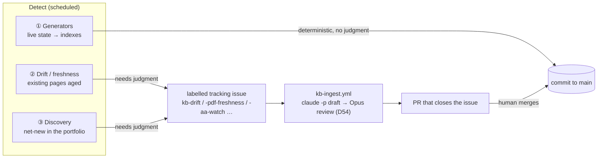

# Automation — how the KB keeps itself current

The KB maintains itself on three axes. The rule: **deterministic regeneration auto-commits; anything
needing judgment is detected, then Claude drafts the fix on the Max plan and opens a PR / issue for
human review.** Claude never writes to `main` directly. All the moving parts live in `scripts/` and
`.github/workflows/`; this page is the map. (Per-script detail: [`scripts/README.md`](../scripts/README.md).)

## The three axes

### 1. Generators — deterministic, auto-commit
Pure functions of live state; no judgment, so they regenerate and commit straight to `main`.

| What | Script | Workflow | Cadence |
|---|---|---|---|
| Postgres schema snapshots (+ dep graph) | `gen_db_schema.py`, `gen_dependency_graph.py` | `db-schema.yml` | daily |
| Pipeline registry + health | `gen_pipeline_registry.py` | `pipeline-registry.yml` ⏸ | (local runner) |
| Framework PDF text + visual captions | `gen_framework_extracts.py`, `gen_framework_captions.py` | `framework-sync.yml` | weekly |
| Catalog, framework READMEs, public site, **doc counts** | `gen_catalog.py`, `gen_framework_readmes.py`, `gen_public_site.py`, `gen_doc_counts.py` | `refresh-site.yml` | monthly |
| Public AA map + catalog (served fresh) | `gen_public_site.py`, `gen_aa_site.py`, `gen_catalog.py` | `site.yml` (regen-at-deploy) | every push to main |
| Public AA trigger-stats page (DB-backed) | `gen_trigger_performance.py`, `gen_trigger_site.py` | `trigger-stats.yml` | daily + on framework edits |
| Spoke-repo registry | `gen_spoke_repos.py` | (local) | on demand |

`gen_doc_counts.py` injects the live corpus counts into the ROADMAP `<!-- COUNTS -->` block so the meta-docs never hand-type a number that can rot. The **public AA site auto-tracks the KB**: `site.yml` regenerates the no-DB artifacts (map, shells, catalog) on every deploy, and `trigger-stats.yml` regenerates the DB-backed stats page daily + on framework edits (then commits → deploy).

### 2. Drift / freshness — watch what's *already* in the KB
Detect staleness in existing pages; **never auto-fix**. Each maintains a labelled tracking issue and,
where a clean fix exists, dispatches the **detect→fix→PR loop** (below).

| Axis | Script | Workflow | Issue | Fix |
|---|---|---|---|---|
| **Code** drift (spoke moved) | `check_drift.py` | `drift-check.yml` (daily) | `kb-drift` | re-ingest stale page → PR |
| **Doc** freshness (PDF aging/newer) | `check_pdf_freshness.py` | `pdf-freshness.yml` (weekly) | `kb-pdf-freshness` | re-ingest framework → PR |
| **Estate** drift (Azure/dbx changed) | `check_infra_drift.py` | `infra-drift.yml` ⏸ (daily) | `kb-infra-drift` | draft page for new app → PR |
| **Meta-doc** drift (counts / refs / links) | `check_docs.py` · `mkdocs --strict` (links) | `check-docs.yml` (weekly) · `lint-docs.yml` (push/PR) | `kb-docs` | run `gen_doc_counts.py` / fix ref; prose staleness → `docs-audit.yml` |
| **Framework validity** (endorsed but past `valid_until`) | `check_validity.py` | `validity-check.yml` (push to `frameworks/**` + weekly) | `kb-validity` | review the framework → renew / supersede / retire, or fill `valid_until` |

The **meta-docs maintain themselves on the same three axes** as the content: counts are *generated* (`gen_doc_counts.py`), mechanical rot is *detected* (`check_docs.py` + the `mkdocs --strict` link check in `lint-docs.yml`), and *judgment* staleness — shipped phases still marked todo, resolved open-questions, superseded rationale — is fixed by a monthly headless-Claude pass (`docs-audit.yml`) that opens a `kb-docs` PR. The DESIGN decision log stays append-only.

### 3. Discovery — find net-new things to ingest
Watch the *outside* (the org, the OCHA AA portfolio) for things the KB doesn't have yet.

| What | Script | Workflow | Issue |
|---|---|---|---|
| New/removed **ocha-dap repos** | `check_new_repos.py` | `discover-repos.yml` (weekly) | `kb-new-repos` |
| **Existing** un-ingested in-scope repos (backfill) | `check_coverage.py` | (on demand) | `kb-coverage` |
| **OCHA/CERF AA frameworks + activations** (full portfolio, any age) + **missing older versions** of held frameworks | `aa_watch.py` | `aa-watch.yml` (weekly) | `kb-aa-watch` |
| **Backlog fill** — drains the framework wishlist into kb-ingest, trickled | `drain_aa_backlog.py` | `aa-backlog-fill.yml` (weekly) | (commits the queue) |

The **framework-ingest backlog** (`infrastructure/.aa-backlog.json`) is a queue of frameworks / older
versions to ingest later (e.g. Nepal/Philippines/Bangladesh older versions found by `aa-watch`).
`aa-backlog-fill.yml` dispatches a few per run via `kb-ingest` and removes them from the file, so the
list drains to empty over weeks without re-dispatching. Add entries by hand or promote them from the
`kb-aa-watch` issue.

The two framework-coverage tools are complementary: `check_coverage.py` is **repo-based** (a framework
with a `ds-aa-*` repo and no page); `aa_watch.py` is **portfolio-based** (a framework that exists on the
OCHA/CERF site with *no repo at all* — e.g. the 2020–21 CERF pilots). Somalia drought is the canonical
example only the portfolio axis can catch.

## The detect→fix→PR loop

The shared "fix" half of every drift axis is **`.github/workflows/kb-ingest.yml`** → headless
`claude -p` on the **Max plan** (`CLAUDE_CODE_OAUTH_TOKEN`, same mechanism as the framework captions).
**Two-model split:** the **draft** runs on **Sonnet** (cheaper bulk writing — the `MODEL` input, default
`sonnet`); the **Opus review** that follows is **always Opus** regardless of the draft model. So every
ingest is *Sonnet draft → Opus review → PR for human check*. The draft scripts:

- `ingest_system.py` — draft a NEW app/pipeline page, or re-ingest a STALE one in place (`--page`).
- `ingest_framework.py` — re-draft a framework version from its PDF extract (authority) + code.
- `ingest_framework_web.py` — draft a **repo-less** framework page from public OCHA/CERF sources via
  Claude **WebSearch** (the comprehensiveness path for historical pilots — Somalia drought etc.).
  Dispatch: `kb-ingest.yml -f kind=framework -f country=SOM -f hazard=drought [-f doc=<url>]`.
- `ingest_review.py` — the **Opus QA gate**: review the just-drafted page(s) in the working tree against
  the template + public sources, fix in place, and emit the review summary for the PR body. Runs in
  `kb-ingest.yml` between the draft and PR steps; not a detector.
- `aa_watch.py` — Claude **WebFetch + WebSearch** discovery (frameworks/activations/older-versions we
  lack), **grounded on a deterministic backbone**: it fetches the authoritative CERF AA portfolio
  sources (`CERF_SOURCES` — the portal + portfolio-update PDF) and enumerates from those (with CERF's
  published ~19–20-framework count as a completeness check), not free search from memory.

Each detector **emits** the affected items (`--emit-stale` / `--emit-due` / `--emit-new-apps`) and
dispatches `kb-ingest`, which **drafts → Opus-reviews → opens a PR** that **closes the tracking issue**
on merge. The Opus pre-review (`ingest_review.py`) restores the interactive ingest's QA gate: after the
draft is written but **before** the PR opens, a second headless `claude -p` (Opus, `--allowedTools
WebSearch Read Edit`) verifies the page against the template + public sources, **fixes it in place**,
and writes a review summary that is folded into the PR body. So the PR arrives **pre-reviewed** — the
human reviewer reads that summary, spot-checks, and merges (kept "as simple as possible for human
review"). If the review step fails it warns and opens the PR with the unreviewed draft rather than
dropping the work. Two further safeties: the loops **trickle** (cap re-ingests/run — drift 6, freshness
4) and **dedup** (skip a page that already has an open `kb-ingest` PR). `kb-ingest.yml` never runs on
`pull_request` (keeps the Max token off fork PRs).

## The issue janitor — any issue → fix → PR

`kb-ingest` fixes the *detectors'* findings with fixed parameters. The **issue janitor**
(`.github/workflows/issue-janitor.yml` + `scripts/resolve_issue.py`) generalises that to **any
eligible open issue**: it reads the issue **and its full comment thread** and lets headless Claude
(Max plan) draft a fix → a PR that **Closes #N**. So people (and the detectors) can just *file issues*
and they get cleaned up; **comment the authoritative answer on an issue and the next run applies it**
(the thread is fed to Claude, and each issue's PR branch `kb-autofix/issue-<N>` is force-updated).

- **Eligible** = open issues labelled `kb-autofix` / `kb-feedback` / any `kb-*` detector label; skipped
  if `wontfix` / `no-autofix`. Runs: **daily sweep** (caps re-runs/run; skips issues that already have an
  open autofix PR), **manual** (one issue or a sweep), **a maintainer comment** on an eligible issue
  (re-runs it — the comment→correction path; gated to OWNER/MEMBER/COLLABORATOR, never the bot), and the
  **`kb-autofix` label** being added.
- **Safety:** verify-before-edit (no source / no maintainer decision ⇒ it makes **no** change and leaves
  the issue for a human, with a one-time note on explicit requests); never fabricates facts; never
  auto-merges (the PR is the human gate); never runs on `pull_request`.

## Verify before you ingest (discovery output ≠ fact)

Discovery (`aa-watch`, the CERF backbone, the sweeps) emits **candidates, not facts**. Before a
candidate is added to `.aa-backlog.json` or sent through `kb-ingest`, confirm **OCHA/CERF ownership**
(CERF pre-arranged financing + a CERF/OCHA source). Out of scope even when OCHA-CHD does supporting
work: **IFRC/Red Cross EAPs**, **FAO/WFP/government** early action, and **plain CERF allocations**
(rapid-response/underfunded/top-ups). `aa_watch.py` enforces this with an ownership gate and names
Kenya (an IFRC EAP) + Timor-Leste (a CERF top-up) as negative examples — but the gate is a filter, not
a guarantee: a human still verifies on the review PR. (Real misses: a CERF Timor-Leste top-up got
queued as a "framework"; the Kenya page long credited the IFRC EAP's activation to OCHA — see
[DESIGN D53](../docs/DESIGN.md).)

## Scope — comprehensive of the OCHA AA portfolio

The KB aims to be **as comprehensive as possible of the OCHA/CERF anticipatory-action portfolio — not
only the frameworks the DS team built.** Historical pilots (the 2020–21 cohort: Somalia drought, South
Sudan flood, Madagascar plague, Malawi dry spells, …) and frameworks with **no DS repo and no modern
published doc** are still in scope; they are drafted from public OCHA/CERF sources via the web-research
path. There is therefore **no out-of-scope ignore-list** on `aa-watch` — it reconciles the whole
portfolio every run. (See [INGESTION.md](../docs/INGESTION.md) for the framework-page rule.)

## Running it / secrets

- **CI dormancy:** `pipeline-registry.yml` and `infra-drift.yml` are ⏸ until their secrets exist; until
  then [`scripts/run_local_updaters.sh`](../scripts/run_local_updaters.sh) runs them from a local
  checkout (launchd agent, daily) on local `az`/`databricks` auth. See [local-updaters in
  scripts/README](../scripts/README.md#local-updaters-scheduled-on-your-machine--for-the-dormant-ci-workflows).
- **Secrets:** `CLAUDE_CODE_OAUTH_TOKEN` (set — the Max-plan token) powers every Claude path.
  `INGEST_GH_PAT` / `DISCOVER_GH_PAT` (org `repo:read`, not yet set) let the fix loop clone PRIVATE
  spokes and the sweep see PRIVATE repos; without them those halves degrade safely (public-only). The
  same PAT would also close the `check_drift.py` private-spoke blind spot.

## Issue labels (one per signal)
`kb-drift` · `kb-pdf-freshness` · `kb-infra-drift` · `kb-new-repos` · `kb-coverage` · `kb-aa-watch` ·
`kb-docs` (meta-doc drift / audit) · `kb-validity` (frameworks past validity) · `kb-ingest` (the review PRs) ·
`kb-autofix` (issue-janitor fix PRs).
