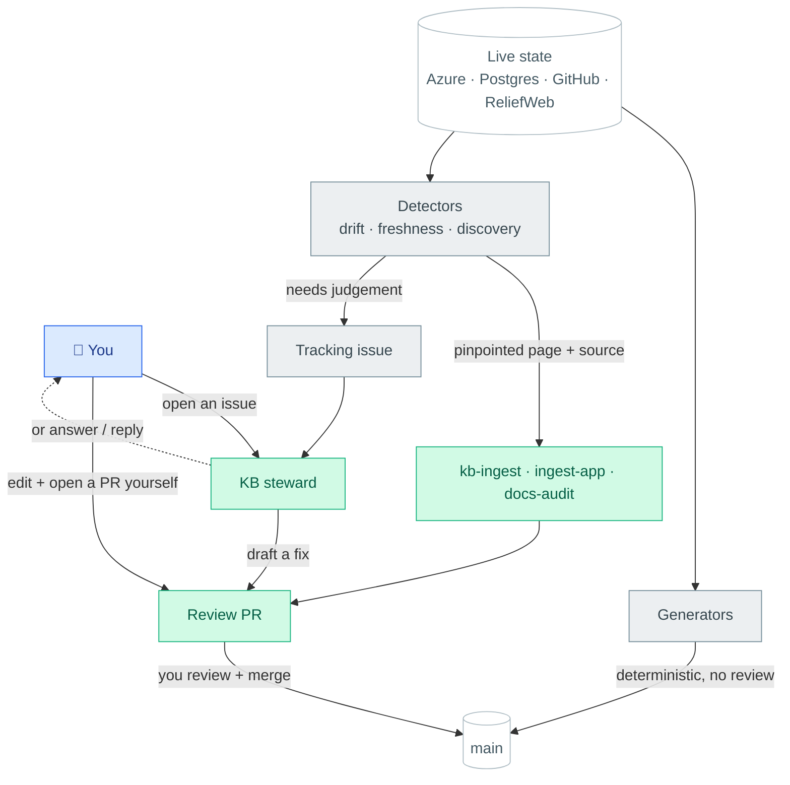

# How the KB changes — human + automated

Everything in this knowledge base is created or changed by one of the paths below, and **almost all of
them end in a human-reviewed PR.** The one exception is deterministic generators — pure functions of
live state — which commit straight to `main`. **Claude never writes to `main` directly**, and **nothing
auto-merges.** This page is the map of every path, every automation, and its schedule; per-script detail
is in [`scripts/README.md`](../scripts/README.md).

**Two ways in:**

- **A person.** *Easiest:* open an issue saying what you want changed or added — the **KB steward** (below) drafts it as a PR (or comments asking). *Or:* edit a page and open a PR yourself. Either way you review and merge.
- **The machine.** Scheduled jobs watch live state (Azure, Postgres, GitHub, ReliefWeb) and either **regenerate** indexes deterministically (→ straight to `main`) or **detect** drift / net-new material and **draft** a fix for review — via `kb-ingest` (a pinpointed page) or a tracking issue the steward picks up.

Colour = **who acts**: 🟦 **you** · 🟩 the **steward** bot (`chd-ds-kb-bot`) · ⬜ **mechanical CI**
(`github-actions[bot]`) · ⬜ white = shared state (`main`, live sources). Nothing green reaches `main`
without you merging; only grey commits directly (deterministic, no judgement).

## Who does what — the three actors

Three identities touch this repo. The **colour/identity tells you whether something wants your attention**
and **what it's even able to do**:

| Colour · Actor | Identity | Does | Can touch — permissions & reach |
|---|---|---|---|
| 🟩 **The steward** | `chd-ds-kb-bot[bot]` — a **GitHub App** (own avatar, no seat) | the judgement work: issue fixes, ingests, the monthly doc audit; **answers questions** on issues | **This repo only.** Contents R/W · Pull requests R/W · Issues R/W. **No** `workflows` permission (can't change CI), **no** reach to any other repo, and **never writes to `main`** — only opens PRs you merge. Its Claude subprocess runs with GitHub tokens **scrubbed**, so it can't push directly or exfiltrate one. |
| ⬜ **Mechanical CI** | `github-actions[bot]` — the built-in `GITHUB_TOKEN` | deterministic regenerations (schema, catalog, site, counts) + raises detector *flag* issues | **This repo only**, per-workflow least-privilege: Contents write (commits to `main`), Issues write, and Actions write on the 3 detectors that dispatch `kb-ingest`. No LLM judgement — pure functions of live state. |
| 🟦 **You** | your GitHub account | decide, review, merge; direct edits via Claude Code on your machine | **Owner** — full access. The **only** actor that **merges** a PR. Claude Code on your laptop has *your* local access; the bots run in GitHub Actions and can't see it. |

The line between the two bots is the one the whole system runs on: **needs judgement → the steward drafts a
PR (or answers); purely mechanical → CI does it directly.** So there's never a bot change on `main` you
didn't either merge or set up as a deterministic generator. The steward's PRs, comments, **and the commits
inside them** are all attributed to `chd-ds-kb-bot` (the commit-author email carries the bot's user id), so
it reads as one identity throughout.

## Every automation at a glance

Every scheduled/triggered workflow, what it does, and when it runs. Times are UTC. **Bold** = it can open
a PR or a tracking issue; the rest just commit generated output or run checks.

| Workflow | What it does | When |
|---|---|---|
| `db-schema.yml` | Postgres schema snapshots + dependency graph → `main` | daily 06:41 |
| `pipeline-registry.yml` | pipeline registry + live health → `main` | daily 06:47 (local runner ⏸) |
| `trigger-stats.yml` | regenerate the public AA trigger-stats page | daily 07:11 + on framework edits |
| `framework-sync.yml` | framework PDF text + visual captions | weekly |
| `refresh-site.yml` | catalog, framework READMEs, public site, doc counts → `main` | monthly (1st) 06:00 |
| `site.yml` | rebuild + deploy the public AA site/map | every push to `main` |
| **`drift-check.yml`** | spoke moved/renamed → dispatches `kb-ingest` re-sync | daily 07:17 |
| **`infra-drift.yml`** | new/changed Azure app → dispatches `kb-ingest` | daily 07:37 |
| **`pdf-freshness.yml`** | a framework PDF may have a newer version → `kb-ingest` | weekly (Mon 07:23) |
| **`validity-check.yml`** | framework past its validity → `kb-validity` issue | weekly (Mon 06:00) + push |
| **`discover-repos.yml`** | new `ocha-dap` repos to triage → `kb-new-repos` issue | weekly (Mon 07:27) |
| **`aa-watch.yml`** | new frameworks/activations in the portfolio → `kb-aa-watch` issue | weekly (Mon 07:33) |
| **`aa-backlog-fill.yml`** | drains the verified AA backlog → dispatches `kb-ingest` | weekly (Mon 07:43) |
| **`check-docs.yml`** | mechanical meta-doc rot → `kb-docs` issue | weekly (Mon 07:23) + push |
| **`docs-audit.yml`** | judgment meta-doc staleness (Claude pass) → PR/issue | monthly (1st) 06:00 |
| `lint-docs.yml` | `mkdocs build --strict` link check on PRs | push + pull_request |
| **`kb-ingest.yml`** | draft/re-draft a page (Sonnet → Opus review) → PR | dispatch only (by the detectors) |
| **`ingest-app.yml`** | draft an app page → PR | dispatch only |
| **`kb-steward.yml`** | the front door: any issue → fix/ask → PR | issue open/comment · daily 05:00 sweep · manual |

## The three axes

### 1. Generators — deterministic, auto-commit
Pure functions of live state; no judgment, so they regenerate and commit straight to `main`.

| What | Script | Workflow | Cadence |
|---|---|---|---|
| Postgres schema snapshots (+ dep graph) | `gen_db_schema.py`, `gen_dependency_graph.py` | `db-schema.yml` | daily |
| Pipeline registry + health | `gen_pipeline_registry.py` | `pipeline-registry.yml` ⏸ | (local runner) |
| Framework PDF text + visual captions | `gen_framework_extracts.py`, `gen_framework_captions.py` | `framework-sync.yml` | weekly |
| Catalog, framework READMEs, public site, **doc counts** | `gen_catalog.py`, `gen_framework_readmes.py`, `gen_public_site.py`, `gen_doc_counts.py` | `refresh-site.yml` | monthly |
| Public AA map + catalog (served fresh) | `gen_public_site.py`, `gen_aa_site.py`, `gen_catalog.py` | `site.yml` (regen-at-deploy) | every push to main |
| Public AA trigger-stats page (DB-backed) | `gen_trigger_performance.py`, `gen_trigger_site.py` | `trigger-stats.yml` | daily + on framework edits |
| Spoke-repo registry | `gen_spoke_repos.py` | (local) | on demand |

`gen_doc_counts.py` injects the live corpus counts into the ROADMAP `<!-- COUNTS -->` block so the meta-docs never hand-type a number that can rot. The **public AA site auto-tracks the KB**: `site.yml` regenerates the no-DB artifacts (map, shells, catalog) on every deploy, and `trigger-stats.yml` regenerates the DB-backed stats page daily + on framework edits (then commits → deploy).

### 2. Drift / freshness — watch what's *already* in the KB
Detect staleness in existing pages; **never auto-fix**. Each maintains a labelled tracking issue and,
where a clean fix exists, dispatches the **detect→fix→PR loop** (below).

| Axis | Script | Workflow | Issue | Fix |
|---|---|---|---|---|
| **Code** drift (spoke moved) | `check_drift.py` | `drift-check.yml` (daily) | `kb-drift` | re-ingest stale page → PR |
| **Doc** freshness (PDF aging/newer) | `check_pdf_freshness.py` | `pdf-freshness.yml` (weekly) | `kb-pdf-freshness` | re-ingest framework → PR |
| **Estate** drift (Azure/dbx changed) | `check_infra_drift.py` | `infra-drift.yml` ⏸ (daily) | `kb-infra-drift` | draft page for new app → PR |
| **Meta-doc** drift (counts / refs / links) | `check_docs.py` · `mkdocs --strict` (links) | `check-docs.yml` (weekly) · `lint-docs.yml` (push/PR) | `kb-docs` | run `gen_doc_counts.py` / fix ref; prose staleness → `docs-audit.yml` |
| **Framework validity** (endorsed but past `valid_until`) | `check_validity.py` | `validity-check.yml` (push to `frameworks/**` + weekly) | `kb-validity` | review the framework → renew / supersede / retire, or fill `valid_until` |

The **meta-docs maintain themselves on the same three axes** as the content: counts are *generated* (`gen_doc_counts.py`), mechanical rot is *detected* (`check_docs.py` + the `mkdocs --strict` link check in `lint-docs.yml`), and *judgment* staleness — shipped phases still marked todo, resolved open-questions, superseded rationale — is fixed by a monthly headless-Claude pass (`docs-audit.yml`) that opens a `kb-docs` PR. The DESIGN decision log stays append-only.

### 3. Discovery — find net-new things to ingest
Watch the *outside* (the org, the OCHA AA portfolio) for things the KB doesn't have yet.

| What | Script | Workflow | Issue |
|---|---|---|---|
| New/removed **ocha-dap repos** | `check_new_repos.py` | `discover-repos.yml` (weekly) | `kb-new-repos` |
| **Existing** un-ingested in-scope repos (backfill) | `check_coverage.py` | (on demand) | `kb-coverage` |
| **OCHA/CERF AA frameworks + activations** (full portfolio, any age) + **missing older versions** of held frameworks | `aa_watch.py` | `aa-watch.yml` (weekly) | `kb-aa-watch` |
| **Backlog fill** — drains the framework wishlist into kb-ingest, trickled | `drain_aa_backlog.py` | `aa-backlog-fill.yml` (weekly) | (commits the queue) |

The **framework-ingest backlog** (`infrastructure/.aa-backlog.json`) is a queue of frameworks / older
versions to ingest later (e.g. Nepal/Philippines/Bangladesh older versions found by `aa-watch`).
`aa-backlog-fill.yml` dispatches a few per run via `kb-ingest` and removes them from the file, so the
list drains to empty over weeks without re-dispatching. Add entries by hand or promote them from the
`kb-aa-watch` issue.

The two framework-coverage tools are complementary: `check_coverage.py` is **repo-based** (a framework
with a `ds-aa-*` repo and no page); `aa_watch.py` is **portfolio-based** (a framework that exists on the
OCHA/CERF site with *no repo at all* — e.g. the 2020–21 CERF pilots). Somalia drought is the canonical
example only the portfolio axis can catch.

## The detect→fix→PR loop

The shared "fix" half of every drift axis is **`.github/workflows/kb-ingest.yml`** → headless
`claude -p` on the **Max plan** (`CLAUDE_CODE_OAUTH_TOKEN`, same mechanism as the framework captions).
**Two-model split:** the **draft** runs on **Sonnet** (cheaper bulk writing — the `MODEL` input, default
`sonnet`); the **Opus review** that follows is **always Opus** regardless of the draft model. So every
ingest is *Sonnet draft → Opus review → PR for human check*. The draft scripts:

- `ingest_system.py` — draft a NEW app/pipeline page, or re-ingest a STALE one in place (`--page`).
- `ingest_framework.py` — re-draft a framework version from its PDF extract (authority) + code.
- `ingest_framework_web.py` — draft a **repo-less** framework page from public OCHA/CERF sources via
  Claude **WebSearch** (the comprehensiveness path for historical pilots — Somalia drought etc.).
  Dispatch: `kb-ingest.yml -f kind=framework -f country=SOM -f hazard=drought [-f doc=<url>]`.
- `ingest_review.py` — the **Opus QA gate**: review the just-drafted page(s) in the working tree against
  the template + public sources, fix in place, and emit the review summary for the PR body. Runs in
  `kb-ingest.yml` between the draft and PR steps; not a detector.
- `aa_watch.py` — Claude **WebFetch + WebSearch** discovery (frameworks/activations/older-versions we
  lack), **grounded on a deterministic backbone**: it fetches the authoritative CERF AA portfolio
  sources (`CERF_SOURCES` — the portal + portfolio-update PDF) and enumerates from those (with CERF's
  published ~19–20-framework count as a completeness check), not free search from memory.

Each detector **emits** the affected items (`--emit-stale` / `--emit-due` / `--emit-new-apps`) and
dispatches `kb-ingest`, which **drafts → Opus-reviews → opens a PR** that **closes the tracking issue**
on merge. The Opus pre-review (`ingest_review.py`) restores the interactive ingest's QA gate: after the
draft is written but **before** the PR opens, a second headless `claude -p` (Opus, `--allowedTools
WebSearch Read Edit`) verifies the page against the template + public sources, **fixes it in place**,
and writes a review summary that is folded into the PR body. So the PR arrives **pre-reviewed** — the
human reviewer reads that summary, spot-checks, and merges (kept "as simple as possible for human
review"). If the review step fails it warns and opens the PR with the unreviewed draft rather than
dropping the work. Two further safeties: the loops **trickle** (cap re-ingests/run — drift 6, freshness
4) and **dedup** (skip a page that already has an open `kb-ingest` PR). `kb-ingest.yml` never runs on
`pull_request` (keeps the Max token off fork PRs).

## The KB steward — the single human front door (any issue → fix/ask → PR)

`kb-ingest` fixes the *detectors'* pinpointed findings with fixed parameters. The **KB steward**
(`.github/workflows/kb-steward.yml` + `scripts/resolve_issue.py` + `scripts/kb_steward_prompt.md`) is
the **team's one entry point** and the resolver for judgment-shaped automated issues: it reads an issue
**and its full comment thread** and lets headless Claude (Max plan) either draft the change → a PR that
**Closes #N**, or — when it lacks a source/decision — **comment asking for it**. So anyone can just
*open an issue* describing what they want changed/added; **comment the authoritative answer or decision
and the next run applies it** (the thread is fed to Claude, and each issue's PR branch
`kb-autofix/issue-<N>` is force-updated). For a "build a whole new page" request the steward **delegates
to the structured `ingest_*.py` scripts** rather than hand-writing the page, so it keeps the template +
source-grounding + review.

- **In scope** (no label needed) = **any issue opened/commented by a team member** (write/admin — the
  human front door), plus automated issues that need judgment: `kb-feedback`, `kb-validity`, `kb-docs`,
  `kb-new-repos`, `kb-coverage`, `kb-aa-watch`, and the `kb-autofix` label. **Opted out** by `discuss` /
  `no-autofix` / `wontfix` (pure discussion). **Deliberately NOT here:** the deterministic re-syncs
  `kb-drift` / `kb-pdf-freshness` / `kb-infra-drift` — those go straight to a `kb-ingest` PR (no issue),
  so the steward never races them. Runs: **issue opened/labelled**, **a maintainer comment** (re-runs it
  — the comment→correction path; gated to OWNER/MEMBER/COLLABORATOR, never the bot), **daily sweep** (caps
  re-runs/run; skips issues that already have an open autofix PR), and **manual**.
- **Safety:** verify-before-edit (no source / no maintainer decision ⇒ it makes **no** change and leaves
  the issue for a human, with a one-time note on explicit requests); never fabricates facts; never
  auto-merges (the PR is the human gate); never runs on `pull_request`.
- **Security** (issue text is partly untrusted input to an LLM agent with Bash + web — D57): **trust
  gate** (engages only on a maintainer comment, a manual dispatch, or an `issues` event whose author is a
  team member or our automation bot — a public feedback issue needs a maintainer to vouch first);
  **least privilege** (only the repo-scoped App token — no personal PAT, no cross-repo reach, no
  `workflows` permission); **credential isolation** (`resolve_issue.py` scrubs every GH token from the
  Claude subprocess and the checkout uses `persist-credentials: false`, so an injected agent can't read a
  write token); **blast radius** (edits under `.github/` and `scripts/` are reverted before the PR; the
  prompt itself instructs refuse-and-no-op on any exfiltration/CI/secret request). Residual: Claude still
  holds `CLAUDE_CODE_OAUTH_TOKEN` (it needs it to run) — that's Max-plan API access only, rotatable.

### What the steward can — and can't — do

**It is a *proposer*, never a committer.** Its only power over the live KB is to open a PR; a human
merges (or doesn't). So the real question is *what can it put in a PR* — and that's deliberately bounded:

**Can:** make **small, corrective content edits** — fix a fact, add/adjust a page, reconcile a
discrepancy, update prose — always cited to a source or a maintainer's decision. For a genuine "build a
new page" request it delegates to the structured `ingest_*.py` (template + grounding). Every such change
is one reviewable PR.

**Can't (hard limits, enforced in the workflow — not just asked of the model):**

- **Change anything live on its own** — no direct writes to `main`, no auto-merge. Ever.
- **Erase or restructure the KB.** A draft that **deletes or renames any file**, or touches **more than
  ~25 files**, is *automatically discarded* and handed to a human (`MAX_FILES`). So "please delete all
  the framework pages" or "reorganise the repo" produces **no PR** — it comments that a maintainer must
  do it by hand. Big/structural moves are a human's call by construction.
- **Touch CI or its own machinery.** Any edit under `.github/` or `scripts/` is reverted before the PR
  (and the repo-scoped App token can't push workflow changes anyway).
- **Reach outside this repo, or read secrets / your machine.** It runs in GitHub Actions over a checkout
  of *only this repo*, with GH tokens scrubbed from its environment — it cannot see other repositories,
  production systems, or anyone's local files/Claude history (those never leave your laptop).
- **Act on an untrusted trigger.** Only a team member's issue/comment (or our own automation) engages it;
  a stranger's issue waits for a maintainer to vouch.

In short: it can *propose* small, sourced content fixes; it **cannot** delete pages, restructure the KB,
change automation, escape the repo, or ship anything without a human merge.

## Verify before you ingest (discovery output ≠ fact)

Discovery (`aa-watch`, the CERF backbone, the sweeps) emits **candidates, not facts**. Before a
candidate is added to `.aa-backlog.json` or sent through `kb-ingest`, confirm **OCHA/CERF ownership**
(CERF pre-arranged financing + a CERF/OCHA source). Out of scope even when OCHA-CHD does supporting
work: **IFRC/Red Cross EAPs**, **FAO/WFP/government** early action, and **plain CERF allocations**
(rapid-response/underfunded/top-ups). `aa_watch.py` enforces this with an ownership gate and names
Kenya (an IFRC EAP) + Timor-Leste (a CERF top-up) as negative examples — but the gate is a filter, not
a guarantee: a human still verifies on the review PR. (Real misses: a CERF Timor-Leste top-up got
queued as a "framework"; the Kenya page long credited the IFRC EAP's activation to OCHA — see
[DESIGN D53](../docs/DESIGN.md).)

## Scope — comprehensive of the OCHA AA portfolio

The KB aims to be **as comprehensive as possible of the OCHA/CERF anticipatory-action portfolio — not
only the frameworks the DS team built.** Historical pilots (the 2020–21 cohort: Somalia drought, South
Sudan flood, Madagascar plague, Malawi dry spells, …) and frameworks with **no DS repo and no modern
published doc** are still in scope; they are drafted from public OCHA/CERF sources via the web-research
path. There is therefore **no out-of-scope ignore-list** on `aa-watch` — it reconciles the whole
portfolio every run. (See [INGESTION.md](../docs/INGESTION.md) for the framework-page rule.)

## Running it / secrets

- **CI dormancy:** `pipeline-registry.yml` and `infra-drift.yml` are ⏸ until their secrets exist; until
  then [`scripts/run_local_updaters.sh`](../scripts/run_local_updaters.sh) runs them from a local
  checkout (launchd agent, daily) on local `az`/`databricks` auth. See [local-updaters in
  scripts/README](../scripts/README.md#local-updaters-scheduled-on-your-machine--for-the-dormant-ci-workflows).
- **Secrets:** `CLAUDE_CODE_OAUTH_TOKEN` (set — the Max-plan token) powers every Claude path.
- **Who opens the auto-draft PRs (and why CI runs without "Approve and run").** A PR opened by the
  default `GITHUB_TOKEN` **cannot trigger workflows** (GitHub's anti-recursion rule), so its `lint-docs`
  **build-strict** check would sit in *action_required* until a maintainer clicks **"Approve and run"**.
  The three PR-opening workflows (`kb-ingest.yml`, `ingest-app.yml`, `kb-steward.yml`) therefore push
  the branch + open the PR with a **non-default identity**, picked in this order of preference:
  1. **GitHub App token** — `KB_BOT_APP_ID` + `KB_BOT_APP_PRIVATE_KEY` (the **chd-ds-kb-bot** App, id 4185926,
     installed on this repo only). Each run mints a short-lived installation token via
     `actions/create-github-app-token`. PRs open as **`chd-ds-kb-bot[bot]`** (a true automation identity, no
     GitHub seat) **and** trigger CI. **This is the live setup** (both secrets are set).
     App permissions needed: **Contents R/W**, **Pull requests R/W**, **Issues R/W** (the steward reads/
     comments/labels issues), **Metadata R**; install it on this repo.
  2. **`INGEST_GH_PAT`** (set — a classic `repo`+`workflow` PAT, owner `t-downing`) — fallback if the App
     secrets are absent. Triggers CI, but PRs are attributed to the **user**, not a bot. This PAT also
     (a) lets the fix loop clone **PRIVATE** spokes, (b) lets the sweep see private repos, and (c) closes
     the `check_drift.py` private-spoke blind spot — so keep it even once the App is in place.
  3. **`GITHUB_TOKEN`** — final fallback; PR is `github-actions[bot]` but CI needs manual approval.
  `DISCOVER_GH_PAT` (org `repo:read`) is the same idea for the discovery sweep's private-repo visibility.

## Issue labels (one per signal)
`kb-drift` · `kb-pdf-freshness` · `kb-infra-drift` · `kb-new-repos` · `kb-coverage` · `kb-aa-watch` ·
`kb-docs` (meta-doc drift / audit) · `kb-validity` (frameworks past validity) · `kb-ingest` (the review PRs) ·
`kb-autofix` (KB-steward fix PRs) · `discuss` (opt an issue OUT of the steward).
