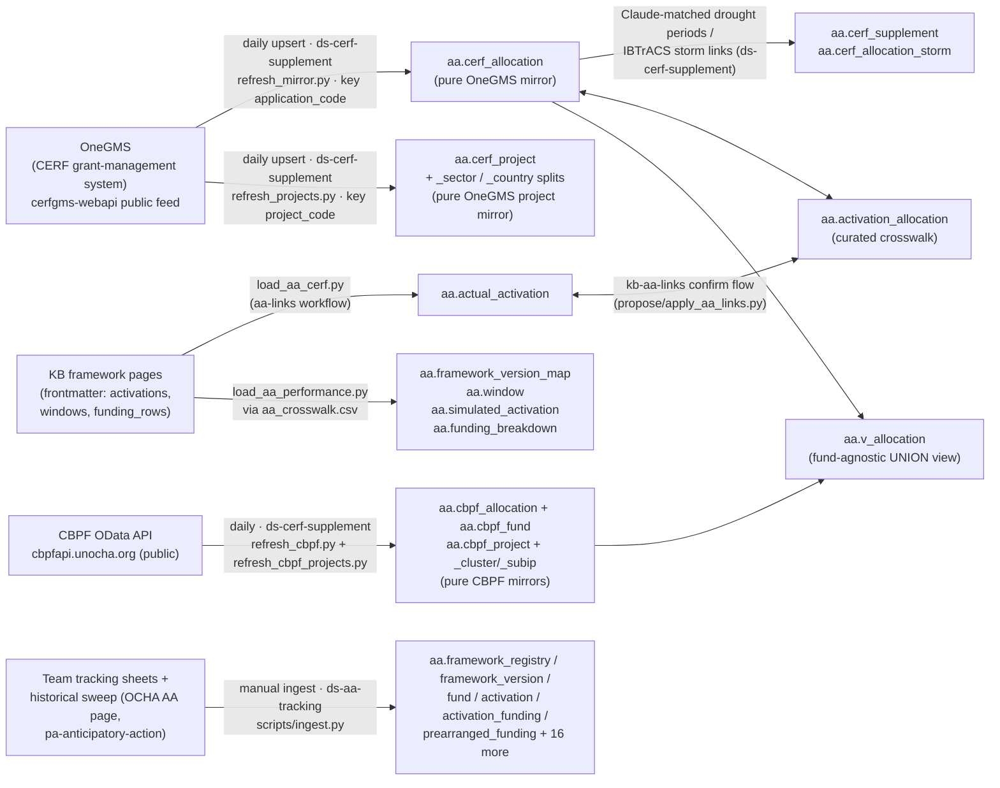
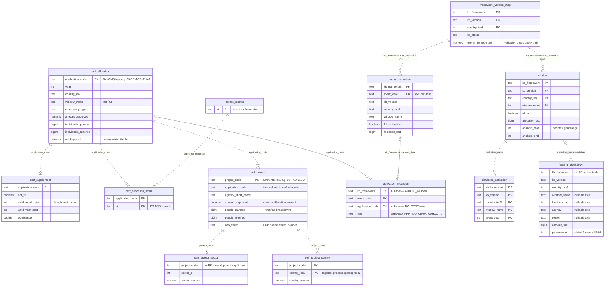
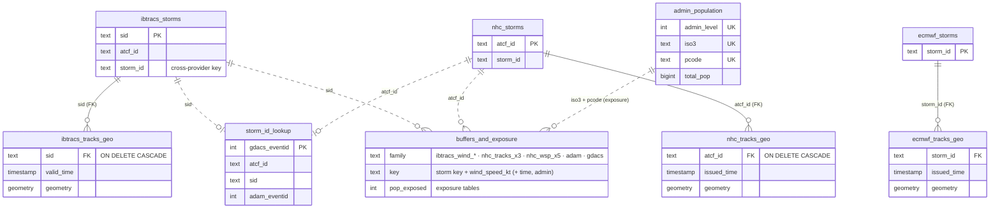

# Database ER diagrams

Relational maps of the two schemas in the DB that actually *are* relational — **`aa`**
and **`storms`** — including the join edges the DB doesn't declare. The generated
[db-schema-dev.md](db-schema-dev.md) / [db-schema.md](db-schema.md) snapshots have the
complete column lists; this page adds the **relationships, provenance, and the
constraint story**. Hand-curated (the interesting edges are join-by-convention, so no
generator can introspect them); verified against live dev-DB `pg_constraint` /
`pg_indexes` introspection on 2026-08-03.

**Legend:** solid line = **declared foreign key** (DB-enforced); dashed line =
**join-by-convention** (same key, no constraint). The other schemas (`public`, `app`,
`hpc`, `ipc`, `pop`, `projects`) are flat fact/stats tables keyed by
`(iso3, pcode, valid_date, …)` with no inter-table structure — nothing to diagram
(see [the note at the end](#the-other-schemas-deliberately-not-relational)).

## `aa` — the AA portfolio & CERF funding schema (dev only)

Three writers meet in this schema (strict single-writer-per-table): the **OneGMS
mirrors** (CERF feed + CBPF OData API, `ds-cerf-supplement`), the **KB framework
pages** (loaded from frontmatter, this repo), and since 2026-08 the **AA
portfolio-tracking system** (`ds-aa-tracking` — 22 tables seeded from the team's
tracking spreadsheets + a historical sweep; see
[pipelines/aa-tracking.md](../pipelines/aa-tracking.md)). The curated crosswalk
`activation_allocation` is the hinge joining the KB and mirror sides; the tracking
tables crosswalk to both.

### Provenance — how OneGMS gets in and what joins it

`aa.cerf_allocation` is a **pure mirror** of the OneGMS feed (D83): `ds-cerf-supplement`
is its sole writer, and everything AA-interpretive lives in the tables beside it. See
[datasets/cerf-onegms.md](datasets/cerf-onegms.md) for the feed itself and its gotchas
(key on `application_code`, never `application_id`).

### Entity-relationship diagram

`activation_allocation` is deliberately keyless: its three row kinds carry NULLs a PK
can't hold — *link* rows (both sides set, many-to-many: `SHARED_APP` = several
activations on one application, and e.g. LAC Mar-2026 = one activation on three
applications), `NO_CERF` rows (activation funded outside CERF → `application_code`
NULL), and `ADHOC_AA` rows (AA allocation with no OCHA framework → framework side
NULL). Uniqueness is enforced by a **coalesce expression index** plus two CHECK
constraints on the NULL pattern, and the two declared FKs still guard whichever side
is non-null (D83).

### Views (computed, never stored)

RP / activation probability are **never stored** — computed in views from the raw
facts so there is one source of truth; the gsheet-published figures are kept only as
`*_reported` cross-checks.

| view | computes | from |
|---|---|---|
| `v_window_performance` | per-window n_activations, Weibull return period, activation prob | `window` ⟕ `simulated_activation` |
| `v_framework_performance` | overall RP/prob per (framework, version, country), total budget | `window` + `simulated_activation` |
| `v_funding_by_sector` / `_agency` / `_window` | marginals of the budget cells | `funding_breakdown` |
| `v_activation_funding` | per real activation: linked CERF USD, individuals planned/reached | `actual_activation` ⟕ `activation_allocation` ⟕ `cerf_allocation` |
| `v_aa_allocation` | every AA allocation, framework-linked or ad-hoc | `activation_allocation` ⨝ `cerf_allocation` |
| `v_allocation` | fund-agnostic allocation union (fund_type, allocation_code, amount, is_aa) | `cerf_allocation` ∪ `cbpf_allocation` (owned by ds-cerf-supplement) |
| `v_trk_*` (7 views) | tracking-system reconciliation: framework-current rollup, version attribution/summary, activation reconciliation vs KB, AA-flag + localization checks | ds-aa-tracking tables ⟕ KB/mirror tables |

### The 2026-08 expansion (ds-aa-tracking + CBPF mirrors)

The schema grew from 9 to ~34 tables in Aug 2026: 22 **portfolio-tracking** tables
(`ds-aa-tracking` — registry/version/window-era model: `framework_registry` →
`framework_version` (the unified version registry, one row per **endorsed document**)
→ version-attributed facts (status, funding, coverage, calendar, focal points, report
inclusion) + `fund` / `activation` / `activation_funding` (one activation, N fund
allocations — multi-fund events like Nigeria Sep-2025 CERF+NHF reconcile as one
event)) and 5 **CBPF mirror** tables + `v_allocation`. Diagramming all of them here
would drown the page — the tracking system publishes its own always-current
**crow's-foot ERDs and column-level schema** (plus the target-state roadmap toward
unifying `framework_version_map` into `framework_version`) on its review site
(ocha-dap.github.io/ds-aa-tracking, internal password) and in its repo `DESIGN.md`.
The diagram above remains the KB-side + CERF-mirror core.

### Is `aa` set up properly as a relational database?

Mostly, yes — it's the best-constrained schema we have, and the soft spots are
deliberate trade-offs rather than neglect (audit below covers the original 9-table
core; the ds-aa-tracking tables follow the same conventions — natural keys, UNIQUE
NULLS NOT DISTINCT composites, single writer, full-refresh loads — with their
constraint story in the repo's DESIGN.md):

- **Uniqueness: 8 of 9 tables enforced.** Seven composite/natural PKs, plus the
  crosswalk's expression index. **`funding_breakdown` is the one gap** — no PK or
  unique index; correctness rests on `load_aa_performance.py`'s full-refresh load and
  its load-time cross-check of per-window sums against `window.allocation_usd`. If it
  ever gains incremental writers, add `UNIQUE NULLS NOT DISTINCT (kb_framework,
  kb_version, country_iso3, window_name, fund_source, agency, sector)` (the pattern
  `storms` already uses).
- **FKs: 2 declared, ~7 by convention.** Only the crosswalk edges are DB-enforced.
  The rest are idempotent-upsert loaders from external sources (OneGMS feed, KB
  frontmatter, gsheet crosswalk) where FKs would impose load ordering across
  *separate repos' pipelines* (e.g. `ds-cerf-supplement`'s mirror refresh vs this
  repo's `aa-links` sync) for little gain — referential integrity is instead checked
  at load time (`apply_aa_links.py` validates activation-exists + code-exists +
  country-match before writing). The cheap wins, if wanted: `cerf_supplement` and
  `cerf_allocation_storm` → `cerf_allocation` (same writer owns all three, so no
  ordering risk), and `simulated_activation` → `window` → `framework_version_map`
  (one loader, already writes in that order).
- **Natural text keys, not surrogates — deliberate.** `kb_framework` / `kb_version`
  mirror the KB page slugs (the KB is the source of truth; the DB is a projection of
  frontmatter), and `application_code` is OneGMS's own stable key.
- **Type warts:** `actual_activation.event_date` is `text` and is half the PK — it
  holds frontmatter date strings; fine for joining, but don't date-arithmetic on it
  without casting. `cerf_supplement`'s drought periods are split int month/year
  columns rather than dates.
- **Dev-only, deliberately** — the schema is analysis/curation infrastructure, not a
  prod app dependency (nothing in [pipeline-registry.md](pipeline-registry.md) reads
  it from prod).

## `storms` — storm identity, tracks, and exposure

Hub-and-spoke around three per-provider **identity tables** — `ibtracs_storms`
(`sid`), `nhc_storms` (`atcf_id`), `ecmwf_storms` — sharing a synthetic cross-provider
`storm_id`, with `storm_id_lookup` crosswalking GDACS/ADAM event ids onto them. Track
tables have real FKs (`ON DELETE CASCADE`); the buffer/exposure families dedupe via
composite `UNIQUE` constraints (22 of them) instead of PKs.

`buffers_and_exposure` above is a stand-in for the ~15 derived tables (see
[db-schema-dev.md](db-schema-dev.md) for the full list): the `ibtracs_wind_*` pair,
the three `nhc_tracks_{obsv,fcast,fcastonly}_{buffers,exposure}` sets, the five
`nhc_wsp_*` wind-speed-probability tables, and the ADAM/GDACS exposure +
`*_fm_lookup` admin-matching tables. All key back to their provider's identity table
by convention and dedupe with composite `UNIQUE` (mostly `NULLS NOT DISTINCT`)
constraints.

## The other schemas — deliberately not relational

`public`, `app`, `hpc`, `ipc`, `pop`, and `projects` are **flat fact/stats tables**:
raster zonal stats, HAPI/HPC extracts, and per-project monitoring series, each keyed
by some subset of `(iso3, pcode, adm_level, valid_date, issued_date)` and written by
append/replace pipelines. There are no inter-table joins to draw — the only shared
dimension is the admin geometry in `public.polygon` / `public.iso3`, which everything
joins on `(iso3, pcode)` by convention. Constraint coverage is thin (e.g. `app` and
`projects` have no PKs at all, `public.floodscan`/`era5`/`seas5` dedupe only by
pipeline discipline) — a known pattern, acceptable while each table has exactly one
pipeline writer; see [dependency-graph.md](dependency-graph.md) for who writes what.
