<!-- generated by scripts/gen_dependency_graph.py — declare edges via `depends_on` on each page, not here -->

# Dependency graph & blast radius

Cross-content-type dependencies, built from the `depends_on` field on every framework / pipeline / app page. Edges are declared once (direct upstream); **reverse edges and blast radius are derived here**, so this is always consistent. Arrows below point in the direction failure propagates: **X → Y means "if X breaks, Y is affected."**

## Single points of failure (blast radius)

If a node breaks, everything in its **transitive downstream** is affected. Sorted by reach.

| node | type | direct dependents | total downstream | what breaks (transitive) |
|---|---|--:|--:|---|
| `infrastructure/storage` | external | 4 | 16 | `eth-drought-monitoring`, `glb-tropicalcyclones`, `hti-hurricanes-impactmodel`, `mdg-monitoring`, `pipelines-status`, `public.era5`, `public.imerg`, `public.qa`, `public.seas5`, `raster-pipelines`, `raster-stats`, `raster-stats-app`, `seas5-skill`, `seas5-viz`, `seasonal-bulletin`, `teleconnections` |
| `infrastructure/database` | external | 2 | 14 | `eth-drought-monitoring`, `glb-tropicalcyclones`, `mdg-monitoring`, `pipelines-status`, `public.era5`, `public.imerg`, `public.qa`, `public.seas5`, `raster-stats`, `raster-stats-app`, `seas5-skill`, `seas5-viz`, `seasonal-bulletin`, `teleconnections` |
| `pipelines/imerg` | external | 1 | 13 | `eth-drought-monitoring`, `glb-tropicalcyclones`, `mdg-monitoring`, `public.era5`, `public.imerg`, `public.qa`, `public.seas5`, `raster-stats`, `raster-stats-app`, `seas5-skill`, `seas5-viz`, `seasonal-bulletin`, `teleconnections` |
| [`public.iso3`](db-schema.md#public) | table | 2 | 13 | `eth-drought-monitoring`, `glb-tropicalcyclones`, `mdg-monitoring`, `public.era5`, `public.imerg`, `public.qa`, `public.seas5`, `raster-stats`, `raster-stats-app`, `seas5-skill`, `seas5-viz`, `seasonal-bulletin`, `teleconnections` |
| [`raster-stats`](../pipelines/raster-stats.md) | pipeline | 4 | 12 | `eth-drought-monitoring`, `glb-tropicalcyclones`, `mdg-monitoring`, `public.era5`, `public.imerg`, `public.qa`, `public.seas5`, `raster-stats-app`, `seas5-skill`, `seas5-viz`, `seasonal-bulletin`, `teleconnections` |
| `MFED zips)` | external | 1 | 10 | `app.adm`, `app.admin_lookup`, `app.floodscan_exposure`, `app.floodscan_exposure_regions`, `app.quantile`, `app.quantile_regions`, `data-validation-app`, `floodexposure-monitoring`, `floodexposure-monitoring-app`, `floodscan-ingest` |
| [`Listmonk (comms)`](comms-listmonk.md) | infra | 9 | 10 | `afro-cholera`, `eth-drought-monitoring`, `fji-storms`, `fji-storms-app`, `fms-tc-outlook`, `ken-drought-monitoring`, `mmr-cyclones`, `moz-cholera`, `moz-cholera-monitoring`, `storms-alerts` |
| [`Databricks Job Compute policy 000C79D951EAF0D6 (injects dsci secrets)`](databricks.md) | infra | 2 | 9 | `cerf-supplement`, `cub-hurricanes`, `hti-hurricanes`, `hti-hurricanes-app`, `hti-hurricanes-monitoring`, `hurricanes-monitoring`, `raster-pipelines`, `storms-alerts`, `storms-pipeline` |
| [`floodscan-ingest`](../pipelines/floodscan-ingest.md) | pipeline | 2 | 9 | `app.adm`, `app.admin_lookup`, `app.floodscan_exposure`, `app.floodscan_exposure_regions`, `app.quantile`, `app.quantile_regions`, `data-validation-app`, `floodexposure-monitoring`, `floodexposure-monitoring-app` |
| [`app.floodscan_exposure`](db-schema.md#app) | table | 2 | 8 | `app.adm`, `app.admin_lookup`, `app.floodscan_exposure`, `app.floodscan_exposure_regions`, `app.quantile`, `app.quantile_regions`, `floodexposure-monitoring`, `floodexposure-monitoring-app` |
| [`floodexposure-monitoring`](../pipelines/floodexposure-monitoring.md) | pipeline | 7 | 8 | `app.adm`, `app.admin_lookup`, `app.floodscan_exposure`, `app.floodscan_exposure_regions`, `app.quantile`, `app.quantile_regions`, `floodexposure-monitoring`, `floodexposure-monitoring-app` |
| [`storms-pipeline`](../pipelines/storms-pipeline.md) | pipeline | 4 | 7 | `cerf-supplement`, `cub-hurricanes`, `hti-hurricanes`, `hti-hurricanes-app`, `hti-hurricanes-monitoring`, `hurricanes-monitoring`, `storms-alerts` |
| [`imerg`](../pipelines/imerg.md) | pipeline | 5 | 6 | `glb-cyclones-impactmodel`, `glb-tropicalcyclones`, `hti-hurricanes`, `hti-hurricanes-monitoring`, `mdg-monitoring`, `seas5-viz` |
| [`public.era5`](db-schema.md#public) | table | 5 | 5 | `raster-stats-app`, `seas5-skill`, `seas5-viz`, `seasonal-bulletin`, `teleconnections` |
| [`public.seas5`](db-schema.md#public) | table | 5 | 5 | `eth-drought-monitoring`, `raster-stats-app`, `seas5-skill`, `seas5-viz`, `seasonal-bulletin` |
| [`storms.ibtracs_storms`](db-schema.md#storms) | table | 4 | 5 | `cerf-3rm-app`, `cerf-supplement`, `glb-tropicalcyclones`, `storm-impact-harmonisation`, `storms-alerts` |
| `AWS SMTP (comms)` | infra | 1 | 3 | `cub-hurricanes`, `hti-hurricanes-app`, `hurricanes-monitoring` |
| [`public.imerg`](db-schema.md#public) | table | 3 | 3 | `glb-tropicalcyclones`, `mdg-monitoring`, `raster-stats-app` |
| [`public.polygon`](db-schema.md#public) | table | 3 | 3 | `mdg-monitoring`, `seas5-viz`, `seasonal-bulletin` |
| [`storms.ibtracs_tracks_geo`](db-schema.md#storms) | table | 2 | 3 | `cerf-3rm-app`, `glb-tropicalcyclones`, `storm-impact-harmonisation` |
| [`storms.nhc_storms`](db-schema.md#storms) | table | 2 | 3 | `cerf-3rm-app`, `storm-impact-harmonisation`, `storms-alerts` |
| [`hurricanes-monitoring`](../pipelines/hurricanes-monitoring.md) | pipeline | 2 | 2 | `cub-hurricanes`, `hti-hurricanes-app` |
| `infrastructure/comms-listmonk` | external | 1 | 2 | `cerf-3rm-app`, `storm-impact-harmonisation` |
| `pipelines/nhc-forecast` | external | 1 | 2 | `cerf-3rm-app`, `storm-impact-harmonisation` |
| `pipelines/storms-pipeline` | external | 1 | 2 | `cerf-3rm-app`, `storm-impact-harmonisation` |
| `ERA5 precipitation (DB table public.era5, adm_level=0) — produced by the Databricks `Run ERA5` job (job_id 954457722530604); no dedicated ERA5 pipeline page exists in the KB yet` | external | 1 | 1 | `teleconnections` |
| [`app.adm`](db-schema.md#app) | table | 1 | 1 | `floodexposure-monitoring-app` |
| [`app.admin_lookup`](db-schema.md#app) | table | 1 | 1 | `floodexposure-monitoring-app` |
| [`app.floodscan_exposure_regions`](db-schema.md#app) | table | 1 | 1 | `floodexposure-monitoring-app` |
| [`app.quantile`](db-schema.md#app) | table | 1 | 1 | `floodexposure-monitoring-app` |
| [`app.quantile_regions`](db-schema.md#app) | table | 1 | 1 | `floodexposure-monitoring-app` |
| `database` | external | 1 | 1 | `seas5-viz` |
| `era5` | external | 1 | 1 | `seasonal-bulletin` |
| [`fji-storms`](../frameworks/fji-storms/) | framework | 1 | 1 | `fji-storms-app` |
| `gfm-stac` | external | 1 | 1 | `flood-gfm` |
| `ghsl` | external | 1 | 1 | `flood-gfm` |
| [`hti-hurricanes-monitoring`](../pipelines/hti-hurricanes-monitoring.md) | pipeline | 1 | 1 | `hti-hurricanes` |
| `ibtracs` | external | 1 | 1 | `glb-tropicalcyclones` |
| `infrastructure/deployments` | external | 1 | 1 | `pipelines-status` |
| `infrastructure/seas5` | external | 1 | 1 | `eth-drought-monitoring` |
| [`moz-cyclones-monitoring`](../pipelines/moz-cyclones-monitoring.md) | pipeline | 1 | 1 | `moz-cyclones` |
| `pipelines/raster-stats` | external | 1 | 1 | `raster-stats-app` |
| `seas5` | external | 1 | 1 | `seasonal-bulletin` |
| [`storm-impact-harmonisation`](../pipelines/storm-impact-harmonisation.md) | pipeline | 1 | 1 | `cerf-3rm-app` |
| [`storms.nhc_tracks_geo`](db-schema.md#storms) | table | 1 | 1 | `storms-alerts` |

## Graph

```mermaid
graph LR
  n_aws_smtp["AWS SMTP (comms)"]
  n_dbx_job_compute["Databricks Job Compute policy 000C79D951EAF0D6 (injects dsci secrets)"]
  n_listmonk["Listmonk (comms)"]
  n_era5_precipitation__db_table_public_era5__adm_level_0____produced_by_the_databricks__run_era5__job__job_id_954457722530604___no_dedicated_era5_pipeline_page_exists_in_the_kb_yet["ERA5 precipitation (DB table public.era5, adm_level=0) — produced by the Databricks `Run ERA5` job (job_id 954457722530604); no dedicated ERA5 pipeline page exists in the KB yet"]
  n_mfed_zips_["MFED zips)"]
  n_database["database"]
  n_era5["era5"]
  n_gfm_stac["gfm-stac"]
  n_ghsl["ghsl"]
  n_ibtracs["ibtracs"]
  n_infrastructure_comms_listmonk["infrastructure/comms-listmonk"]
  n_infrastructure_database["infrastructure/database"]
  n_infrastructure_deployments["infrastructure/deployments"]
  n_infrastructure_seas5["infrastructure/seas5"]
  n_infrastructure_storage["infrastructure/storage"]
  n_pipelines_imerg["pipelines/imerg"]
  n_pipelines_nhc_forecast["pipelines/nhc-forecast"]
  n_pipelines_raster_stats["pipelines/raster-stats"]
  n_pipelines_storms_pipeline["pipelines/storms-pipeline"]
  n_seas5["seas5"]
  n_app_adm["app.adm"]
  n_app_admin_lookup["app.admin_lookup"]
  n_app_floodscan_exposure["app.floodscan_exposure"]
  n_app_floodscan_exposure_regions["app.floodscan_exposure_regions"]
  n_app_quantile["app.quantile"]
  n_app_quantile_regions["app.quantile_regions"]
  n_public_era5["public.era5"]
  n_public_imerg["public.imerg"]
  n_public_iso3["public.iso3"]
  n_public_polygon["public.polygon"]
  n_public_qa["public.qa"]
  n_public_seas5["public.seas5"]
  n_storms_ibtracs_storms["storms.ibtracs_storms"]
  n_storms_ibtracs_tracks_geo["storms.ibtracs_tracks_geo"]
  n_storms_nhc_storms["storms.nhc_storms"]
  n_storms_nhc_tracks_geo["storms.nhc_tracks_geo"]
  n_afro_cholera["afro-cholera"]
  n_cerf_supplement["cerf-supplement"]
  n_eth_drought_monitoring["eth-drought-monitoring"]
  n_flood_gfm["flood-gfm"]
  n_floodexposure_monitoring["floodexposure-monitoring"]
  n_floodscan_ingest["floodscan-ingest"]
  n_fms_tc_outlook["fms-tc-outlook"]
  n_glb_cyclones_impactmodel["glb-cyclones-impactmodel"]
  n_glb_tropicalcyclones["glb-tropicalcyclones"]
  n_hti_hurricanes_impactmodel["hti-hurricanes-impactmodel"]
  n_hti_hurricanes_monitoring["hti-hurricanes-monitoring"]
  n_hurricanes_monitoring["hurricanes-monitoring"]
  n_imerg["imerg"]
  n_ken_drought_monitoring["ken-drought-monitoring"]
  n_mdg_monitoring["mdg-monitoring"]
  n_moz_cholera_monitoring["moz-cholera-monitoring"]
  n_moz_cyclones_monitoring["moz-cyclones-monitoring"]
  n_pipelines_status["pipelines-status"]
  n_raster_pipelines["raster-pipelines"]
  n_raster_stats["raster-stats"]
  n_seasonal_bulletin["seasonal-bulletin"]
  n_storm_impact_harmonisation["storm-impact-harmonisation"]
  n_storms_alerts["storms-alerts"]
  n_storms_pipeline["storms-pipeline"]
  n_teleconnections["teleconnections"]
  n_cerf_3rm_app["cerf-3rm-app"]
  n_data_validation_app["data-validation-app"]
  n_fji_storms_app["fji-storms-app"]
  n_floodexposure_monitoring_app["floodexposure-monitoring-app"]
  n_hti_hurricanes_app["hti-hurricanes-app"]
  n_raster_stats_app["raster-stats-app"]
  n_seas5_skill["seas5-skill"]
  n_seas5_viz["seas5-viz"]
  n_cub_hurricanes["cub-hurricanes"]
  n_fji_storms["fji-storms"]
  n_hti_hurricanes["hti-hurricanes"]
  n_mmr_cyclones["mmr-cyclones"]
  n_moz_cholera["moz-cholera"]
  n_moz_cyclones["moz-cyclones"]
  n_listmonk --> n_afro_cholera
  n_floodexposure_monitoring --> n_app_adm
  n_floodexposure_monitoring --> n_app_admin_lookup
  n_floodexposure_monitoring --> n_app_floodscan_exposure
  n_floodexposure_monitoring --> n_app_floodscan_exposure_regions
  n_floodexposure_monitoring --> n_app_quantile
  n_floodexposure_monitoring --> n_app_quantile_regions
  n_storm_impact_harmonisation --> n_cerf_3rm_app
  n_storms_pipeline --> n_cerf_supplement
  n_storms_ibtracs_storms --> n_cerf_supplement
  n_hurricanes_monitoring --> n_cub_hurricanes
  n_floodscan_ingest --> n_data_validation_app
  n_infrastructure_seas5 --> n_eth_drought_monitoring
  n_listmonk --> n_eth_drought_monitoring
  n_public_seas5 --> n_eth_drought_monitoring
  n_listmonk --> n_fji_storms
  n_fji_storms --> n_fji_storms_app
  n_gfm_stac --> n_flood_gfm
  n_ghsl --> n_flood_gfm
  n_app_floodscan_exposure --> n_floodexposure_monitoring
  n_floodscan_ingest --> n_floodexposure_monitoring
  n_app_adm --> n_floodexposure_monitoring_app
  n_app_admin_lookup --> n_floodexposure_monitoring_app
  n_app_floodscan_exposure --> n_floodexposure_monitoring_app
  n_app_floodscan_exposure_regions --> n_floodexposure_monitoring_app
  n_app_quantile --> n_floodexposure_monitoring_app
  n_app_quantile_regions --> n_floodexposure_monitoring_app
  n_floodexposure_monitoring --> n_floodexposure_monitoring_app
  n_mfed_zips_ --> n_floodscan_ingest
  n_listmonk --> n_fms_tc_outlook
  n_imerg --> n_glb_cyclones_impactmodel
  n_ibtracs --> n_glb_tropicalcyclones
  n_imerg --> n_glb_tropicalcyclones
  n_public_imerg --> n_glb_tropicalcyclones
  n_storms_ibtracs_storms --> n_glb_tropicalcyclones
  n_storms_ibtracs_tracks_geo --> n_glb_tropicalcyclones
  n_hti_hurricanes_monitoring --> n_hti_hurricanes
  n_hurricanes_monitoring --> n_hti_hurricanes_app
  n_infrastructure_storage --> n_hti_hurricanes_impactmodel
  n_imerg --> n_hti_hurricanes_monitoring
  n_storms_pipeline --> n_hti_hurricanes_monitoring
  n_aws_smtp --> n_hurricanes_monitoring
  n_storms_pipeline --> n_hurricanes_monitoring
  n_listmonk --> n_ken_drought_monitoring
  n_imerg --> n_mdg_monitoring
  n_public_imerg --> n_mdg_monitoring
  n_public_polygon --> n_mdg_monitoring
  n_listmonk --> n_mmr_cyclones
  n_listmonk --> n_moz_cholera
  n_listmonk --> n_moz_cholera_monitoring
  n_moz_cyclones_monitoring --> n_moz_cyclones
  n_infrastructure_database --> n_pipelines_status
  n_infrastructure_deployments --> n_pipelines_status
  n_infrastructure_storage --> n_pipelines_status
  n_raster_stats --> n_public_era5
  n_raster_stats --> n_public_imerg
  n_raster_stats --> n_public_qa
  n_raster_stats --> n_public_seas5
  n_dbx_job_compute --> n_raster_pipelines
  n_infrastructure_storage --> n_raster_pipelines
  n_infrastructure_database --> n_raster_stats
  n_infrastructure_storage --> n_raster_stats
  n_pipelines_imerg --> n_raster_stats
  n_public_iso3 --> n_raster_stats
  n_pipelines_raster_stats --> n_raster_stats_app
  n_public_era5 --> n_raster_stats_app
  n_public_imerg --> n_raster_stats_app
  n_public_iso3 --> n_raster_stats_app
  n_public_seas5 --> n_raster_stats_app
  n_public_era5 --> n_seas5_skill
  n_public_seas5 --> n_seas5_skill
  n_database --> n_seas5_viz
  n_imerg --> n_seas5_viz
  n_public_era5 --> n_seas5_viz
  n_public_polygon --> n_seas5_viz
  n_public_seas5 --> n_seas5_viz
  n_era5 --> n_seasonal_bulletin
  n_public_era5 --> n_seasonal_bulletin
  n_public_polygon --> n_seasonal_bulletin
  n_public_seas5 --> n_seasonal_bulletin
  n_seas5 --> n_seasonal_bulletin
  n_infrastructure_comms_listmonk --> n_storm_impact_harmonisation
  n_pipelines_nhc_forecast --> n_storm_impact_harmonisation
  n_pipelines_storms_pipeline --> n_storm_impact_harmonisation
  n_storms_ibtracs_storms --> n_storm_impact_harmonisation
  n_storms_ibtracs_tracks_geo --> n_storm_impact_harmonisation
  n_storms_nhc_storms --> n_storm_impact_harmonisation
  n_listmonk --> n_storms_alerts
  n_storms_pipeline --> n_storms_alerts
  n_storms_ibtracs_storms --> n_storms_alerts
  n_storms_nhc_storms --> n_storms_alerts
  n_storms_nhc_tracks_geo --> n_storms_alerts
  n_dbx_job_compute --> n_storms_pipeline
  n_era5_precipitation__db_table_public_era5__adm_level_0____produced_by_the_databricks__run_era5__job__job_id_954457722530604___no_dedicated_era5_pipeline_page_exists_in_the_kb_yet --> n_teleconnections
  n_public_era5 --> n_teleconnections
  classDef framework fill:#dbeafe,stroke:#3b82f6;
  classDef pipeline fill:#dcfce7,stroke:#22c55e;
  classDef app fill:#ffedd5,stroke:#f97316;
  classDef infra fill:#fee2e2,stroke:#ef4444;
  classDef analysis fill:#ede9fe,stroke:#8b5cf6;
  classDef table fill:#fef9c3,stroke:#eab308;
  classDef external fill:#f3f4f6,stroke:#9ca3af,stroke-dasharray:4;
  class n_moz_cholera,n_fji_storms,n_hti_hurricanes,n_cub_hurricanes,n_moz_cyclones,n_mmr_cyclones framework;
  class n_storm_impact_harmonisation,n_hti_hurricanes_impactmodel,n_glb_tropicalcyclones,n_storms_alerts,n_ken_drought_monitoring,n_hti_hurricanes_monitoring,n_teleconnections,n_moz_cyclones_monitoring,n_flood_gfm,n_hurricanes_monitoring,n_seasonal_bulletin,n_fms_tc_outlook,n_imerg,n_cerf_supplement,n_raster_stats,n_afro_cholera,n_floodscan_ingest,n_raster_pipelines,n_mdg_monitoring,n_storms_pipeline,n_moz_cholera_monitoring,n_eth_drought_monitoring,n_glb_cyclones_impactmodel,n_pipelines_status,n_floodexposure_monitoring pipeline;
  class n_seas5_skill,n_cerf_3rm_app,n_floodexposure_monitoring_app,n_data_validation_app,n_seas5_viz,n_fji_storms_app,n_raster_stats_app,n_hti_hurricanes_app app;
  class n_public_qa,n_public_seas5,n_public_polygon,n_public_iso3,n_storms_nhc_storms,n_app_floodscan_exposure,n_app_quantile_regions,n_app_quantile,n_storms_nhc_tracks_geo,n_public_imerg,n_storms_ibtracs_storms,n_storms_ibtracs_tracks_geo,n_app_admin_lookup,n_app_adm,n_public_era5,n_app_floodscan_exposure_regions table;
  class n_dbx_job_compute,n_listmonk,n_aws_smtp infra;
  class n_infrastructure_deployments,n_gfm_stac,n_ibtracs,n_pipelines_storms_pipeline,n_infrastructure_storage,n_infrastructure_seas5,n_pipelines_imerg,n_era5,n_mfed_zips_,n_seas5,n_database,n_era5_precipitation__db_table_public_era5__adm_level_0____produced_by_the_databricks__run_era5__job__job_id_954457722530604___no_dedicated_era5_pipeline_page_exists_in_the_kb_yet,n_infrastructure_comms_listmonk,n_pipelines_nhc_forecast,n_ghsl,n_infrastructure_database,n_pipelines_raster_stats external;
```

## Adjacency (nodes with edges)

| node | type | depends on ↑ | depended on by ↓ |
|---|---|---|---|
| `AWS SMTP (comms)` | infra | — | `hurricanes-monitoring` |
| [`Databricks Job Compute policy 000C79D951EAF0D6 (injects dsci secrets)`](databricks.md) | infra | — | `raster-pipelines`, `storms-pipeline` |
| [`Listmonk (comms)`](comms-listmonk.md) | infra | — | `afro-cholera`, `eth-drought-monitoring`, `fji-storms`, `fms-tc-outlook`, `ken-drought-monitoring`, `mmr-cyclones`, `moz-cholera`, `moz-cholera-monitoring`, `storms-alerts` |
| `ERA5 precipitation (DB table public.era5, adm_level=0) — produced by the Databricks `Run ERA5` job (job_id 954457722530604); no dedicated ERA5 pipeline page exists in the KB yet` | external | — | `teleconnections` |
| `MFED zips)` | external | — | `floodscan-ingest` |
| `database` | external | — | `seas5-viz` |
| `era5` | external | — | `seasonal-bulletin` |
| `gfm-stac` | external | — | `flood-gfm` |
| `ghsl` | external | — | `flood-gfm` |
| `ibtracs` | external | — | `glb-tropicalcyclones` |
| `infrastructure/comms-listmonk` | external | — | `storm-impact-harmonisation` |
| `infrastructure/database` | external | — | `pipelines-status`, `raster-stats` |
| `infrastructure/deployments` | external | — | `pipelines-status` |
| `infrastructure/seas5` | external | — | `eth-drought-monitoring` |
| `infrastructure/storage` | external | — | `hti-hurricanes-impactmodel`, `pipelines-status`, `raster-pipelines`, `raster-stats` |
| `pipelines/imerg` | external | — | `raster-stats` |
| `pipelines/nhc-forecast` | external | — | `storm-impact-harmonisation` |
| `pipelines/raster-stats` | external | — | `raster-stats-app` |
| `pipelines/storms-pipeline` | external | — | `storm-impact-harmonisation` |
| `seas5` | external | — | `seasonal-bulletin` |
| [`app.adm`](db-schema.md#app) | table | `floodexposure-monitoring` | `floodexposure-monitoring-app` |
| [`app.admin_lookup`](db-schema.md#app) | table | `floodexposure-monitoring` | `floodexposure-monitoring-app` |
| [`app.floodscan_exposure`](db-schema.md#app) | table | `floodexposure-monitoring` | `floodexposure-monitoring`, `floodexposure-monitoring-app` |
| [`app.floodscan_exposure_regions`](db-schema.md#app) | table | `floodexposure-monitoring` | `floodexposure-monitoring-app` |
| [`app.quantile`](db-schema.md#app) | table | `floodexposure-monitoring` | `floodexposure-monitoring-app` |
| [`app.quantile_regions`](db-schema.md#app) | table | `floodexposure-monitoring` | `floodexposure-monitoring-app` |
| [`public.era5`](db-schema.md#public) | table | `raster-stats` | `raster-stats-app`, `seas5-skill`, `seas5-viz`, `seasonal-bulletin`, `teleconnections` |
| [`public.imerg`](db-schema.md#public) | table | `raster-stats` | `glb-tropicalcyclones`, `mdg-monitoring`, `raster-stats-app` |
| [`public.iso3`](db-schema.md#public) | table | — | `raster-stats`, `raster-stats-app` |
| [`public.polygon`](db-schema.md#public) | table | — | `mdg-monitoring`, `seas5-viz`, `seasonal-bulletin` |
| [`public.qa`](db-schema.md#public) | table | `raster-stats` | — |
| [`public.seas5`](db-schema.md#public) | table | `raster-stats` | `eth-drought-monitoring`, `raster-stats-app`, `seas5-skill`, `seas5-viz`, `seasonal-bulletin` |
| [`storms.ibtracs_storms`](db-schema.md#storms) | table | — | `cerf-supplement`, `glb-tropicalcyclones`, `storm-impact-harmonisation`, `storms-alerts` |
| [`storms.ibtracs_tracks_geo`](db-schema.md#storms) | table | — | `glb-tropicalcyclones`, `storm-impact-harmonisation` |
| [`storms.nhc_storms`](db-schema.md#storms) | table | — | `storm-impact-harmonisation`, `storms-alerts` |
| [`storms.nhc_tracks_geo`](db-schema.md#storms) | table | — | `storms-alerts` |
| [`afro-cholera`](../pipelines/afro-cholera.md) | pipeline | `listmonk` | — |
| [`cerf-supplement`](../pipelines/cerf-supplement.md) | pipeline | `storms-pipeline`, `storms.ibtracs_storms` | — |
| [`eth-drought-monitoring`](../pipelines/eth-drought-monitoring.md) | pipeline | `infrastructure/seas5`, `listmonk`, `public.seas5` | — |
| [`flood-gfm`](../pipelines/flood-gfm.md) | pipeline | `gfm-stac`, `ghsl` | — |
| [`floodexposure-monitoring`](../pipelines/floodexposure-monitoring.md) | pipeline | `app.floodscan_exposure`, `floodscan-ingest` | `app.adm`, `app.admin_lookup`, `app.floodscan_exposure`, `app.floodscan_exposure_regions`, `app.quantile`, `app.quantile_regions`, `floodexposure-monitoring-app` |
| [`floodscan-ingest`](../pipelines/floodscan-ingest.md) | pipeline | `MFED zips)` | `data-validation-app`, `floodexposure-monitoring` |
| [`fms-tc-outlook`](../pipelines/fms-tc-outlook.md) | pipeline | `listmonk` | — |
| [`glb-cyclones-impactmodel`](../pipelines/glb-cyclones-impactmodel.md) | pipeline | `imerg` | — |
| [`glb-tropicalcyclones`](../pipelines/glb-tropicalcyclones.md) | pipeline | `ibtracs`, `imerg`, `public.imerg`, `storms.ibtracs_storms`, `storms.ibtracs_tracks_geo` | — |
| [`hti-hurricanes-impactmodel`](../pipelines/hti-hurricanes-impactmodel.md) | pipeline | `infrastructure/storage` | — |
| [`hti-hurricanes-monitoring`](../pipelines/hti-hurricanes-monitoring.md) | pipeline | `imerg`, `storms-pipeline` | `hti-hurricanes` |
| [`hurricanes-monitoring`](../pipelines/hurricanes-monitoring.md) | pipeline | `aws-smtp`, `storms-pipeline` | `cub-hurricanes`, `hti-hurricanes-app` |
| [`imerg`](../pipelines/imerg.md) | pipeline | — | `glb-cyclones-impactmodel`, `glb-tropicalcyclones`, `hti-hurricanes-monitoring`, `mdg-monitoring`, `seas5-viz` |
| [`ken-drought-monitoring`](../pipelines/ken-drought-monitoring.md) | pipeline | `listmonk` | — |
| [`mdg-monitoring`](../pipelines/mdg-monitoring.md) | pipeline | `imerg`, `public.imerg`, `public.polygon` | — |
| [`moz-cholera-monitoring`](../pipelines/moz-cholera-monitoring.md) | pipeline | `listmonk` | — |
| [`moz-cyclones-monitoring`](../pipelines/moz-cyclones-monitoring.md) | pipeline | — | `moz-cyclones` |
| [`pipelines-status`](../pipelines/pipelines-status.md) | pipeline | `infrastructure/database`, `infrastructure/deployments`, `infrastructure/storage` | — |
| [`raster-pipelines`](../pipelines/raster-pipelines.md) | pipeline | `dbx-job-compute`, `infrastructure/storage` | — |
| [`raster-stats`](../pipelines/raster-stats.md) | pipeline | `infrastructure/database`, `infrastructure/storage`, `pipelines/imerg`, `public.iso3` | `public.era5`, `public.imerg`, `public.qa`, `public.seas5` |
| [`seasonal-bulletin`](../pipelines/seasonal-bulletin.md) | pipeline | `era5`, `public.era5`, `public.polygon`, `public.seas5`, `seas5` | — |
| [`storm-impact-harmonisation`](../pipelines/storm-impact-harmonisation.md) | pipeline | `infrastructure/comms-listmonk`, `pipelines/nhc-forecast`, `pipelines/storms-pipeline`, `storms.ibtracs_storms`, `storms.ibtracs_tracks_geo`, `storms.nhc_storms` | `cerf-3rm-app` |
| [`storms-alerts`](../pipelines/storms-alerts.md) | pipeline | `listmonk`, `storms-pipeline`, `storms.ibtracs_storms`, `storms.nhc_storms`, `storms.nhc_tracks_geo` | — |
| [`storms-pipeline`](../pipelines/storms-pipeline.md) | pipeline | `dbx-job-compute` | `cerf-supplement`, `hti-hurricanes-monitoring`, `hurricanes-monitoring`, `storms-alerts` |
| [`teleconnections`](../pipelines/teleconnections.md) | pipeline | `ERA5 precipitation (DB table public.era5, adm_level=0) — produced by the Databricks `Run ERA5` job (job_id 954457722530604); no dedicated ERA5 pipeline page exists in the KB yet`, `public.era5` | — |
| [`cerf-3rm-app`](../apps/cerf-3rm-app.md) | app | `storm-impact-harmonisation` | — |
| [`data-validation-app`](../apps/data-validation-app.md) | app | `floodscan-ingest` | — |
| [`fji-storms-app`](../apps/fji-storms-app.md) | app | `fji-storms` | — |
| [`floodexposure-monitoring-app`](../apps/floodexposure-monitoring-app.md) | app | `app.adm`, `app.admin_lookup`, `app.floodscan_exposure`, `app.floodscan_exposure_regions`, `app.quantile`, `app.quantile_regions`, `floodexposure-monitoring` | — |
| [`hti-hurricanes-app`](../apps/hti-hurricanes-app.md) | app | `hurricanes-monitoring` | — |
| [`raster-stats-app`](../apps/raster-stats-app.md) | app | `pipelines/raster-stats`, `public.era5`, `public.imerg`, `public.iso3`, `public.seas5` | — |
| [`seas5-skill`](../apps/seas5-skill.md) | app | `public.era5`, `public.seas5` | — |
| [`seas5-viz`](../apps/seas5-viz.md) | app | `database`, `imerg`, `public.era5`, `public.polygon`, `public.seas5` | — |
| [`cub-hurricanes`](../frameworks/cub-hurricanes/) | framework | `hurricanes-monitoring` | — |
| [`fji-storms`](../frameworks/fji-storms/) | framework | `listmonk` | `fji-storms-app` |
| [`hti-hurricanes`](../frameworks/hti-hurricanes/) | framework | `hti-hurricanes-monitoring` | — |
| [`mmr-cyclones`](../frameworks/mmr-cyclones/) | framework | `listmonk` | — |
| [`moz-cholera`](../frameworks/moz-cholera/) | framework | `listmonk` | — |
| [`moz-cyclones`](../frameworks/moz-cyclones/) | framework | `moz-cyclones-monitoring` | — |

## Flags

- **Unresolved / not-yet-a-page dependencies (18):** `ERA5 precipitation (DB table public.era5, adm_level=0) — produced by the Databricks `Run ERA5` job (job_id 954457722530604); no dedicated ERA5 pipeline page exists in the KB yet`, `MFED zips)`, `aws-smtp`, `database`, `era5`, `gfm-stac`, `ghsl`, `ibtracs`, `infrastructure/comms-listmonk`, `infrastructure/database`, `infrastructure/deployments`, `infrastructure/seas5`, `infrastructure/storage`, `pipelines/imerg`, `pipelines/nhc-forecast`, `pipelines/raster-stats`, `pipelines/storms-pipeline`, `seas5` — referenced as `depends_on` but no KB page yet (ingest or stub them to complete the chain).
- **Frameworks with no declared edges (20):** their monitoring isn't yet ingested as a pipeline, or `depends_on` is unset — most run monitoring in-repo. Edges fill in as pipelines/apps are ingested.

