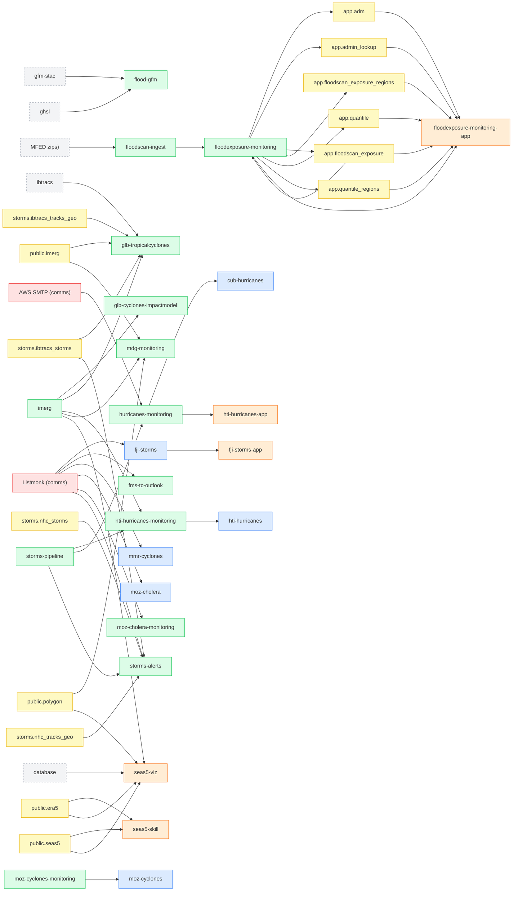

<!-- generated by scripts/gen_dependency_graph.py — declare edges via `depends_on` on each page, not here -->

# Dependency graph & blast radius

Cross-content-type dependencies, built from the `depends_on` field on every framework / pipeline / app page. Edges are declared once (direct upstream); **reverse edges and blast radius are derived here**, so this is always consistent. Arrows below point in the direction failure propagates: **X → Y means "if X breaks, Y is affected."**

## Single points of failure (blast radius)

If a node breaks, everything in its **transitive downstream** is affected. Sorted by reach.

| node | type | direct dependents | total downstream | what breaks (transitive) |
|---|---|--:|--:|---|
| `MFED zips)` | external | 1 | 9 | `app.adm`, `app.admin_lookup`, `app.floodscan_exposure`, `app.floodscan_exposure_regions`, `app.quantile`, `app.quantile_regions`, `floodexposure-monitoring`, `floodexposure-monitoring-app`, `floodscan-ingest` |
| [`app.floodscan_exposure`](db-schema.md#app) | table | 2 | 8 | `app.adm`, `app.admin_lookup`, `app.floodscan_exposure`, `app.floodscan_exposure_regions`, `app.quantile`, `app.quantile_regions`, `floodexposure-monitoring`, `floodexposure-monitoring-app` |
| [`floodexposure-monitoring`](../pipelines/floodexposure-monitoring.md) | pipeline | 7 | 8 | `app.adm`, `app.admin_lookup`, `app.floodscan_exposure`, `app.floodscan_exposure_regions`, `app.quantile`, `app.quantile_regions`, `floodexposure-monitoring`, `floodexposure-monitoring-app` |
| [`floodscan-ingest`](../pipelines/floodscan-ingest.md) | pipeline | 1 | 8 | `app.adm`, `app.admin_lookup`, `app.floodscan_exposure`, `app.floodscan_exposure_regions`, `app.quantile`, `app.quantile_regions`, `floodexposure-monitoring`, `floodexposure-monitoring-app` |
| [`Listmonk (comms)`](comms-listmonk.md) | infra | 6 | 7 | `fji-storms`, `fji-storms-app`, `fms-tc-outlook`, `mmr-cyclones`, `moz-cholera`, `moz-cholera-monitoring`, `storms-alerts` |
| [`imerg`](../pipelines/imerg.md) | pipeline | 5 | 6 | `glb-cyclones-impactmodel`, `glb-tropicalcyclones`, `hti-hurricanes`, `hti-hurricanes-monitoring`, `mdg-monitoring`, `seas5-viz` |
| [`storms-pipeline`](../pipelines/storms-pipeline.md) | pipeline | 3 | 6 | `cub-hurricanes`, `hti-hurricanes`, `hti-hurricanes-app`, `hti-hurricanes-monitoring`, `hurricanes-monitoring`, `storms-alerts` |
| `AWS SMTP (comms)` | infra | 1 | 3 | `cub-hurricanes`, `hti-hurricanes-app`, `hurricanes-monitoring` |
| [`hurricanes-monitoring`](../pipelines/hurricanes-monitoring.md) | pipeline | 2 | 2 | `cub-hurricanes`, `hti-hurricanes-app` |
| [`public.era5`](db-schema.md#public) | table | 2 | 2 | `seas5-skill`, `seas5-viz` |
| [`public.imerg`](db-schema.md#public) | table | 2 | 2 | `glb-tropicalcyclones`, `mdg-monitoring` |
| [`public.polygon`](db-schema.md#public) | table | 2 | 2 | `mdg-monitoring`, `seas5-viz` |
| [`public.seas5`](db-schema.md#public) | table | 2 | 2 | `seas5-skill`, `seas5-viz` |
| [`storms.ibtracs_storms`](db-schema.md#storms) | table | 2 | 2 | `glb-tropicalcyclones`, `storms-alerts` |
| [`app.adm`](db-schema.md#app) | table | 1 | 1 | `floodexposure-monitoring-app` |
| [`app.admin_lookup`](db-schema.md#app) | table | 1 | 1 | `floodexposure-monitoring-app` |
| [`app.floodscan_exposure_regions`](db-schema.md#app) | table | 1 | 1 | `floodexposure-monitoring-app` |
| [`app.quantile`](db-schema.md#app) | table | 1 | 1 | `floodexposure-monitoring-app` |
| [`app.quantile_regions`](db-schema.md#app) | table | 1 | 1 | `floodexposure-monitoring-app` |
| `database` | external | 1 | 1 | `seas5-viz` |
| [`fji-storms`](../frameworks/fji-storms/) | framework | 1 | 1 | `fji-storms-app` |
| `gfm-stac` | external | 1 | 1 | `flood-gfm` |
| `ghsl` | external | 1 | 1 | `flood-gfm` |
| [`hti-hurricanes-monitoring`](../pipelines/hti-hurricanes-monitoring.md) | pipeline | 1 | 1 | `hti-hurricanes` |
| `ibtracs` | external | 1 | 1 | `glb-tropicalcyclones` |
| [`moz-cyclones-monitoring`](../pipelines/moz-cyclones-monitoring.md) | pipeline | 1 | 1 | `moz-cyclones` |
| [`storms.ibtracs_tracks_geo`](db-schema.md#storms) | table | 1 | 1 | `glb-tropicalcyclones` |
| [`storms.nhc_storms`](db-schema.md#storms) | table | 1 | 1 | `storms-alerts` |
| [`storms.nhc_tracks_geo`](db-schema.md#storms) | table | 1 | 1 | `storms-alerts` |

## Graph

## Adjacency (nodes with edges)

| node | type | depends on ↑ | depended on by ↓ |
|---|---|---|---|
| `AWS SMTP (comms)` | infra | — | `hurricanes-monitoring` |
| [`Listmonk (comms)`](comms-listmonk.md) | infra | — | `fji-storms`, `fms-tc-outlook`, `mmr-cyclones`, `moz-cholera`, `moz-cholera-monitoring`, `storms-alerts` |
| `MFED zips)` | external | — | `floodscan-ingest` |
| `database` | external | — | `seas5-viz` |
| `gfm-stac` | external | — | `flood-gfm` |
| `ghsl` | external | — | `flood-gfm` |
| `ibtracs` | external | — | `glb-tropicalcyclones` |
| [`app.adm`](db-schema.md#app) | table | `floodexposure-monitoring` | `floodexposure-monitoring-app` |
| [`app.admin_lookup`](db-schema.md#app) | table | `floodexposure-monitoring` | `floodexposure-monitoring-app` |
| [`app.floodscan_exposure`](db-schema.md#app) | table | `floodexposure-monitoring` | `floodexposure-monitoring`, `floodexposure-monitoring-app` |
| [`app.floodscan_exposure_regions`](db-schema.md#app) | table | `floodexposure-monitoring` | `floodexposure-monitoring-app` |
| [`app.quantile`](db-schema.md#app) | table | `floodexposure-monitoring` | `floodexposure-monitoring-app` |
| [`app.quantile_regions`](db-schema.md#app) | table | `floodexposure-monitoring` | `floodexposure-monitoring-app` |
| [`public.era5`](db-schema.md#public) | table | — | `seas5-skill`, `seas5-viz` |
| [`public.imerg`](db-schema.md#public) | table | — | `glb-tropicalcyclones`, `mdg-monitoring` |
| [`public.polygon`](db-schema.md#public) | table | — | `mdg-monitoring`, `seas5-viz` |
| [`public.seas5`](db-schema.md#public) | table | — | `seas5-skill`, `seas5-viz` |
| [`storms.ibtracs_storms`](db-schema.md#storms) | table | — | `glb-tropicalcyclones`, `storms-alerts` |
| [`storms.ibtracs_tracks_geo`](db-schema.md#storms) | table | — | `glb-tropicalcyclones` |
| [`storms.nhc_storms`](db-schema.md#storms) | table | — | `storms-alerts` |
| [`storms.nhc_tracks_geo`](db-schema.md#storms) | table | — | `storms-alerts` |
| [`flood-gfm`](../pipelines/flood-gfm.md) | pipeline | `gfm-stac`, `ghsl` | — |
| [`floodexposure-monitoring`](../pipelines/floodexposure-monitoring.md) | pipeline | `app.floodscan_exposure`, `floodscan-ingest` | `app.adm`, `app.admin_lookup`, `app.floodscan_exposure`, `app.floodscan_exposure_regions`, `app.quantile`, `app.quantile_regions`, `floodexposure-monitoring-app` |
| [`floodscan-ingest`](../pipelines/floodscan-ingest.md) | pipeline | `MFED zips)` | `floodexposure-monitoring` |
| [`fms-tc-outlook`](../pipelines/fms-tc-outlook.md) | pipeline | `listmonk` | — |
| [`glb-cyclones-impactmodel`](../pipelines/glb-cyclones-impactmodel.md) | pipeline | `imerg` | — |
| [`glb-tropicalcyclones`](../pipelines/glb-tropicalcyclones.md) | pipeline | `ibtracs`, `imerg`, `public.imerg`, `storms.ibtracs_storms`, `storms.ibtracs_tracks_geo` | — |
| [`hti-hurricanes-monitoring`](../pipelines/hti-hurricanes-monitoring.md) | pipeline | `imerg`, `storms-pipeline` | `hti-hurricanes` |
| [`hurricanes-monitoring`](../pipelines/hurricanes-monitoring.md) | pipeline | `aws-smtp`, `storms-pipeline` | `cub-hurricanes`, `hti-hurricanes-app` |
| [`imerg`](../pipelines/imerg.md) | pipeline | — | `glb-cyclones-impactmodel`, `glb-tropicalcyclones`, `hti-hurricanes-monitoring`, `mdg-monitoring`, `seas5-viz` |
| [`mdg-monitoring`](../pipelines/mdg-monitoring.md) | pipeline | `imerg`, `public.imerg`, `public.polygon` | — |
| [`moz-cholera-monitoring`](../pipelines/moz-cholera-monitoring.md) | pipeline | `listmonk` | — |
| [`moz-cyclones-monitoring`](../pipelines/moz-cyclones-monitoring.md) | pipeline | — | `moz-cyclones` |
| [`storms-alerts`](../pipelines/storms-alerts.md) | pipeline | `listmonk`, `storms-pipeline`, `storms.ibtracs_storms`, `storms.nhc_storms`, `storms.nhc_tracks_geo` | — |
| [`storms-pipeline`](../pipelines/storms-pipeline.md) | pipeline | — | `hti-hurricanes-monitoring`, `hurricanes-monitoring`, `storms-alerts` |
| [`fji-storms-app`](../apps/fji-storms-app.md) | app | `fji-storms` | — |
| [`floodexposure-monitoring-app`](../apps/floodexposure-monitoring-app.md) | app | `app.adm`, `app.admin_lookup`, `app.floodscan_exposure`, `app.floodscan_exposure_regions`, `app.quantile`, `app.quantile_regions`, `floodexposure-monitoring` | — |
| [`hti-hurricanes-app`](../apps/hti-hurricanes-app.md) | app | `hurricanes-monitoring` | — |
| [`seas5-skill`](../apps/seas5-skill.md) | app | `public.era5`, `public.seas5` | — |
| [`seas5-viz`](../apps/seas5-viz.md) | app | `database`, `imerg`, `public.era5`, `public.polygon`, `public.seas5` | — |
| [`cub-hurricanes`](../frameworks/cub-hurricanes/) | framework | `hurricanes-monitoring` | — |
| [`fji-storms`](../frameworks/fji-storms/) | framework | `listmonk` | `fji-storms-app` |
| [`hti-hurricanes`](../frameworks/hti-hurricanes/) | framework | `hti-hurricanes-monitoring` | — |
| [`mmr-cyclones`](../frameworks/mmr-cyclones/) | framework | `listmonk` | — |
| [`moz-cholera`](../frameworks/moz-cholera/) | framework | `listmonk` | — |
| [`moz-cyclones`](../frameworks/moz-cyclones/) | framework | `moz-cyclones-monitoring` | — |

## Flags

- **Unresolved / not-yet-a-page dependencies (6):** `MFED zips)`, `aws-smtp`, `database`, `gfm-stac`, `ghsl`, `ibtracs` — referenced as `depends_on` but no KB page yet (ingest or stub them to complete the chain).
- **Frameworks with no declared edges (20):** their monitoring isn't yet ingested as a pipeline, or `depends_on` is unset — most run monitoring in-repo. Edges fill in as pipelines/apps are ingested.

