<!-- generated by scripts/gen_dependency_graph.py — declare edges via `depends_on` on each page, not here -->

# Dependency graph & blast radius

Cross-content-type dependencies, built from the `depends_on` field on every framework / pipeline / app page. Edges are declared once (direct upstream); **reverse edges and blast radius are derived here**, so this is always consistent. Arrows below point in the direction failure propagates: **X → Y means "if X breaks, Y is affected."**

## Single points of failure (blast radius)

If a node breaks, everything in its **transitive downstream** is affected. Sorted by reach.

| node | type | direct dependents | total downstream | what breaks (transitive) |
|---|---|--:|--:|---|
| [`Databricks Job Compute policy 000C79D951EAF0D6 (injects dsci secrets)`](databricks.md) | infra | 3 | 39 | `cerf-3rm-app`, `cerf-supplement`, `chd-ds-aa-hti-hurricanes-app`, `cmr-flooding-support`, `contingency-hurricanes`, `cub-hurricanes`, `eth-drought-monitoring`, `glb-tropicalcyclones`, `hti-hurricanes`, `hti-hurricanes-app`, `hti-hurricanes-monitoring`, `hurricanes-monitoring`, `ibtracs-matching`, `mdg-monitoring`, `public.era5`, `public.floodscan`, `public.imerg`, `public.iso3`, `public.polygon`, `public.qa`, `public.seas5`, `raster-pipelines`, `raster-stats`, `raster-stats-app`, `seas5-skill`, `seas5-viz`, `seasonal-bulletin`, `som-risk-analysis-support`, `storm-exposure-compare`, `storm-impact-harmonisation`, `storms-alerts`, `storms-pipeline`, `storms.ecmwf_storms`, `storms.ecmwf_tracks_geo`, `storms.ibtracs_storms`, `storms.ibtracs_tracks_geo`, `storms.nhc_storms`, `storms.nhc_tracks_geo`, `teleconnections` |
| [`storms-pipeline`](../pipelines/storms-pipeline.md) | pipeline | 13 | 20 | `cerf-3rm-app`, `cerf-supplement`, `chd-ds-aa-hti-hurricanes-app`, `contingency-hurricanes`, `cub-hurricanes`, `glb-tropicalcyclones`, `hti-hurricanes`, `hti-hurricanes-app`, `hti-hurricanes-monitoring`, `hurricanes-monitoring`, `ibtracs-matching`, `storm-exposure-compare`, `storm-impact-harmonisation`, `storms-alerts`, `storms.ecmwf_storms`, `storms.ecmwf_tracks_geo`, `storms.ibtracs_storms`, `storms.ibtracs_tracks_geo`, `storms.nhc_storms`, `storms.nhc_tracks_geo` |
| [`raster-pipelines`](../pipelines/raster-pipelines.md) | pipeline | 2 | 18 | `cmr-flooding-support`, `eth-drought-monitoring`, `glb-tropicalcyclones`, `mdg-monitoring`, `public.era5`, `public.floodscan`, `public.imerg`, `public.iso3`, `public.polygon`, `public.qa`, `public.seas5`, `raster-stats`, `raster-stats-app`, `seas5-skill`, `seas5-viz`, `seasonal-bulletin`, `som-risk-analysis-support`, `teleconnections` |
| [`public.iso3`](db-schema.md#public) | table | 2 | 17 | `eth-drought-monitoring`, `glb-tropicalcyclones`, `mdg-monitoring`, `public.era5`, `public.floodscan`, `public.imerg`, `public.iso3`, `public.polygon`, `public.qa`, `public.seas5`, `raster-stats`, `raster-stats-app`, `seas5-skill`, `seas5-viz`, `seasonal-bulletin`, `som-risk-analysis-support`, `teleconnections` |
| [`raster-stats`](../pipelines/raster-stats.md) | pipeline | 8 | 17 | `eth-drought-monitoring`, `glb-tropicalcyclones`, `mdg-monitoring`, `public.era5`, `public.floodscan`, `public.imerg`, `public.iso3`, `public.polygon`, `public.qa`, `public.seas5`, `raster-stats`, `raster-stats-app`, `seas5-skill`, `seas5-viz`, `seasonal-bulletin`, `som-risk-analysis-support`, `teleconnections` |
| [`Listmonk (comms)`](comms-listmonk.md) | infra | 12 | 15 | `afro-cholera`, `cerf-3rm-app`, `eth-drought-monitoring`, `fji-storms`, `fji-storms-app`, `fms-tc-outlook`, `ken-drought-monitoring`, `mdg-monitoring`, `mmr-cyclones`, `moz-cholera`, `moz-cholera-monitoring`, `rosea-thresholds-monitoring`, `storm-exposure-compare`, `storm-impact-harmonisation`, `storms-alerts` |
| [`floodscan-ingest`](../pipelines/floodscan-ingest.md) | pipeline | 2 | 10 | `app.adm`, `app.admin_lookup`, `app.floodscan_exposure`, `app.floodscan_exposure_regions`, `app.quantile`, `app.quantile_regions`, `cmr-flooding-support`, `data-validation-app`, `floodexposure-monitoring`, `floodexposure-monitoring-app` |
| [`app.floodscan_exposure`](db-schema.md#app) | table | 2 | 9 | `app.adm`, `app.admin_lookup`, `app.floodscan_exposure`, `app.floodscan_exposure_regions`, `app.quantile`, `app.quantile_regions`, `cmr-flooding-support`, `floodexposure-monitoring`, `floodexposure-monitoring-app` |
| [`floodexposure-monitoring`](../pipelines/floodexposure-monitoring.md) | pipeline | 8 | 9 | `app.adm`, `app.admin_lookup`, `app.floodscan_exposure`, `app.floodscan_exposure_regions`, `app.quantile`, `app.quantile_regions`, `cmr-flooding-support`, `floodexposure-monitoring`, `floodexposure-monitoring-app` |
| [`imerg`](../pipelines/imerg.md) | pipeline | 5 | 7 | `chd-ds-aa-hti-hurricanes-app`, `contingency-hurricanes`, `glb-cyclones-impactmodel`, `glb-tropicalcyclones`, `hti-hurricanes`, `hti-hurricanes-monitoring`, `mdg-monitoring` |
| [`public.seas5`](db-schema.md#public) | table | 6 | 6 | `eth-drought-monitoring`, `raster-stats-app`, `seas5-skill`, `seas5-viz`, `seasonal-bulletin`, `som-risk-analysis-support` |
| [`storms.ibtracs_storms`](db-schema.md#storms) | table | 4 | 6 | `cerf-3rm-app`, `cerf-supplement`, `glb-tropicalcyclones`, `storm-exposure-compare`, `storm-impact-harmonisation`, `storms-alerts` |
| [`public.era5`](db-schema.md#public) | table | 5 | 5 | `raster-stats-app`, `seas5-skill`, `seas5-viz`, `seasonal-bulletin`, `teleconnections` |
| [`storms.ibtracs_tracks_geo`](db-schema.md#storms) | table | 2 | 4 | `cerf-3rm-app`, `glb-tropicalcyclones`, `storm-exposure-compare`, `storm-impact-harmonisation` |
| [`storms.nhc_storms`](db-schema.md#storms) | table | 2 | 4 | `cerf-3rm-app`, `storm-exposure-compare`, `storm-impact-harmonisation`, `storms-alerts` |
| `AWS SMTP (comms)` | infra | 1 | 3 | `cub-hurricanes`, `hti-hurricanes-app`, `hurricanes-monitoring` |
| [`ipc`](datasets/ipc.md) | external | 3 | 3 | `hdx-signals`, `rosea-thresholds`, `rosea-thresholds-monitoring` |
| [`nhc-forecast`](../pipelines/nhc-forecast.md) | pipeline | 1 | 3 | `cerf-3rm-app`, `storm-exposure-compare`, `storm-impact-harmonisation` |
| [`public.imerg`](db-schema.md#public) | table | 3 | 3 | `glb-tropicalcyclones`, `mdg-monitoring`, `raster-stats-app` |
| [`public.polygon`](db-schema.md#public) | table | 3 | 3 | `mdg-monitoring`, `seas5-viz`, `seasonal-bulletin` |
| [`ghsl`](datasets/ghsl.md) | external | 2 | 2 | `flood-gfm`, `ven-earthquake-support` |
| [`hti-hurricanes-monitoring`](../pipelines/hti-hurricanes-monitoring.md) | pipeline | 2 | 2 | `chd-ds-aa-hti-hurricanes-app`, `hti-hurricanes` |
| [`hurricanes-monitoring`](../pipelines/hurricanes-monitoring.md) | pipeline | 2 | 2 | `cub-hurricanes`, `hti-hurricanes-app` |
| [`storm-impact-harmonisation`](../pipelines/storm-impact-harmonisation.md) | pipeline | 2 | 2 | `cerf-3rm-app`, `storm-exposure-compare` |
| [`worldpop`](datasets/worldpop.md) | external | 2 | 2 | `geospatial-impact-exposure`, `ven-earthquake-support` |
| [`app.adm`](db-schema.md#app) | table | 1 | 1 | `floodexposure-monitoring-app` |
| [`app.admin_lookup`](db-schema.md#app) | table | 1 | 1 | `floodexposure-monitoring-app` |
| [`app.floodscan_exposure_regions`](db-schema.md#app) | table | 1 | 1 | `floodexposure-monitoring-app` |
| [`app.quantile`](db-schema.md#app) | table | 1 | 1 | `floodexposure-monitoring-app` |
| [`app.quantile_regions`](db-schema.md#app) | table | 1 | 1 | `floodexposure-monitoring-app` |
| [`cerf-onegms`](datasets/cerf-onegms.md) | external | 1 | 1 | `cerf-supplement` |
| [`chd-ds-geospatial-impact-viewer`](../apps/chd-ds-geospatial-impact-viewer.md) | app | 1 | 1 | `geospatial-impact-exposure` |
| [`fji-storms`](../frameworks/fji-storms/) | framework | 1 | 1 | `fji-storms-app` |
| `gfm-stac` | external | 1 | 1 | `flood-gfm` |
| [`hnrp`](datasets/hnrp.md) | external | 1 | 1 | `geospatial-impact-exposure` |
| [`lac-dry-corridor`](../frameworks/lac-dry-corridor/) | framework | 1 | 1 | `cerf-global-trigger-allocations-app` |
| [`moz-cyclones-monitoring`](../pipelines/moz-cyclones-monitoring.md) | pipeline | 1 | 1 | `moz-cyclones` |
| [`storms.nhc_tracks_geo`](db-schema.md#storms) | table | 1 | 1 | `storms-alerts` |

## Graph

```mermaid
graph LR
  n_aws_smtp["AWS SMTP (comms)"]
  n_dbx_job_compute["Databricks Job Compute policy 000C79D951EAF0D6 (injects dsci secrets)"]
  n_listmonk["Listmonk (comms)"]
  n_cerf_onegms["cerf-onegms"]
  n_gfm_stac["gfm-stac"]
  n_ghsl["ghsl"]
  n_hnrp["hnrp"]
  n_ipc["ipc"]
  n_worldpop["worldpop"]
  n_app_adm["app.adm"]
  n_app_admin_lookup["app.admin_lookup"]
  n_app_floodscan_exposure["app.floodscan_exposure"]
  n_app_floodscan_exposure_regions["app.floodscan_exposure_regions"]
  n_app_quantile["app.quantile"]
  n_app_quantile_regions["app.quantile_regions"]
  n_public_era5["public.era5"]
  n_public_floodscan["public.floodscan"]
  n_public_imerg["public.imerg"]
  n_public_iso3["public.iso3"]
  n_public_polygon["public.polygon"]
  n_public_qa["public.qa"]
  n_public_seas5["public.seas5"]
  n_storms_ecmwf_storms["storms.ecmwf_storms"]
  n_storms_ecmwf_tracks_geo["storms.ecmwf_tracks_geo"]
  n_storms_ibtracs_storms["storms.ibtracs_storms"]
  n_storms_ibtracs_tracks_geo["storms.ibtracs_tracks_geo"]
  n_storms_nhc_storms["storms.nhc_storms"]
  n_storms_nhc_tracks_geo["storms.nhc_tracks_geo"]
  n_afro_cholera["afro-cholera"]
  n_cerf_supplement["cerf-supplement"]
  n_eth_drought_monitoring["eth-drought-monitoring"]
  n_flood_gfm["flood-gfm"]
  n_floodexposure_monitoring["floodexposure-monitoring"]
  n_floodscan_ingest["floodscan-ingest"]
  n_fms_tc_outlook["fms-tc-outlook"]
  n_glb_cyclones_impactmodel["glb-cyclones-impactmodel"]
  n_glb_tropicalcyclones["glb-tropicalcyclones"]
  n_hdx_signals["hdx-signals"]
  n_hti_hurricanes_monitoring["hti-hurricanes-monitoring"]
  n_hurricanes_monitoring["hurricanes-monitoring"]
  n_imerg["imerg"]
  n_ken_drought_monitoring["ken-drought-monitoring"]
  n_mdg_monitoring["mdg-monitoring"]
  n_moz_cholera_monitoring["moz-cholera-monitoring"]
  n_moz_cyclones_monitoring["moz-cyclones-monitoring"]
  n_nhc_forecast["nhc-forecast"]
  n_raster_pipelines["raster-pipelines"]
  n_raster_stats["raster-stats"]
  n_rosea_thresholds_monitoring["rosea-thresholds-monitoring"]
  n_seasonal_bulletin["seasonal-bulletin"]
  n_storm_impact_harmonisation["storm-impact-harmonisation"]
  n_storms_alerts["storms-alerts"]
  n_storms_pipeline["storms-pipeline"]
  n_teleconnections["teleconnections"]
  n_ven_earthquake_support["ven-earthquake-support"]
  n_cerf_3rm_app["cerf-3rm-app"]
  n_cerf_global_trigger_allocations_app["cerf-global-trigger-allocations-app"]
  n_chd_ds_aa_hti_hurricanes_app["chd-ds-aa-hti-hurricanes-app"]
  n_chd_ds_geospatial_impact_viewer["chd-ds-geospatial-impact-viewer"]
  n_data_validation_app["data-validation-app"]
  n_fji_storms_app["fji-storms-app"]
  n_floodexposure_monitoring_app["floodexposure-monitoring-app"]
  n_geospatial_impact_exposure["geospatial-impact-exposure"]
  n_hti_hurricanes_app["hti-hurricanes-app"]
  n_raster_stats_app["raster-stats-app"]
  n_seas5_skill["seas5-skill"]
  n_seas5_viz["seas5-viz"]
  n_storm_exposure_compare["storm-exposure-compare"]
  n_cmr_flooding_support["cmr-flooding-support"]
  n_contingency_hurricanes["contingency-hurricanes"]
  n_ibtracs_matching["ibtracs-matching"]
  n_rosea_thresholds["rosea-thresholds"]
  n_som_risk_analysis_support["som-risk-analysis-support"]
  n_cub_hurricanes["cub-hurricanes"]
  n_fji_storms["fji-storms"]
  n_hti_hurricanes["hti-hurricanes"]
  n_lac_dry_corridor["lac-dry-corridor"]
  n_mmr_cyclones["mmr-cyclones"]
  n_moz_cholera["moz-cholera"]
  n_moz_cyclones["moz-cyclones"]
  n_listmonk --> n_afro_cholera
  n_floodexposure_monitoring --> n_app_adm
  n_floodexposure_monitoring --> n_app_admin_lookup
  n_floodexposure_monitoring --> n_app_floodscan_exposure
  n_floodexposure_monitoring --> n_app_floodscan_exposure_regions
  n_floodexposure_monitoring --> n_app_quantile
  n_floodexposure_monitoring --> n_app_quantile_regions
  n_storm_impact_harmonisation --> n_cerf_3rm_app
  n_lac_dry_corridor --> n_cerf_global_trigger_allocations_app
  n_cerf_onegms --> n_cerf_supplement
  n_storms_pipeline --> n_cerf_supplement
  n_storms_ibtracs_storms --> n_cerf_supplement
  n_hti_hurricanes_monitoring --> n_chd_ds_aa_hti_hurricanes_app
  n_floodexposure_monitoring --> n_cmr_flooding_support
  n_raster_pipelines --> n_cmr_flooding_support
  n_imerg --> n_contingency_hurricanes
  n_storms_pipeline --> n_contingency_hurricanes
  n_hurricanes_monitoring --> n_cub_hurricanes
  n_floodscan_ingest --> n_data_validation_app
  n_listmonk --> n_eth_drought_monitoring
  n_public_seas5 --> n_eth_drought_monitoring
  n_listmonk --> n_fji_storms
  n_fji_storms --> n_fji_storms_app
  n_gfm_stac --> n_flood_gfm
  n_ghsl --> n_flood_gfm
  n_app_floodscan_exposure --> n_floodexposure_monitoring
  n_floodscan_ingest --> n_floodexposure_monitoring
  n_app_adm --> n_floodexposure_monitoring_app
  n_app_admin_lookup --> n_floodexposure_monitoring_app
  n_app_floodscan_exposure --> n_floodexposure_monitoring_app
  n_app_floodscan_exposure_regions --> n_floodexposure_monitoring_app
  n_app_quantile --> n_floodexposure_monitoring_app
  n_app_quantile_regions --> n_floodexposure_monitoring_app
  n_floodexposure_monitoring --> n_floodexposure_monitoring_app
  n_listmonk --> n_fms_tc_outlook
  n_chd_ds_geospatial_impact_viewer --> n_geospatial_impact_exposure
  n_hnrp --> n_geospatial_impact_exposure
  n_worldpop --> n_geospatial_impact_exposure
  n_imerg --> n_glb_cyclones_impactmodel
  n_imerg --> n_glb_tropicalcyclones
  n_public_imerg --> n_glb_tropicalcyclones
  n_storms_ibtracs_storms --> n_glb_tropicalcyclones
  n_storms_ibtracs_tracks_geo --> n_glb_tropicalcyclones
  n_ipc --> n_hdx_signals
  n_hti_hurricanes_monitoring --> n_hti_hurricanes
  n_hurricanes_monitoring --> n_hti_hurricanes_app
  n_imerg --> n_hti_hurricanes_monitoring
  n_storms_pipeline --> n_hti_hurricanes_monitoring
  n_aws_smtp --> n_hurricanes_monitoring
  n_storms_pipeline --> n_hurricanes_monitoring
  n_storms_pipeline --> n_ibtracs_matching
  n_listmonk --> n_ken_drought_monitoring
  n_imerg --> n_mdg_monitoring
  n_listmonk --> n_mdg_monitoring
  n_public_imerg --> n_mdg_monitoring
  n_public_polygon --> n_mdg_monitoring
  n_listmonk --> n_mmr_cyclones
  n_listmonk --> n_moz_cholera
  n_listmonk --> n_moz_cholera_monitoring
  n_moz_cyclones_monitoring --> n_moz_cyclones
  n_raster_stats --> n_public_era5
  n_raster_stats --> n_public_floodscan
  n_raster_stats --> n_public_imerg
  n_raster_stats --> n_public_iso3
  n_raster_stats --> n_public_polygon
  n_raster_stats --> n_public_qa
  n_raster_stats --> n_public_seas5
  n_dbx_job_compute --> n_raster_pipelines
  n_dbx_job_compute --> n_raster_stats
  n_public_iso3 --> n_raster_stats
  n_raster_pipelines --> n_raster_stats
  n_public_era5 --> n_raster_stats_app
  n_public_imerg --> n_raster_stats_app
  n_public_iso3 --> n_raster_stats_app
  n_public_seas5 --> n_raster_stats_app
  n_raster_stats --> n_raster_stats_app
  n_ipc --> n_rosea_thresholds
  n_ipc --> n_rosea_thresholds_monitoring
  n_listmonk --> n_rosea_thresholds_monitoring
  n_public_era5 --> n_seas5_skill
  n_public_seas5 --> n_seas5_skill
  n_public_era5 --> n_seas5_viz
  n_public_polygon --> n_seas5_viz
  n_public_seas5 --> n_seas5_viz
  n_public_era5 --> n_seasonal_bulletin
  n_public_polygon --> n_seasonal_bulletin
  n_public_seas5 --> n_seasonal_bulletin
  n_public_seas5 --> n_som_risk_analysis_support
  n_storm_impact_harmonisation --> n_storm_exposure_compare
  n_listmonk --> n_storm_impact_harmonisation
  n_nhc_forecast --> n_storm_impact_harmonisation
  n_storms_pipeline --> n_storm_impact_harmonisation
  n_storms_ibtracs_storms --> n_storm_impact_harmonisation
  n_storms_ibtracs_tracks_geo --> n_storm_impact_harmonisation
  n_storms_nhc_storms --> n_storm_impact_harmonisation
  n_listmonk --> n_storms_alerts
  n_storms_pipeline --> n_storms_alerts
  n_storms_ibtracs_storms --> n_storms_alerts
  n_storms_nhc_storms --> n_storms_alerts
  n_storms_nhc_tracks_geo --> n_storms_alerts
  n_dbx_job_compute --> n_storms_pipeline
  n_storms_pipeline --> n_storms_ecmwf_storms
  n_storms_pipeline --> n_storms_ecmwf_tracks_geo
  n_storms_pipeline --> n_storms_ibtracs_storms
  n_storms_pipeline --> n_storms_ibtracs_tracks_geo
  n_storms_pipeline --> n_storms_nhc_storms
  n_storms_pipeline --> n_storms_nhc_tracks_geo
  n_public_era5 --> n_teleconnections
  n_ghsl --> n_ven_earthquake_support
  n_worldpop --> n_ven_earthquake_support
  classDef framework fill:#dbeafe,stroke:#3b82f6;
  classDef pipeline fill:#dcfce7,stroke:#22c55e;
  classDef app fill:#ffedd5,stroke:#f97316;
  classDef infra fill:#fee2e2,stroke:#ef4444;
  classDef analysis fill:#ede9fe,stroke:#8b5cf6;
  classDef table fill:#fef9c3,stroke:#eab308;
  classDef external fill:#f3f4f6,stroke:#9ca3af,stroke-dasharray:4;
  class n_moz_cholera,n_moz_cyclones,n_cub_hurricanes,n_hti_hurricanes,n_fji_storms,n_lac_dry_corridor,n_mmr_cyclones framework;
  class n_seasonal_bulletin,n_fms_tc_outlook,n_cerf_supplement,n_storms_alerts,n_afro_cholera,n_ken_drought_monitoring,n_hurricanes_monitoring,n_flood_gfm,n_rosea_thresholds_monitoring,n_floodexposure_monitoring,n_glb_cyclones_impactmodel,n_moz_cyclones_monitoring,n_nhc_forecast,n_imerg,n_hti_hurricanes_monitoring,n_floodscan_ingest,n_moz_cholera_monitoring,n_raster_stats,n_hdx_signals,n_eth_drought_monitoring,n_glb_tropicalcyclones,n_raster_pipelines,n_storms_pipeline,n_ven_earthquake_support,n_mdg_monitoring,n_storm_impact_harmonisation,n_teleconnections pipeline;
  class n_cerf_global_trigger_allocations_app,n_floodexposure_monitoring_app,n_geospatial_impact_exposure,n_cerf_3rm_app,n_fji_storms_app,n_hti_hurricanes_app,n_raster_stats_app,n_storm_exposure_compare,n_chd_ds_aa_hti_hurricanes_app,n_seas5_viz,n_chd_ds_geospatial_impact_viewer,n_seas5_skill,n_data_validation_app app;
  class n_ibtracs_matching,n_som_risk_analysis_support,n_contingency_hurricanes,n_rosea_thresholds,n_cmr_flooding_support analysis;
  class n_storms_ecmwf_tracks_geo,n_app_adm,n_public_seas5,n_public_polygon,n_app_admin_lookup,n_public_qa,n_app_floodscan_exposure,n_storms_ibtracs_storms,n_public_era5,n_storms_nhc_storms,n_app_floodscan_exposure_regions,n_public_floodscan,n_storms_ibtracs_tracks_geo,n_app_quantile,n_public_iso3,n_storms_ecmwf_storms,n_public_imerg,n_storms_nhc_tracks_geo,n_app_quantile_regions table;
  class n_dbx_job_compute,n_listmonk,n_aws_smtp infra;
  class n_hnrp,n_gfm_stac,n_ipc,n_worldpop,n_cerf_onegms,n_ghsl external;
```

## Adjacency (nodes with edges)

| node | type | depends on ↑ | depended on by ↓ |
|---|---|---|---|
| `AWS SMTP (comms)` | infra | — | `hurricanes-monitoring` |
| [`Databricks Job Compute policy 000C79D951EAF0D6 (injects dsci secrets)`](databricks.md) | infra | — | `raster-pipelines`, `raster-stats`, `storms-pipeline` |
| [`Listmonk (comms)`](comms-listmonk.md) | infra | — | `afro-cholera`, `eth-drought-monitoring`, `fji-storms`, `fms-tc-outlook`, `ken-drought-monitoring`, `mdg-monitoring`, `mmr-cyclones`, `moz-cholera`, `moz-cholera-monitoring`, `rosea-thresholds-monitoring`, `storm-impact-harmonisation`, `storms-alerts` |
| [`cerf-onegms`](datasets/cerf-onegms.md) | external | — | `cerf-supplement` |
| `gfm-stac` | external | — | `flood-gfm` |
| [`ghsl`](datasets/ghsl.md) | external | — | `flood-gfm`, `ven-earthquake-support` |
| [`hnrp`](datasets/hnrp.md) | external | — | `geospatial-impact-exposure` |
| [`ipc`](datasets/ipc.md) | external | — | `hdx-signals`, `rosea-thresholds`, `rosea-thresholds-monitoring` |
| [`worldpop`](datasets/worldpop.md) | external | — | `geospatial-impact-exposure`, `ven-earthquake-support` |
| [`app.adm`](db-schema.md#app) | table | `floodexposure-monitoring` | `floodexposure-monitoring-app` |
| [`app.admin_lookup`](db-schema.md#app) | table | `floodexposure-monitoring` | `floodexposure-monitoring-app` |
| [`app.floodscan_exposure`](db-schema.md#app) | table | `floodexposure-monitoring` | `floodexposure-monitoring`, `floodexposure-monitoring-app` |
| [`app.floodscan_exposure_regions`](db-schema.md#app) | table | `floodexposure-monitoring` | `floodexposure-monitoring-app` |
| [`app.quantile`](db-schema.md#app) | table | `floodexposure-monitoring` | `floodexposure-monitoring-app` |
| [`app.quantile_regions`](db-schema.md#app) | table | `floodexposure-monitoring` | `floodexposure-monitoring-app` |
| [`public.era5`](db-schema.md#public) | table | `raster-stats` | `raster-stats-app`, `seas5-skill`, `seas5-viz`, `seasonal-bulletin`, `teleconnections` |
| [`public.floodscan`](db-schema.md#public) | table | `raster-stats` | — |
| [`public.imerg`](db-schema.md#public) | table | `raster-stats` | `glb-tropicalcyclones`, `mdg-monitoring`, `raster-stats-app` |
| [`public.iso3`](db-schema.md#public) | table | `raster-stats` | `raster-stats`, `raster-stats-app` |
| [`public.polygon`](db-schema.md#public) | table | `raster-stats` | `mdg-monitoring`, `seas5-viz`, `seasonal-bulletin` |
| [`public.qa`](db-schema.md#public) | table | `raster-stats` | — |
| [`public.seas5`](db-schema.md#public) | table | `raster-stats` | `eth-drought-monitoring`, `raster-stats-app`, `seas5-skill`, `seas5-viz`, `seasonal-bulletin`, `som-risk-analysis-support` |
| [`storms.ecmwf_storms`](db-schema.md#storms) | table | `storms-pipeline` | — |
| [`storms.ecmwf_tracks_geo`](db-schema.md#storms) | table | `storms-pipeline` | — |
| [`storms.ibtracs_storms`](db-schema.md#storms) | table | `storms-pipeline` | `cerf-supplement`, `glb-tropicalcyclones`, `storm-impact-harmonisation`, `storms-alerts` |
| [`storms.ibtracs_tracks_geo`](db-schema.md#storms) | table | `storms-pipeline` | `glb-tropicalcyclones`, `storm-impact-harmonisation` |
| [`storms.nhc_storms`](db-schema.md#storms) | table | `storms-pipeline` | `storm-impact-harmonisation`, `storms-alerts` |
| [`storms.nhc_tracks_geo`](db-schema.md#storms) | table | `storms-pipeline` | `storms-alerts` |
| [`afro-cholera`](../pipelines/afro-cholera.md) | pipeline | `listmonk` | — |
| [`cerf-supplement`](../pipelines/cerf-supplement.md) | pipeline | `cerf-onegms`, `storms-pipeline`, `storms.ibtracs_storms` | — |
| [`eth-drought-monitoring`](../pipelines/eth-drought-monitoring.md) | pipeline | `listmonk`, `public.seas5` | — |
| [`flood-gfm`](../pipelines/flood-gfm.md) | pipeline | `gfm-stac`, `ghsl` | — |
| [`floodexposure-monitoring`](../pipelines/floodexposure-monitoring.md) | pipeline | `app.floodscan_exposure`, `floodscan-ingest` | `app.adm`, `app.admin_lookup`, `app.floodscan_exposure`, `app.floodscan_exposure_regions`, `app.quantile`, `app.quantile_regions`, `cmr-flooding-support`, `floodexposure-monitoring-app` |
| [`floodscan-ingest`](../pipelines/floodscan-ingest.md) | pipeline | — | `data-validation-app`, `floodexposure-monitoring` |
| [`fms-tc-outlook`](../pipelines/fms-tc-outlook.md) | pipeline | `listmonk` | — |
| [`glb-cyclones-impactmodel`](../pipelines/glb-cyclones-impactmodel.md) | pipeline | `imerg` | — |
| [`glb-tropicalcyclones`](../pipelines/glb-tropicalcyclones.md) | pipeline | `imerg`, `public.imerg`, `storms.ibtracs_storms`, `storms.ibtracs_tracks_geo` | — |
| [`hdx-signals`](../pipelines/hdx-signals.md) | pipeline | `ipc` | — |
| [`hti-hurricanes-monitoring`](../pipelines/hti-hurricanes-monitoring.md) | pipeline | `imerg`, `storms-pipeline` | `chd-ds-aa-hti-hurricanes-app`, `hti-hurricanes` |
| [`hurricanes-monitoring`](../pipelines/hurricanes-monitoring.md) | pipeline | `aws-smtp`, `storms-pipeline` | `cub-hurricanes`, `hti-hurricanes-app` |
| [`imerg`](../pipelines/imerg.md) | pipeline | — | `contingency-hurricanes`, `glb-cyclones-impactmodel`, `glb-tropicalcyclones`, `hti-hurricanes-monitoring`, `mdg-monitoring` |
| [`ken-drought-monitoring`](../pipelines/ken-drought-monitoring.md) | pipeline | `listmonk` | — |
| [`mdg-monitoring`](../pipelines/mdg-monitoring.md) | pipeline | `imerg`, `listmonk`, `public.imerg`, `public.polygon` | — |
| [`moz-cholera-monitoring`](../pipelines/moz-cholera-monitoring.md) | pipeline | `listmonk` | — |
| [`moz-cyclones-monitoring`](../pipelines/moz-cyclones-monitoring.md) | pipeline | — | `moz-cyclones` |
| [`nhc-forecast`](../pipelines/nhc-forecast.md) | pipeline | — | `storm-impact-harmonisation` |
| [`raster-pipelines`](../pipelines/raster-pipelines.md) | pipeline | `dbx-job-compute` | `cmr-flooding-support`, `raster-stats` |
| [`raster-stats`](../pipelines/raster-stats.md) | pipeline | `dbx-job-compute`, `public.iso3`, `raster-pipelines` | `public.era5`, `public.floodscan`, `public.imerg`, `public.iso3`, `public.polygon`, `public.qa`, `public.seas5`, `raster-stats-app` |
| [`rosea-thresholds-monitoring`](../pipelines/rosea-thresholds-monitoring.md) | pipeline | `ipc`, `listmonk` | — |
| [`seasonal-bulletin`](../pipelines/seasonal-bulletin.md) | pipeline | `public.era5`, `public.polygon`, `public.seas5` | — |
| [`storm-impact-harmonisation`](../pipelines/storm-impact-harmonisation.md) | pipeline | `listmonk`, `nhc-forecast`, `storms-pipeline`, `storms.ibtracs_storms`, `storms.ibtracs_tracks_geo`, `storms.nhc_storms` | `cerf-3rm-app`, `storm-exposure-compare` |
| [`storms-alerts`](../pipelines/storms-alerts.md) | pipeline | `listmonk`, `storms-pipeline`, `storms.ibtracs_storms`, `storms.nhc_storms`, `storms.nhc_tracks_geo` | — |
| [`storms-pipeline`](../pipelines/storms-pipeline.md) | pipeline | `dbx-job-compute` | `cerf-supplement`, `contingency-hurricanes`, `hti-hurricanes-monitoring`, `hurricanes-monitoring`, `ibtracs-matching`, `storm-impact-harmonisation`, `storms-alerts`, `storms.ecmwf_storms`, `storms.ecmwf_tracks_geo`, `storms.ibtracs_storms`, `storms.ibtracs_tracks_geo`, `storms.nhc_storms`, `storms.nhc_tracks_geo` |
| [`teleconnections`](../pipelines/teleconnections.md) | pipeline | `public.era5` | — |
| [`ven-earthquake-support`](../pipelines/ven-earthquake-support.md) | pipeline | `ghsl`, `worldpop` | — |
| [`cerf-3rm-app`](../apps/cerf-3rm-app.md) | app | `storm-impact-harmonisation` | — |
| [`cerf-global-trigger-allocations-app`](../apps/cerf-global-trigger-allocations-app.md) | app | `lac-dry-corridor` | — |
| [`chd-ds-aa-hti-hurricanes-app`](../apps/chd-ds-aa-hti-hurricanes-app.md) | app | `hti-hurricanes-monitoring` | — |
| [`chd-ds-geospatial-impact-viewer`](../apps/chd-ds-geospatial-impact-viewer.md) | app | — | `geospatial-impact-exposure` |
| [`data-validation-app`](../apps/data-validation-app.md) | app | `floodscan-ingest` | — |
| [`fji-storms-app`](../apps/fji-storms-app.md) | app | `fji-storms` | — |
| [`floodexposure-monitoring-app`](../apps/floodexposure-monitoring-app.md) | app | `app.adm`, `app.admin_lookup`, `app.floodscan_exposure`, `app.floodscan_exposure_regions`, `app.quantile`, `app.quantile_regions`, `floodexposure-monitoring` | — |
| [`geospatial-impact-exposure`](../apps/geospatial-impact-exposure.md) | app | `chd-ds-geospatial-impact-viewer`, `hnrp`, `worldpop` | — |
| [`hti-hurricanes-app`](../apps/hti-hurricanes-app.md) | app | `hurricanes-monitoring` | — |
| [`raster-stats-app`](../apps/raster-stats-app.md) | app | `public.era5`, `public.imerg`, `public.iso3`, `public.seas5`, `raster-stats` | — |
| [`seas5-skill`](../apps/seas5-skill.md) | app | `public.era5`, `public.seas5` | — |
| [`seas5-viz`](../apps/seas5-viz.md) | app | `public.era5`, `public.polygon`, `public.seas5` | — |
| [`storm-exposure-compare`](../apps/storm-exposure-compare.md) | app | `storm-impact-harmonisation` | — |
| [`cmr-flooding-support`](../analysis/cmr-flooding-support.md) | analysis | `floodexposure-monitoring`, `raster-pipelines` | — |
| [`contingency-hurricanes`](../analysis/contingency-hurricanes.md) | analysis | `imerg`, `storms-pipeline` | — |
| [`ibtracs-matching`](../analysis/ibtracs-matching.md) | analysis | `storms-pipeline` | — |
| [`rosea-thresholds`](../analysis/rosea-thresholds.md) | analysis | `ipc` | — |
| [`som-risk-analysis-support`](../analysis/som-risk-analysis-support.md) | analysis | `public.seas5` | — |
| [`cub-hurricanes`](../frameworks/cub-hurricanes/) | framework | `hurricanes-monitoring` | — |
| [`fji-storms`](../frameworks/fji-storms/) | framework | `listmonk` | `fji-storms-app` |
| [`hti-hurricanes`](../frameworks/hti-hurricanes/) | framework | `hti-hurricanes-monitoring` | — |
| [`lac-dry-corridor`](../frameworks/lac-dry-corridor/) | framework | — | `cerf-global-trigger-allocations-app` |
| [`mmr-cyclones`](../frameworks/mmr-cyclones/) | framework | `listmonk` | — |
| [`moz-cholera`](../frameworks/moz-cholera/) | framework | `listmonk` | — |
| [`moz-cyclones`](../frameworks/moz-cyclones/) | framework | `moz-cyclones-monitoring` | — |

## Flags

- **Unresolved / not-yet-a-page dependencies (2):** `aws-smtp`, `gfm-stac` — referenced as `depends_on` but no KB page yet (ingest or stub them to complete the chain).
- **Frameworks with no declared edges (24):** their monitoring isn't yet ingested as a pipeline, or `depends_on` is unset — most run monitoring in-repo. Edges fill in as pipelines/apps are ingested.

