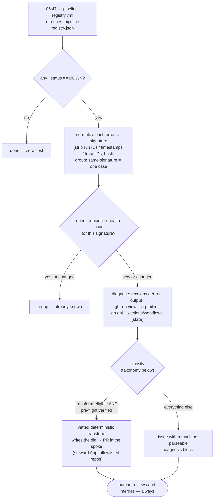

# Self-healing pipelines — design proposal

> **Status: proposal. Nothing here is built.** This page is the design to argue with before any code
> exists. The detection half it builds on *is* live — see [pipeline-registry.md](pipeline-registry.md).

## The gap

[D43](../docs/DESIGN.md) gave us **detection**: `gen_pipeline_registry.py` reads live Databricks + GHA
state daily and emits one row per deployed job with `_status` (`OK|WARN|DOWN|UNKNOWN`) and `_flags`.
As of 2026-08-05 it says **20 prod pipelines, 6 DOWN**.

What it does not do is anything about them. A human has to notice the board, open the run, read the
traceback, find the repo, work out the fix, and open a PR. In practice that loop has a latency measured
in weeks: `Run IBTrACS` and `Run ECMWF Storms` have been failing since **June 2026** and were still
failing when this page was written.

Every other detect→fix loop in the KB already closes ([automation.md](automation.md)): a detector opens
a labelled issue, `kb-ingest` drafts the fix with headless Claude, a human merges. **Pipeline health is
the one axis that detects and then stops.** Phase 5 in the [ROADMAP](../docs/ROADMAP.md) has carried
_"Remaining: pipeline-health → alerting"_ ever since. This proposes going one step past alerting.

## What "self-healing" means here — and what it doesn't

**It does not mean pipelines repair themselves.** It means the boring, mechanical middle of the loop —
pull the traceback, identify the class of failure, locate the offending line, draft a candidate patch —
runs automatically, and a human still decides whether the patch is right.

The output is **a PR in the spoke repo, or an issue, never a merge.** The bot's job is to turn "🔴 DOWN"
into "here is the exact error, here is what class of failure it is, here is a proposed diff, and here is
what I could not verify." That is a large saving even when the diff is wrong, because the diagnosis is
the expensive part and it is the part that is fully mechanical.

## The loop

What happens on a given morning:



| # | Stage | Mechanism |
|---|---|---|
| 1 | **Detect** | Already built. `.pipeline-registry.json` entries where `_status == "DOWN"`. |
| 2 | **Triage** | Dedupe against open tracking issues by failure signature; apply cooldown + caps. |
| 3 | **Diagnose** | Pull the evidence: Databricks `jobs get-run` → `jobs get-run-output`; GHA `gh run view --log-failed`; workflow `state` via `gh api` (catches disables, which produce *no* failed runs at all). Extract error type, message, file, line. |
| 4 | **Classify** | Map the signature to a failure class (table below) → decides *whether* anything is patched at all. |
| 5 | **Act** | A vetted transform opens a spoke PR — **or** an issue is filed — **or** nothing (transition-triggered: a stable, already-reported DOWN is a no-op). |

Stages 1–3 and the transforms in 5 are deterministic scripting. The model call sits in 4→5: writing
the diagnosis narrative and classifying the ambiguous middle (see the architecture sketch). Stage 4 is
where the whole design's safety lives.

## Failure taxonomy → action

The classifier's job is mostly to say **"don't touch this."** Most failure classes are not code bugs.

| Class | Signals | Action | Confidence |
|---|---|---|---|
| **Transient infra** | `INTERNAL_ERROR`, cluster launch failure, 5xx, timeout | Retry once. No PR. Escalate to issue on 3rd consecutive. | — |
| **Credential / secret expiry** | 401/403, `token expired`, SAS expiry | **Issue + notify.** Code cannot fix a secret. | — |
| **Dependency drift** | `ImportError`, `ModuleNotFoundError`, resolver conflict | PR **only if** the symbol is verified present in the proposed version (see worked example) | Medium |
| **Upstream data contract** | `KeyError` on a column, 404 on a source URL, schema change | PR against the loader/parser | Medium |
| **Env / build** | image build failure, lockfile resolution | PR (pin/lockfile) | Medium |
| **Platform disable — automatic** | workflow `state: disabled_inactivity` (GitHub kills schedules after 60 days of repo inactivity; produces **no failed runs**, just silence) | Re-enable via API + PR adding a keep-alive workflow (the pattern `ds-nhc-forecast` already uses) | High |
| **Platform disable — human** | workflow `state: disabled_manually` | **Issue only.** Someone chose to turn it off; re-enabling would override a human decision. Ask, don't act. | — |
| **Data quality / assertion** | assertion failures, empty-frame guards | **Issue.** Usually the data is wrong, not the code. | — |
| **Config drift** | `MODE=dev`, `PAUSED`, `PERSONAL-CLUSTER` (these are WARN, not DOWN) | PR against DAB config — small, mechanical diff | High |
| **Logic error** | anything else with a real traceback | **Issue with evidence.** Never an unattended patch. | Low |
| **Unknown** | unparseable | Issue with raw log excerpt | — |

## Worked example — the two storm pipelines, diagnosed today

This is not hypothetical. Every step below was run by hand on 2026-08-05 to prove the stages are
mechanisable, and it is also the best argument for the guardrails.

**Stage 1 — detect.** Two rows: `dbx:638351145729392` (`Run IBTrACS`) and `dbx:1053499360455948`
(`Run ECMWF Storms`), both `DOWN`, flags `FAILING, NO-SUCCESS`, both `OCHA-DAP/ds-storms-pipeline`.

**Stage 3 — diagnose.** `jobs list-runs` → `jobs get-run` → `jobs get-run-output` yields, for *both*:

```
ImportError: cannot import name 'calculate_wind_buffers_gdf'
from 'ocha_lens.utils.storm'
  File "src/pipelines/ibtracs.py", line 16
```

Two DOWN pipelines, one root cause. That collapse is itself worth automating — the board shows two
problems, there is one.

**Stage 4 — classify.** `ImportError` → *dependency drift*. The repo pins `ocha-lens==0.5.1`; a newer
release, `0.6.0`, exists (published 2026-07-05). The obvious patch writes itself: bump the pin.

**That patch would be wrong.** `calculate_wind_buffers_gdf` exists **only on `ocha-lens` `main`**. It is
in *no published release* — not `0.5.1`, not the latest `0.6.0`. A pin bump to `0.6.0` produces a clean,
plausible, confidently-worded one-line PR that **does not fix the pipeline**, and nothing in
`ds-storms-pipeline`'s CI would catch that, because its CI never imports `ocha_lens` on a cluster.

The real fix crosses a repo boundary: cut an `ocha-lens` release containing the symbol, *then* bump the
pin — two coordinated PRs plus a release decision that belongs to a human.

**Three rules fall directly out of this one example:**

1. **Verify the fix, not the plausibility.** For any dependency bump the bot must confirm the missing
   symbol is actually present in the proposed version, by inspecting that version — not infer it from
   "a newer release exists."
2. **Cross-repo fixes are issue-only.** If the resolution requires a change in a repo other than the
   failing one, the bot writes that up; it does not open speculative PRs in two places.
3. **A green CI is not evidence.** Where CI cannot exercise the failure, the PR must say so out loud.

## The whole board, diagnosed (2026-08-06)

The same by-hand exercise, extended to every DOWN row. Six red squares, **four distinct failure
classes, four different correct actions** — which is the argument for stage 4 in one table. None of
these diagnoses needed a model; all of them needed the classification to be right.

| Pipeline | Board says | Actual diagnosis | Class → correct action |
|---|---|---|---|
| `Run IBTrACS` (dbx) | FAILING | `ImportError: calculate_wind_buffers_gdf` — symbol exists only on `ocha-lens` `main`, in no release | Dependency drift, **cross-repo** → issue: "cut a lens release, then bump" |
| `Run ECMWF Storms` (dbx) | FAILING | *Identical signature* — same bug | Same **case** as above: one issue covering both handles |
| `daily_alerts.yml` (ds-afro-cholera) | OVERDUE, silent since 3 May | `state: disabled_inactivity` — GitHub's 60-day auto-disable; **no failed runs exist to read** | Platform disable (auto) → re-enable + keep-alive PR |
| `main.yml` (ds-acled-fetcher) | OVERDUE, silent since 19 May | `state: disabled_inactivity` — same | Same class → same mechanical fix |
| `run_monitor_imerg.yml` (ds-aa-mdg-monitoring) | OVERDUE | `state: disabled_manually` — **a person turned it off** | Human decision → issue only; re-enabling would override them |
| `run-python-script.yaml` (ds-nhc-forecast) | FAILING since 8 Jun | real failing runs; needs the log read (`--log-failed`) | Genuine failure → full diagnosis path |

Read the traps in that table: a naive fixer bumps the storms pin to a version that doesn't contain the
symbol (wrong), opens two PRs for one bug (noisy), "fixes" MDG monitoring by re-enabling a workflow a
human deliberately disabled (harmful), and stares at `daily_alerts.yml`'s nonexistent failure logs
(blind — the disable classes produce no failed runs, which is why stage 3 checks workflow `state`, not
just logs). Classification is not a refinement of this system; it *is* the system.

## Guardrails

1. **PR-only.** Never a direct push to a spoke's default branch, never auto-merge on a spoke. The one
   auto-merge exception in this repo ([D92](../docs/DESIGN.md), `external-frameworks/`) is KB-internal
   and does not extend outward.
2. **🚨 Anticipatory-action trigger logic is off-limits.** The `ds-aa-*-monitoring` repos compute
   whether a trigger fires. A fired trigger releases CERF money and moves real operations. An LLM
   nudging a threshold, comparison operator, or date window to "make the run go green" could **cause or
   suppress a real activation.** Any candidate diff touching trigger/threshold logic is **issue-only,
   never a PR** — regardless of confidence. This is the guardrail to break the whole feature over if it
   cannot be enforced.
3. **One open attempt per handle**, deduped on `(handle, failure-signature)` with a cooldown, so a
   permanently-broken pipeline does not generate a PR every morning.
4. **Global daily cap** on PRs opened, with the excess logged, not dropped silently.
5. **Never touches the prod data plane.** No test runs against prod DB/blob; `--mode dev` only.
6. **Never touches secrets.** Credential failures are always issue + notify; the bot cannot rotate,
   read, or write a credential.
7. **Kill switch** — a single repo variable disables all spoke writes without a revert.
8. **Evidence-first PR body**: run URL, verbatim error, classification, confidence, the diff's
   rationale, **and an explicit "not verified" section**. Overclaiming is this system's main failure
   mode, so the template must make honesty structural rather than a matter of prompt tone.
9. **Blast radius included.** `dependency-graph.md` already computes what depends on each pipeline;
   the reviewer should see it without looking it up.

## Verification tiers

The hard question is "how would the bot know the fix works?" Usually it can't.

| Tier | What's possible | Applies to |
|---|---|---|
| **T1 — static** | lint, import check, existing unit tests | most repos |
| **T2 — dev dry-run** | run against the dev data plane where the repo supports `--mode dev` | some |
| **T3 — unverifiable** | needs cluster compute, prod credentials, or live upstream data | **most real failures** |

Most fixes land in **T3**. That is not a reason to abandon the idea, but it dictates the framing: a T3
PR is a **diagnosis with a proposed patch**, labelled as such, not a fix. Titles and labels must carry
the tier so nobody merges on the assumption it was tested.

## Architecture sketch

General shape, one level below the loop table — each choice picked against its alternatives.

**Where it runs — a separate consumer of the registry JSON, in the hub.** Not inside
`pipeline-registry.yml` (a deterministic generator and an LLM actor have different failure modes and
need different kill switches), and not per-spoke (N drifting copies of the machinery, secrets
everywhere, and a spoke can't see the fleet — the two-storms-one-bug collapse below is only visible
from above). A `pipeline-heal.yml` here, chained after the daily registry refresh, with
`.pipeline-registry.json` as the interface contract between detection and healing.

**State — GitHub issues are the database.** The loop needs memory: what was tried, when, cooldowns.
Not a committed ledger (daily commit noise + concurrent-session conflicts); instead one tracking issue
per failure signature, labelled `kb-pipeline-health` — the same pattern as every other drift axis
([automation.md](automation.md)), and human-editable state: closing an issue resets the cooldown.
The **signature** is the error normalized (run IDs, timestamps, trace IDs stripped) then hashed, with a
second-order grouping: the *same* signature across *different* handles is one root cause and gets
**one** issue — the board says two pipelines are down, the truth may be one bug.

**The inversion — the model explains; vetted transforms fix.** The classes that earn a PR (config
drift, verified dependency bumps) are mechanical: a known DAB target change, a one-line pin edit. They
don't need a model to write them. The classes that need intelligence (logic errors, ambiguous
tracebacks) are all issue-only anyway. So: **every spoke diff is written by a small whitelist of
deterministic, individually-reviewed transforms; the model's job is the diagnosis narrative and
classifying the ambiguous middle.** The model never holds the pen in a spoke repo. Safer (guardrail 2
holds *by construction* — no transform touches trigger logic), cheaper (no generation for the diffs),
and auditable (review the transform code once, not every generated diff).

**Guardrails live in the runner, not the prompt.** Repo allowlist, path denylist (trigger/threshold
modules), per-class file globs (a dep-bump PR may only touch `requirements.txt` / `pyproject.toml` /
`databricks.yml`), diff-size cap that downgrades to issue-only. Code enforces them; prompts merely
describe them.

**Verification is deterministic pre-flight, not post-hoc hope.** For dependency drift: extract the
missing symbol from the ImportError, install each candidate version in a venv, import-check the symbol
— *before* anything is drafted. Run on the worked example below, this outputs "no published version
verifies → issue: needs an upstream release, then the bump" — the correct answer, from ~20 lines of
script and zero model calls.

**Act on transitions, not states.** A stable DOWN with an open issue is a no-op; work happens only on a
new signature or a recurrence-after-close. Steady-state daily cost ≈ zero — spend spikes only when
something newly breaks, which is when it's wanted. Recurrence-after-close increments a counter on the
issue: past a threshold the finding stops being "patch it" and becomes "this pipeline needs a rewrite."

**Phase 0's output is a machine-parseable diagnosis block** (handle, repo, signature, class, evidence
links, candidate fix, verification result, confidence) in the issue body — so Phase 1 consumes Phase
0's artifacts instead of re-deriving them, and the precision metric falls out of counting the blocks a
human agreed with.

## What it needs

| Need | Status |
|---|---|
| Databricks `jobs` scope for run output | ✅ have it — every diagnosis above ran on it |
| Databricks `clusters` scope | ❌ missing; only affects `PERSONAL-CLUSTER` config-drift detection |
| GHA reads across the org (`PIPELINE_REGISTRY_GH_PAT`) | ✅ set 2026-08-06 — the disable-state diagnoses above ran on it. ⚠️ current value is a broad classic token; swap for a fine-grained org PAT with **Actions: read-only** (same secret name, nothing else changes) |
| Write access to spokes | ❌ `INGEST_GH_PAT` is org **read**. Needs `contents:write` + `pull_requests:write` — see below |
| Headless Claude | ✅ existing `CLAUDE_CODE_OAUTH_TOKEN` Max-plan pattern |

## What approving this means — grants per phase

The trust decision, itemised, so review can be phase-by-phase. **No new bot identities are created at
any phase.**

**Phase 0 (diagnosis-only) needs zero new grants.** Everything it touches is already in place: the
Databricks read token, the GHA read PAT, the Max-plan Claude token, and issue-writing in this repo
(plain `GITHUB_TOKEN`). Approving Phase 0 is approving *comments*, nothing else — that is deliberate,
so the diagnosis quality can be judged before any trust question arises.

**Phase 1 (spoke PRs) is the one real trust decision**, and there are two candidate mechanisms — they
compose rather than compete:

| | **Option A — hub holds the pen** | **Option B — human summons the pen** |
|---|---|---|
| Mechanism | Install the existing **`chd-ds-kb-steward` App** on an explicit allowlist of spoke repos; the vetted deterministic transforms write the diffs | Install the official **[Claude GitHub App](https://github.com/anthropics/claude-code-action)** (`/install-github-app`) on opted-in spokes; the KB posts the diagnosis, a *teammate* comments `@claude` on it, the action drafts the PR inside the spoke |
| New grants | App install per allowlisted repo: `contents:write`, `pull_requests:write`, `actions:write` (the last for the re-enable transform) | Per-spoke: the Claude App (contents/issues/PRs read-write) + a workflow file + `CLAUDE_CODE_OAUTH_TOKEN` (promotable to an org secret, like the `DSCI_AZ_*` ones) |
| Who decides a PR happens | The classifier (automatically, narrow classes only) | A human, per case, *before* any diff exists |
| Who writes the diff | Deterministic transform code, reviewed once | The model, per case |
| Guardrail enforcement | Structural — runner code (path denylist, file globs, diff caps) | Prompt-level only — so **AA-monitoring repos stay excluded from B outright** |
| Fits | The two mechanical classes (platform re-enable, verified pin bumps) | The ambiguous middle, where today the diagnosis issue just sits |
| Hub write access to spokes | Yes (allowlisted) | **Never** |

Recommendation: **A for the mechanical lane, B as the escalation path** — A's classes don't need a
model, and B keeps a human decision in front of every model-written diff while giving the team a way
to act on a diagnosis with one comment instead of a checkout. B is also independently useful (any spoke
gets `@claude` for ordinary work), so piloting it on one non-AA spoke is a low-commitment first step.

Still pending regardless of option: the Databricks **`clusters`** scope (with the workspace admin;
restores the PERSONAL-CLUSTER flag) and swapping `PIPELINE_REGISTRY_GH_PAT` for a fine-grained
Actions-read-only PAT.

On why not simply widen `INGEST_GH_PAT` to org-write: an App is scoped per repo, revocable, and
independently auditable; a broad org-write PAT in a workflow that runs model-authored code is a much
larger blast radius for the same capability.

## Rollout

Staged, with a measured gate between each — the point is to find out whether the diagnoses are any good
before anything can write to another repo.

- **Phase 0 — diagnosis only.** No spoke writes at all. Post diagnosis + proposed patch as a KB issue.
  The 6 current DOWN rows are the test corpus. Measures precision at zero risk.
- **Phase 1 — narrow PRs.** Spoke PRs for the high-confidence classes only (config drift, verified
  dependency bumps). Everything else stays issue-only.
- **Phase 2 — broaden** if and only if precision holds.

**Success metric:** of PRs opened, the share **merged without substantive edit**. Closed-unmerged is the
false-positive rate. Gate Phase 1→2 on a stated bar over at least 10 PRs. If most proposals get closed,
the honest conclusion is that this stops at Phase 0 — which would still have been worth building, since
Phase 0 is what turns a red square into a traceback and a named repo.

## Open questions

- **Who reviews a spoke PR?** The failing repo often belongs to someone else on the team. Routing is
  unsolved — CODEOWNERS, or the registry's `repo` → owner mapping.
- **Notification.** The registry is a page nobody opens daily. Issues, or Slack via `ocha-relay`?
- **Non-team repos.** The registry includes jobs whose repos we don't own. Out of scope, but the
  allowlist must be explicit rather than implicit.
- **Cost.** Every DOWN row daily × a diagnosis call is a real Max-plan budget; Phase 0 measures it.
- **Does it mask decay?** A pipeline auto-patched repeatedly is a pipeline asking to be rewritten. The
  metric above should surface repeat offenders rather than quietly keep them green.
